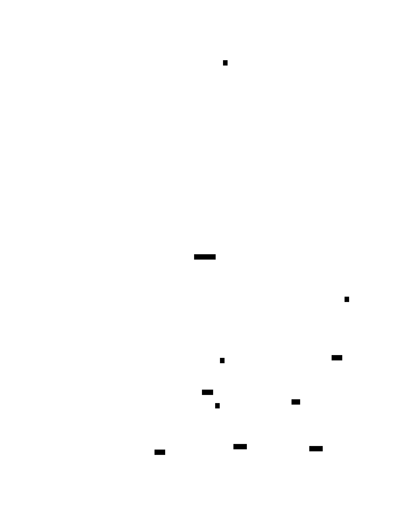
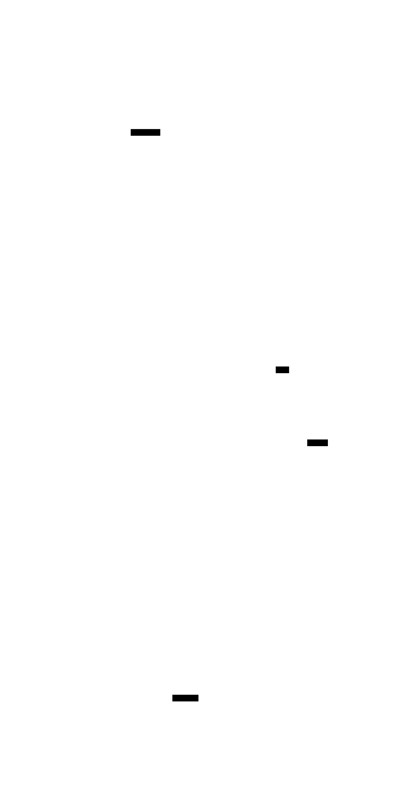

# Plugin Architecture

`spyre-inference` is a vLLM out-of-tree (OOT) platform plugin that enables inference on
IBM's Spyre AI accelerator. It integrates with vLLM's plugin system to replace key
compute layers with Spyre-optimized implementations while preserving the rest of the
vLLM execution pipeline.

## System Overview

The diagram below shows how `spyre-inference` fits into vLLM's process architecture.
Blue boxes are Spyre-specific classes provided by this plugin; dark boxes are vLLM base
classes; the gold box is the model loaded from vLLM's model registry with Spyre custom
ops injected via OOT registration.

<figure markdown="span">
  {: style="width: 140%; max-width: 1200px; margin-left: -20%;" }
  <figcaption>
    Process-level view of vLLM with the spyre-inference plugin. Dashed arrows (▷)
    indicate inheritance; solid arrows indicate composition or dependency.
  </figcaption>
</figure>

The plugin registers via two entry points:

| Entry Point | Purpose |
|---|---|
| `vllm.platform_plugins` | Registers `TorchSpyrePlatform` — sets dtype, worker class, and attention backend |
| `vllm.general_plugins` | Calls `register_all()` — registers all custom ops before model loading |

## Component view of a Granite model

<figure markdown="span">
  {: style="width: 140%; max-width: 1000px; margin-left: -20%" }
  <figcaption>
    Static architecture of the spyre-inference plugin showing how it integrates with
    vLLM and which model layers are replaced for Spyre execution.
  </figcaption>
</figure>

## Custom Op Replacement

Each layer in the Granite model that requires Spyre-specific handling is replaced via
vLLM's `@ClassName.register_oot()` decorator. When vLLM instantiates a layer, the
decorator intercepts and returns the Spyre implementation instead.

| vLLM Layer | Spyre Replacement | Device | Notes |
|---|---|---|---|
| `RMSNorm` | `SpyreRMSNorm` | Spyre | Custom op boundary for `torch.compile` |
| `RotaryEmbedding` | `SpyreRotaryEmbedding` | CPU | Fallback — Spyre doesn't support strided views |
| `VocabParallelEmbedding` | `SpyreVocabParallelEmbedding` | Spyre + CPU | TP shard mask runs on CPU (Spyre inductor rejects int64 constants); embedding lookup on Spyre |
| `QKVParallelLinear` | `SpyreQKVParallelLinear` | Spyre + CPU | TP≥1, `F.linear()` on Spyre, D2H after for downstream `.split()` |
| `RowParallelLinear` | `SpyreRowParallelLinear` | Spyre | TP≥1, `F.linear()` + `all_reduce` when `reduce_results=True` |
| `MergedColumnParallelLinear` | _(unchanged)_ | Spyre | Upstream class with `SpyreUnquantizedLinearMethod` swapped in |
| `SiluAndMul` | `SpyreSiluAndMul` | Spyre | Slicing done on CPU (Spyre limitation) |
| `ParallelLMHead` | `SpyreParallelLMHead` | Spyre | TP≥1; vocab partition padded up to a multiple of 64×32 |

## Attention Backend

The `SpyreAttentionBackend` implements paged attention using pure PyTorch operations
(no custom CUDA kernels). The KV cache is a list of per-page tensors on Spyre — each
page is `[num_kv_heads, block_size, head_size]` — rather than a monolithic tensor. The
default backend runs a FlashAttention-style online softmax that iterates over pages
without any compact-gather step:

| Step | Device | Operation |
|---|---|---|
| 1. q/k/v → CPU | CPU | Bring `q`, `k`, `v` to CPU once (Spyre slicing corrupts strided views) |
| 2. Reshape & cache | Spyre | Per-token overwrite of new K/V into the list-of-pages cache |
| 3. Per-sequence varlen loop | CPU | Iterate sequences via `query_start_loc`, pad `query_len` to 32 |
| 4. Online softmax over pages | Spyre | Compiled per `(num_blocks, padded_query_len)` kernel: `Q @ Kᵀ` → `+ tile_mask` → online softmax → `@ V` |
| 5. Per-token write-back | Spyre | `spyre.overwrite` each result token into the output buffer |

Key constraints:

- **KV length alignment**: 256 tokens (avoids per-step recompilation on Spyre)
- **Query chunk size**: 32 tokens (consistent tensor shapes for compilation)
- **Head size**: Must be a multiple of 64 (128-byte Spyre stick ÷ 2-byte float16)
- **GQA only**: MHA (`num_queries_per_kv = 1`) currently fails in the Spyre compiler's
  layout-propagation pass; only GQA configurations are exercised today.

## Device Placement Strategy

`TorchSpyreModelRunner` inherits from vLLM's `GPUModelRunner` and treats Spyre as the
"GPU" in the `CpuGpuBuffer` pattern. Buffers are created via a `SpyreCpuGpuBuffer`
override:

- **Float dtypes**: `.cpu` on CPU (numpy staging for the scheduler), `.gpu` on Spyre as
  `float16`
- **Int / bool dtypes**: `.gpu` aliased to `.cpu` (Spyre doesn't natively support these)

`self.device` stays `cpu` so that scatter, indexing, and block-table ops run on CPU, but
float compute tensors land on Spyre via `self._spyre_device`.

`_SpyreModelWrapper` sits between the model runner and the model and converts at the
call boundary:

- **Input**: CPU `int32`/`int64` tensors → Spyre `int64` (for embedding lookup)
- **Output**: Spyre `float16` tensors → CPU (for logits indexing and sampling)

The embedding lookup itself runs on Spyre via `SpyreVocabParallelEmbedding`, which
inherits weight loading and shard arithmetic from upstream and only overrides `forward`
to compute the TP shard mask on CPU (the upstream helper does int64 comparisons against
Python int constants, which the Spyre inductor backend rejects).

Hidden states flow on Spyre between decoder layers, with CPU round-trips only for
operations that Spyre doesn't yet support natively (rotary embeddings, q/k/v slicing,
the per-sequence attention varlen loop, logits indexing).

## Distributed (TP)

`TorchSpyrePlatform.get_device_communicator_cls` returns `SpyreCommunicator`, a
`DeviceCommunicatorBase` override that lives in
`spyre_inference/distributed/spyre_communicator.py`. It exists because the installed
`libspyre_comms.so` only implements `barrier`, `broadcast`, single-tensor `allgather`,
and pairwise `send`/`recv`; the list-form `allgather`, `allreduce`, `gather`, and
`reduce` overrides on `SpyreCommsContext` are throw-stubs.

For the TP=2 forward path, `SpyreCommunicator.all_reduce` provides a manual
send/recv-then-broadcast fallback. `all_gather` and `gather` route CPU tensors through
the gloo half of the multi-backend `cpu:gloo,spyre:spyreccl` device group; Spyre
tensors raise a clear `NotImplementedError` describing what's needed to unblock them.
Each fallback is tagged `REPLACE-WITH-NATIVE` so the file can be deleted (or pared back
to genuine perf overrides) once the comms library catches up. The
`tests/test_spyre_comms_native_probes.py` xfail-strict suite is the canonical signal:
when a probe flips green, delete the corresponding override.
