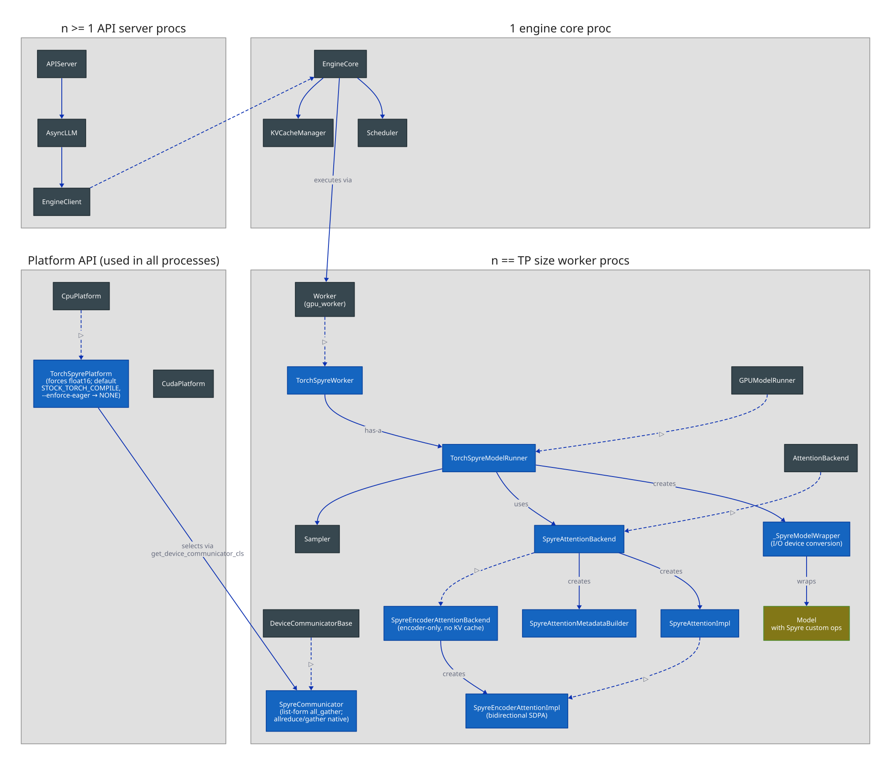
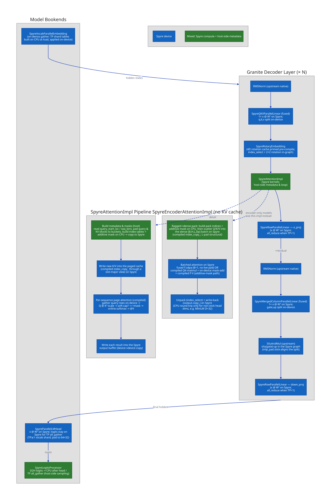

# Plugin Architecture

`spyre-inference` is a vLLM out-of-tree (OOT) platform plugin that enables inference on
IBM's Spyre AI accelerator. It integrates with vLLM's plugin system to replace key
compute layers with Spyre-optimized implementations while preserving the rest of the
vLLM execution pipeline.

## System Overview

The diagram below shows how `spyre-inference` fits into vLLM's process architecture.
Blue boxes are Spyre-specific classes provided by this plugin; dark boxes are vLLM base
classes; the gold box is the model loaded from vLLM's model registry with Spyre custom
ops injected via OOT registration.

<figure markdown="span">
  {: style="width: 140%; max-width: 1200px; margin-left: -20%;" }
  <figcaption>
    Process-level view of vLLM with the spyre-inference plugin. Dashed arrows (▷)
    indicate inheritance; solid arrows indicate composition or dependency.
  </figcaption>
</figure>

The plugin registers via three entry points:

| Entry Point | Target | Purpose |
|---|---|---|
| `vllm.platform_plugins` | `spyre_inference:register` | Registers `TorchSpyrePlatform` — sets dtype, worker class, attention backend, and distributed backend |
| `vllm.general_plugins` | `spyre_inference:register_ops` | Calls `register_all()` — importing the ops package triggers every `@register_oot()` layer swap, and `register_all()` additionally registers the opaque `spyre_rope_rot` and `spyre_convert` custom ops |
| `vllm.general_plugins` | `spyre_inference:register_hf_adapters` | Overrides vLLM's `TransformersForCausalLM` with `HfAdaptersForCausalLM` so `model_impl="transformers"` uses hf-adapters (matmul-based RoPE) on Spyre |

`vLLM` is built from source with `VLLM_TARGET_DEVICE=empty` (no device-specific C
kernels), so the platform overrides a few CPU-backend assumptions: `import_kernels()` is
a no-op (there is no `vllm._C`), and the model runner reimplements the slot-mapping
kernel in pure PyTorch.

## Component view of a Granite model

<figure markdown="span">
  {: style="width: 140%; max-width: 1000px; margin-left: -20%" }
  <figcaption>
    Static architecture of the spyre-inference plugin showing how it integrates with
    vLLM and which model layers are replaced for Spyre execution.
  </figcaption>
</figure>

## Custom Op Replacement

Each layer that requires Spyre-specific handling is replaced via vLLM's
`@ClassName.register_oot()` decorator. Most replacements are pure class swaps that run
when the ops package is imported; two layers (rotary embedding, the `convert` helper)
also register an opaque custom op via `register_all()` — `spyre_convert` keeps device
transfers invisible to `torch.compile`, and `spyre_rope_rot` keeps the forward-context
read of the gathered rotation slice out of the compiled graph.

| vLLM Layer | Spyre Replacement | Device | Notes |
|---|---|---|---|
| `RMSNorm` | `SpyreRMSNorm` | Spyre | `forward_oot` runs a `maybe_compile`d kernel directly on Spyre; no float32 promotion (torch-spyre limitation) |
| `RotaryEmbedding`, `Llama3RotaryEmbedding` | `SpyreRotaryEmbedding`, `SpyreLlama3RotaryEmbedding` | Spyre (`index_select` on CPU) | 2×2 rotation-matrix formulation runs on Spyre; only the frequency-cache `index_select` (`gather_rotation`) runs on CPU before the forward, then the gathered slice is moved to Spyre and read back through the opaque `spyre_rope_rot` op. Only neox-style full rotary is supported (other configs raise `NotImplementedError` at construction) |
| `VocabParallelEmbedding` | `SpyreVocabParallelEmbedding` | CPU → Spyre | The weight is pinned to CPU (`_apply` is a no-op — `F.embedding` has no Spyre kernel), so the gather runs CPU-to-CPU on the CPU-`convert`ed input; TP shard mask is computed on CPU (Spyre inductor rejects int64 constants); only the gathered output is `convert`ed back to Spyre; `all_reduce` when TP>1 |
| `QKVParallelLinear` | `SpyreQKVParallelLinear` | Spyre | Subclass asserts `gather_output=False`; the fused weight stays on-device and `F.linear` runs normally; in eager mode the model runner patches each attention module's forward to replace `qkv.split(...)` with a compiled slice+clone (Spyre drops `storage_offset` on graph inputs, so raw `split` views silently corrupt) |
| `SiluAndMul` | `SpyreSiluAndMul` | Spyre | `forward_oot` runs a `torch.compile`d `forward_native` directly on the fused `[..., 2*d]` tensor; the gate/up slice stays on Spyre (indirect access, no CPU detour) |
| `ParallelLMHead` | `SpyreParallelLMHead` | Spyre → CPU | TP≥1 with vocab sharding; per-rank weight padded to a multiple of 64×32; logits returned on CPU for the downstream TP `all_gather` |
| `LogitsProcessor` | `SpyreLogitsProcessor` | — | Overrides `_gather_logits` (TP>1) and `_get_logits` (all TP sizes) to move logits from Spyre to CPU before downstream scaling / sampling |

`RowParallelLinear` and `MergedColumnParallelLinear` are **not** subclassed:

- `RowParallelLinear` (`o_proj`, `down_proj`) runs the upstream class unchanged — `F.linear`
  dispatches to Spyre, and `all_reduce` (via `SpyreCommunicator`) fires when `reduce_results=True`
  under TP>1.
- `MergedColumnParallelLinear` (`gate_up_proj`) runs the upstream class unchanged: the
  fused `[..., 2*d]` output feeds straight into `SpyreSiluAndMul`, which slices gate/up
  on-device.

## Attention Backend

The `SpyreAttentionBackend` implements paged attention using pure PyTorch operations
(no custom CUDA kernels). The KV cache is a list of per-page tensors on Spyre — each
page is `[num_kv_heads, block_size, head_size]` — rather than a monolithic tensor. It
runs a FlashAttention-style online softmax that iterates over pages without any
compact-gather step:

| Step | Device | Operation |
|---|---|---|
| 1. q/k/v → CPU | CPU | Bring `q`, `k`, `v` to CPU once (Spyre slicing corrupts strided views) |
| 2. Reshape & cache | Spyre | Per-token overwrite of new K/V into the list-of-pages cache |
| 3. Per-sequence varlen loop | CPU | Iterate sequences via `query_start_loc`, pad `query_len` to 32 |
| 4. Online softmax over pages | Spyre | Compiled per `(num_blocks, padded_query_len)` kernel: `Q @ Kᵀ · scale` → optional soft-cap → `+ tile_mask` → online softmax → `@ V` |
| 5. Write-back | CPU → Spyre | Stage each sequence's result into a CPU buffer, then one bulk copy into the Spyre output (per-token `spyre.overwrite` scatter doesn't scale) |

Key constraints:

- **KV length alignment**: 256 tokens (avoids per-step recompilation on Spyre)
- **Query chunk size**: 32 tokens (consistent tensor shapes for compilation)
- **Head size**: Must be a multiple of 64 (128-byte Spyre stick ÷ 2-byte float16)
- **Block size**: Must be a multiple of 64; the platform rounds a user-supplied
  `block_size` up to the next multiple of 64 automatically
- **GQA only**: MHA (`num_queries_per_kv = 1`) currently fails in the Spyre compiler's
  layout-propagation pass; only GQA configurations are exercised today
- **Supported**: sliding-window masking and logits soft-capping are both handled;
  ALiBi slopes are not

### Encoder-only attention

Encoder-only (embedding) models take a separate path. For `ENCODER`/`ENCODER_ONLY`
layers, `TorchSpyrePlatform.get_attn_backend_cls` selects `SpyreEncoderAttentionBackend`
→ `SpyreEncoderAttentionImpl` (both subclass the decoder backend/impl in
`spyre_encoder_attn.py`). This path has **no KV cache** — attention is bidirectional over
the full sequence — so it skips the paged-cache machinery entirely and instead:

1. Assembles a dense, padded batch on CPU (per-sequence variable-length slice, transpose,
   and scatter of ragged Q/K/V into `[num_seqs, H, L, D]`, plus an additive attention
   mask). Both sequence length `L` and head dim `D` are padded to the
   `ENCODER_SEQ_ALIGNMENT = 64` stick so the on-device matmuls stay stick-aligned (this
   is what lets small-head-dim models like MiniLM's `head_size=32` compile).
2. Runs a single batched `F.scaled_dot_product_attention` on Spyre
   (`is_causal=False`, additive mask, `enable_gqa` when `num_kv_heads != num_heads`).
3. Scatters the unpadded results back to CPU, then writes them per token into the Spyre
   output buffer.

## Device Placement Strategy

`TorchSpyreModelRunner` inherits from vLLM's `GPUModelRunner` and treats Spyre as the
"GPU" in the `CpuGpuBuffer` pattern. Buffers are created via a `SpyreCpuGpuBuffer`
override:

- **Float dtypes**: `.cpu` on CPU (numpy staging for the scheduler), `.gpu` on Spyre as
  `float16`
- **Int / bool dtypes**: `.gpu` aliased to `.cpu` (Spyre doesn't natively support these)

`self.device` stays `cpu` so that scatter, indexing, and block-table ops run on CPU, but
float compute tensors land on Spyre via `self._spyre_device`. Because there is no
`vllm._C` under `VLLM_TARGET_DEVICE=empty`, the runner also swaps in a pure-PyTorch
`_compute_slot_mapping` implementation for the paged-cache slot mapping.

At load time, `load_model` moves every module except `Attention` scale buffers onto
Spyre, then calls `_compile_for_spyre` which — in eager mode — patches each attention
module's forward via `_patch_attention_qkv_splits`: the original `qkv.split(...)` is
replaced with a compiled slice+clone that produces contiguous Q/K/V tensors with
`storage_offset=0` (Spyre's Inductor backend drops graph-input offsets, so raw `split`
views silently read from offset 0).

`_SpyreModelWrapper` sits between the model runner and the model and converts at the
call boundary:

- **Input**: CPU `int32`/`int64` tensors → Spyre `int64` (for embedding lookup)
- **Output**: Spyre `float16` tensors → CPU (for logits indexing and sampling)
- **`compute_logits`**: moves the CPU-sliced `hidden_states[logits_indices]` back onto
  Spyre for the `SpyreParallelLMHead` matmul, which then returns logits on CPU

`SpyreVocabParallelEmbedding` inherits weight loading and shard arithmetic from upstream
and overrides `forward` to compute the TP shard mask on CPU (the upstream helper does
int64 comparisons against Python int constants, which the Spyre inductor backend
rejects). Because `F.embedding` has no Spyre kernel, its `_apply` override is a no-op
that pins the weight to CPU: the input is `convert`ed to CPU, the gather runs
CPU-to-CPU, and only the gathered output is `convert`ed back to Spyre. This replaces the
earlier silent D2H/H2D CPU fallback of `aten.embedding`
([torch-spyre#420](https://github.com/torch-spyre/torch-spyre/issues/420)), which
copied the full `[vocab, hidden]` weight on every decode step.

Hidden states flow on Spyre between decoder layers, with CPU round-trips only for
operations that Spyre doesn't yet support natively (the embedding gather, the rotary
frequency-cache `index_select`, the per-sequence attention varlen loop, logits indexing).

## HF-adapters Transformers backend

When `model_impl="transformers"`, the `register_hf_adapters` general plugin swaps vLLM's
`TransformersForCausalLM` for `HfAdaptersForCausalLM` (`spyre_inference/hf_adapters.py`).
vLLM's stock Transformers backend still handles model creation, weight loading, attention
routing, the KV cache, and scheduling; the Spyre OOT layers above apply automatically at
instantiation. The adapter's main job is to replace HF's `RotaryEmbedding` with a
matmul-based RoPE (`apply_rope_matmul`), padding Q/K into a stick-aligned dimension for
the rotation when `head_dim/2` is not a multiple of the Spyre block size and contracting
back afterward.

## Distributed (TP)

`TorchSpyrePlatform.get_device_communicator_cls` returns `SpyreCommunicator`, a
`DeviceCommunicatorBase` override in
`spyre_inference/distributed/spyre_communicator.py`. The installed `libspyre_comms.so`
now implements `barrier`, `broadcast`, `send`/`recv`, list-form `allgather`, `gather`,
and `allreduce`; only `reduce` remains a throw-stub, and torch-spyre's spyreccl
backend still stubs `_allgather_base` (so `dist.all_gather_into_tensor` doesn't work).

`SpyreCommunicator` therefore only overrides:

- **`all_gather`** — routes CPU tensors through the gloo half of the multi-backend
  `cpu:gloo,spyre:spyreccl` group, and uses native list-form `dist.all_gather` for Spyre
  tensors (the base class's `dist.all_gather_into_tensor` path is blocked by the
  `_allgather_base` stub).
- **`reduce_scatter`** — raises; it is not on the TP forward path.

`all_reduce` and `gather` are no longer overridden — they now work natively via
`libspyre_comms`. Each remaining fallback is
tagged `REPLACE-WITH-NATIVE`; the `tests/test_spyre_comms_native_probes.py` xfail-strict
suite is the canonical signal: when a probe flips green, delete the corresponding
override.

The worker (`TorchSpyreWorker`) inherits directly from vLLM's `Worker` (gpu_worker), not
`CPUWorker` — Spyre needs none of the CPU-specific init (NUMA binding, host-RAM
profiling). Data parallelism (`data_parallel_size > 1`) is rejected in
`check_and_update_config`.
