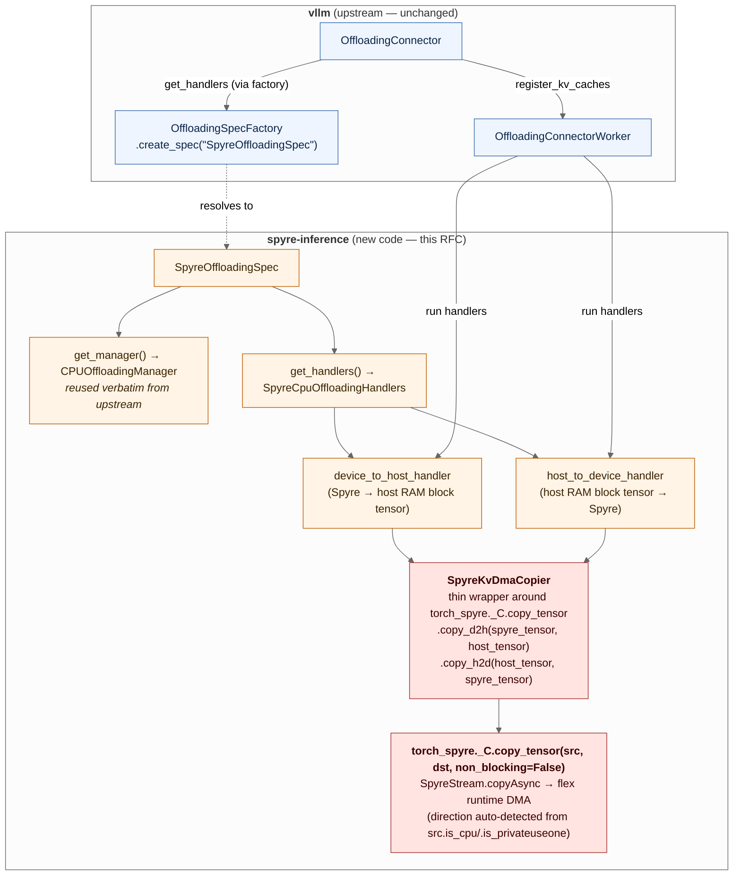

# RFC: Port the upstream KV Connector experience to spyre-inference

| Field | Value |
|---|---|
| Status | Draft |
| Authors | Chen Wang ([@wangchen615](https://github.com/wangchen615)), Yue Zhu ([@yuezhu1](https://github.com/yuezhu1)), Pravein Govindan Kannan ([@praveingk](https://github.com/praveingk)), Hubertus Franke ([@frankeh](https://github.com/frankeh)) |
| Created | 2026-06-05 |
| Updated | 2026-06-08 — rebased on the upstream multi-tier framework (`TieringOffloadingSpec`, `SecondaryTierManager`, `tiering/fs`, `tiering/obj`); incorporated review feedback from [@yuezhu1](https://github.com/yuezhu1). 2026-07-07 — added Milestone 2: cross-instance shared host-memory KV pool (hmlib-backed primary tier, recommended; `SharedOffloadRegion`+DMA alternative), built on the flex raw-copy + shared-host-DMA primitives. Dropped the former M1.5 (filesystem/object `SecondaryTier`) milestone: the intended fast second tier is hillock (a byte-addressable, DMA-able memory pool), which is reached through the M2 shared-pool DMA path, **not** through an fs/obj `SecondaryTierManager` — so a tiering milestone would be a detour. The upstream tiering framework is retained as background only (§3.5). |
| Tracking | First design doc for [#76 — \[Epic\] Develop KVCacheConnector for Spyre](https://github.com/torch-spyre/spyre-inference/issues/76) |
| Related | vLLM `OffloadingConnector`, vLLM `TieringOffloadingSpec` (PR #40020), vLLM `tiering/fs` (PR #41735), vLLM `tiering/obj` (PR #41968), prior internal Spyre PD-disaggregation prototype |

## 1. Motivation

The upstream vLLM `OffloadingConnector` framework gives every CUDA platform three things for free:

1. A pluggable scheduler-side `OffloadingManager` that tracks where each block lives (G/H/F tiers).
2. A worker-side `OffloadingHandler` registry keyed by `(src_type, dst_type)` that performs the actual transfer.
3. An `OffloadingSpec` factory that lets out-of-tree platforms drop in their own manager + handlers without touching upstream code.

As of vLLM v0.22, this stack has grown a fourth layer — a first-class **multi-tier framework** that lets a single connector cascade across host RAM, filesystem, and object stores. This RFC does **not** build on that framework as a milestone (§3.5 keeps it as background): the fast second tier we want is hillock — a byte-addressable, DMA-able memory pool reached through the same shared-pool DMA path as M2 — not a filesystem/object `SecondaryTierManager`, so a tiering milestone would be a detour. See §2 "Goals removed."

The existing `spyre-inference` plugin has **none** of this wired up. `TorchSpyreWorker` extends `CPUWorker` and never calls `register_kv_caches`. Both the single-tier `CPUOffloadingSpec` and the new `TieringOffloadingSpec` (which subclasses `CPUOffloadingSpec`) error out on non-CUDA platforms via the `current_platform.is_cuda_alike()` check at `vllm/v1/kv_offload/cpu/spec.py:89`. So the entire upstream offload + tiering stack is unreachable from Spyre today, and the only KV-tier story we have is "the whole cache is on-device, full-stop."

Meanwhile, an earlier internal Spyre PD-disaggregation prototype has already demonstrated end-to-end KV transfer between two Spyre instances over NIXL, using a Spyre-specific device↔host copy primitive. That prototype is not packaged for vLLM's connector contract — it sits in standalone scripts that drive the model directly via `fms` — so it cannot ride the upstream connector ecosystem (LMCache, llm-d shared-storage backend, prefix caching, PD disaggregation) without an adaptor.

This RFC proposes how to combine the two: take the prototype's data-copy primitive, wrap it as an upstream-conformant `OffloadingHandler`, and register a `SpyreOffloadingSpec` so that the upstream `OffloadingConnector` works on Spyre (M1). It then makes the host tier a **cross-instance shared pool** (M2) so co-located instances reuse each other's offloaded blocks with one raw DMA and no serialization — which is also the path a future faster tier (hillock) will take. The Spyre-specific code stops at the device↔host primary tier; the connector, manager, and factory above it are platform-agnostic upstream code.

## 2. Goals and non-goals

### Goals (M1)

- A user runs vLLM on Spyre with `--kv-transfer-config '{"kv_connector":"OffloadingConnector", "kv_connector_extra_config":{"spec_name":"SpyreOffloadingSpec","cpu_bytes_to_use":"8000000000"}}'` and gets host-RAM offload that survives across requests.
- The Spyre device↔host copy goes through one named, testable primitive (`SpyreKvDmaCopier`) that wraps `torch_spyre._C.copy_tensor(src, dst, non_blocking=False)` — the public, stream-backed Spyre↔CPU copy entrypoint already exposed in the dev-image-pinned torch-spyre commit. No new device-side primitives needed; no flit-offset / `perfdsc` parsing.
- `pytest tests/v1/kv_offload/` runs the same matrix as upstream for the CPU spec, plus a Spyre-specific test that round-trips a known-pattern block device→host→device.

### Goals removed (former M1.5 — filesystem/object tiering)

An earlier draft proposed an M1.5 that registered a `SpyreTieringOffloadingSpec` over the upstream
`tiering/{fs,obj}` `SecondaryTierManager`s (host-RAM-plus-filesystem tiered offload, cross-shared via
content-hashed paths on a shared volume). **This milestone is dropped.** The fast second tier Spyre
actually wants is **hillock** — a byte-addressable, DMA-able memory pool (flex RFC §1.2), reached the
same way as the M2 shared host pool: `mmap` + register + raw DMA. It is *not* a filesystem or object
store, so it does not fit the `SecondaryTierManager` contract (which assumes a `primary_kv_view`
memoryview read/written by CPU-side store/load, not a DMA endpoint). Building the fs/obj tiering path
would therefore be throwaway work on the way to hillock. Cross-instance sharing — the real value M1.5
was reaching for — is delivered directly by **M2** (a shared host-RAM pool now, hillock later) without
a disk round-trip. The upstream tiering framework is retained only as background (§3.5) for readers
who still want an fs/obj tier as a deployment choice; it is not a milestone of this RFC.

### Goals (M2 — cross-instance shared host-memory KV pool)

M1 gives each instance its **own** host-RAM primary tier — a block offloaded by one instance is
invisible to every other. M2 makes the **primary** host tier itself a single POSIX-SHM pool shared by
every co-located Spyre instance, so a KV block offloaded by one instance is reloaded by another with
**one raw DMA and no serialization**. This is the cross-instance sharing the dropped M1.5 was reaching
for, but at memory speed and without a disk round-trip — and it is the same `mmap` + register + raw
DMA path a future hillock tier will use.

- A user runs two `vllm serve` instances on the same host, each with `spec_name:
  "SpyreShmOffloadingSpec"` and a shared pool name, and the second instance gets a prefix-cache hit on
  a block the first offloaded — served by a device←host DMA out of the shared pool, no recompute, no
  file I/O.
- The shared pool is a valid Spyre DMA endpoint on **both** 1p0 and 1p5, via the flex `copyRaw` +
  external-pointer-registration primitives (flex RFC §4.1/§4.5) exposed through torch-spyre
  `copy_tensor_raw` / `register_dmable_host_buffer` (torch-spyre design doc *Exposing flex raw-copy +
  shared-host-DMA to Python*).
- Torn reads under concurrent overwrite are **impossible to consume silently** — a reader validates
  after copy and a stale slot degrades to a cache miss, never to corruption.

M2 depends on lower-layer work that does not exist yet (the flex `copyRaw`/`registerHostBuffer` API
and its torch-spyre bindings); §6.6 and §11 track that dependency chain. M2 is specified here so the
milestone ladder is coherent, but it is gated on those upstream pieces landing.

Items explicitly out of scope (PD disaggregation, replacing the flit-offset addressing scheme, etc.) are listed in §11 alongside their owners and follow-up plans.

## 3. Background: what the upstream `OffloadingConnector` actually requires

Three abstraction points matter on the worker side. References are to vLLM `main` at the version this fork tracks.

### 3.1 `OffloadingConnector` (`vllm/distributed/kv_transfer/kv_connector/v1/offloading_connector.py:46`)

Constructed once per role (`SCHEDULER`/`WORKER`) and delegates to `OffloadingConnectorScheduler` or `OffloadingConnectorWorker`. The worker side calls `connector_worker.register_kv_caches(kv_caches)` with the `dict[str, torch.Tensor]` that the runner has already allocated. **This is the only ingestion point for the on-device KV cache** — everything downstream operates on tensors handed in here.

### 3.2 `OffloadingSpec` (`vllm/v1/kv_offload/base.py:319`)

The contract a platform implements:

- `get_manager() -> OffloadingManager` — scheduler-side bookkeeping (which blocks are where, eviction policy).
- `get_handlers(kv_caches) -> Iterator[(src_type, dst_type, OffloadingHandler)]` — worker-side transfer dispatch. The handler is asked to move a list of `(src_block_ids, dst_block_ids)` pairs and to expose a `get_finished()` poll for completion.

### 3.3 `CpuGpuOffloadingHandlers` (`vllm/v1/kv_offload/cpu/gpu_worker.py:375`)

The reference CUDA implementation. It is **not directly reusable on Spyre** because:

- It allocates `torch.cuda.Stream` per transfer (`spyre` has no public stream API; `_sync_device` in `TorchSpyreModelRunner` is a stub).
- It asserts `gpu_tensor.is_cuda` on every registered KV tensor.
- It calls `ops.swap_blocks_batch`, a custom CUDA op.
- Optional `cudaHostRegister` pinning via `cudart()`.

### 3.4 Dynamic spec loading (`vllm/v1/kv_offload/factory.py:21`)

`OffloadingSpecFactory.register_spec(name, module_path, class_name)` records a tuple but does **not** import the module at registration time. The actual import happens lazily in `create_spec(...)` when the user's `kv_connector_extra_config.spec_name` selects this spec. That matters for an out-of-tree platform plugin: we can register `SpyreOffloadingSpec` from `spyre_inference/__init__.py` without dragging in any Spyre-only module at vLLM import time, and CUDA-only deployments that load `spyre-inference` for unrelated reasons pay zero cost for our spec.

The same pattern applies to `SecondaryTierFactory.register_tier(...)` (`vllm/v1/kv_offload/tiering/factory.py`). Adding a new secondary tier from a third-party package — including ours, if M2 ever ships one — is a one-line registration call, not an upstream PR.

### 3.5 The v0.22 multi-tier layer

vLLM v0.22 added a multi-tier framework on top of the four pieces above:

- **`TieringOffloadingSpec`** (`vllm/v1/kv_offload/tiering/spec.py`, PR #40020) — a concrete `OffloadingSpec` that builds a `TieringOffloadingManager` over a CPU primary tier and one or more secondary tiers.
- **`SecondaryTierManager`** abstract base class (`vllm/v1/kv_offload/tiering/base.py`, PR #40020) — the contract any new tier must implement (`submit_store`, `submit_load`, `get_finished_jobs`, etc.). Cannot be instantiated directly; concrete tiers subclass it.
- **`SecondaryTierFactory`** (`vllm/v1/kv_offload/tiering/factory.py`, PR #40020) — the registry where tiers are plugged in by name (mirrors `OffloadingSpecFactory`).
- **In-tree concrete tiers:** `tiering/fs` (filesystem, PR #41735) and `tiering/obj` (object store, PR #41968), both subclassing `SecondaryTierManager`.

A deployment selects `spec_name: "TieringOffloadingSpec"` (a single spec) and lists secondary tiers in `extra_config`. The `TieringOffloadingManager` orchestrates a coherent hierarchy — primary CPU tier mmap'd via `SharedOffloadRegion`, plus one or more `SecondaryTierManager`s that read/write through a `primary_kv_view: memoryview`. Stores can cascade primary→secondary; loads can promote secondary→primary; the manager owns the bookkeeping.

This framework is **background only** for this RFC — it is not a milestone (see §2 "Goals removed").
A deployment may still select an fs/obj `SecondaryTierManager` on top of M1's `SpyreOffloadingSpec`
via upstream config if it wants a disk/object tier, but this RFC ships no Spyre-specific tiering spec:
the fast second tier we care about (hillock) is a DMA-able memory pool served by M2's shared-pool
path, not an fs/obj secondary tier.

**Historical note on the prior llm-d shape.** llm-d v0.8 deployments use a different shape that pre-dates the v0.22 multi-tier framework: `MultiConnector` stacking two independent top-level `OffloadingSpec`s — typically one Spyre/CUDA `OffloadingSpec` for device↔host plus `SharedStorageOffloadingSpec` from the in-tree `llmd_fs_backend` module in [`llm-d/llm-d-kv-cache`](https://github.com/llm-d/llm-d-kv-cache) for host↔shared-storage. The two children operate in parallel without coordination — saves fan out to both, loads return from whichever child reports a hit first. The standalone PyPI package `llmd-fs-connector` was already EOL at `==0.22`; the maintainers of `llmd_fs_backend` (its in-tree successor in `llm-d/llm-d-kv-cache`) have signaled they are retiring it in favor of the upstream `TieringOffloadingSpec` + `tiering/fs` shape. **This RFC does not target the `MultiConnector + llmd_fs_backend` shape**: it points at a moving target on the way out. The upstream-canonical replacement (`TieringOffloadingSpec` + `tiering/fs`) remains available to deployments as upstream config, but is not a milestone here — cross-instance sharing is delivered by M2's shared pool instead.

## 4. Background: device↔host copy in current torch-spyre

torch-spyre exposes a public, stream-backed copy entrypoint that handles both directions and is already in the dev-image-pinned commit (`4dcfee15c3a93446`):

```python
import torch
import torch_spyre._C as _C   # registered as a private extension; no extra deps

cpu_t   = torch.empty_like(spyre_t, device="cpu")
_C.copy_tensor(spyre_t, cpu_t, non_blocking=False)   # device → host

cpu_in  = torch.zeros(..., dtype=...)
spyre_in = torch.empty(..., device="spyre")
_C.copy_tensor(cpu_in, spyre_in, non_blocking=False) # host → device
```

`copy_tensor(src, dst, non_blocking=False)` is bound in [`torch_spyre/csrc/module.cpp:272`](https://github.com/torch-spyre/torch-spyre/blob/4dcfee15c3a9344652f067149ec65c4bf2941890/torch_spyre/csrc/module.cpp#L272) → `spyre::spyre_copy_from` ([`torch_spyre/csrc/spyre_mem.cpp:581`](https://github.com/torch-spyre/torch-spyre/blob/4dcfee15c3a9344652f067149ec65c4bf2941890/torch_spyre/csrc/spyre_mem.cpp#L581)) → `SpyreStream::copyAsync` ([`torch_spyre/csrc/spyre_stream.cpp:142`](https://github.com/torch-spyre/torch-spyre/blob/4dcfee15c3a9344652f067149ec65c4bf2941890/torch_spyre/csrc/spyre_stream.cpp#L142)) → `copyAsyncImpl`, which invokes the flex runtime's DMA. Direction is auto-detected from `src.is_cpu()` / `src.is_privateuseone()`; no separate H2D/D2H entrypoints. With `non_blocking=False`, `spyre_copy_from` calls `stream.synchronize()` after the DMA, so callers can treat it as synchronous; `non_blocking=True` returns immediately and the caller is responsible for syncing.

This is the only device↔host primitive M1 uses. Earlier internal Spyre prototypes drove the device DMA queues directly (`libsenlib` `DmaiQPush`/`DmaoQPush`, addressed via `flit_offset` parsed from `perfdsc/metadata.json`); those layers existed before torch-spyre exposed `copy_tensor` and are not reused here. With `copy_tensor` available, the connector handler operates on plain `torch.Tensor` arguments and never touches senlib, flit offsets, or perfdsc artifacts.

### 4.1 Data paths in scope

| Path | Milestone | Compose how | Notes |
|---|---|---|---|
| Spyre device ↔ host RAM (single tier) | **M1** | `OffloadingConnector` + `SpyreOffloadingSpec` | Single-tier offload; survives across requests. |
| Spyre device ↔ **shared** host-RAM pool (cross-instance, on-node) | **M2** | `OffloadingConnector` + `SpyreShmOffloadingSpec` (hmlib-backed primary tier) | Multiple co-located instances share one POSIX-SHM primary pool; a block offloaded by one instance is reloaded by another with one raw DMA and seqlock copy→validate — no serialization, no disk. Uses `copy_tensor_raw` + `register_dmable_host_buffer` (§6.6). See §6.7. |
| Direct Spyre device ↔ filesystem / object store | Out of scope | n/a | Would require a Spyre-side analogue of NVIDIA GDS so a secondary tier can DMA without a host bounce. Not provided by torch-spyre today, and the upstream `SecondaryTierManager` contract assumes the `primary_kv_view` is over CPU memory; supporting this would change both. Filed as a future-work item in §11. |

M1 and M2 reuse the same device↔host copy path (§4/§6.1, §6.7); M2 only changes the host side from a
per-instance `torch.empty` buffer to a shared, DMA-registered pool. A deployment that additionally
wants a disk/object tier can still stack an upstream fs/obj `SecondaryTierManager` on top of M1's
`SpyreOffloadingSpec` via config, but this RFC ships no Spyre-specific tiering spec (§2, §3.5).

## 5. Proposed architecture

<!-- Source: figures/spyre-offloading-arch.mmd. Regenerate the SVG with:
       npx -y -p @mermaid-js/mermaid-cli@10 mmdc \
         -i docs/architecture/rfcs/figures/spyre-offloading-arch.mmd \
         -o docs/architecture/rfcs/figures/spyre-offloading-arch.svg \
         -b transparent
-->


<details>
<summary>Mermaid source for the diagram above (also at <code>figures/spyre-offloading-arch.mmd</code>)</summary>



</details>

Key shape: **only `SpyreCpuOffloadingHandlers` and `SpyreKvDmaCopier` are new code on the Spyre side.** Everything above (manager, factory, scheduler-side connector, eviction policies, llm-d composition) is unchanged upstream code.

### 5.1 Why we don't subclass `CpuGpuOffloadingHandlers`

The upstream class is structured around `torch.cuda.Stream`/`torch.Event`. Even ignoring the `is_cuda` assert, half the methods (`get_finished`, `wait`, `shutdown`) call `event.query()` / `event.synchronize()` / `event.elapsed_time()`. There is no "swap CUDA for Spyre" override point. A clean implementation of the same interface (`OffloadingHandler` from `vllm/v1/kv_offload/worker/worker.py`) is shorter than working around the CUDA assumptions.

### 5.2 Why we reuse `CPUOffloadingManager` verbatim

The manager is pure bookkeeping. It is keyed by `LoadStoreSpec` types, not by tensor backends, and the upstream pluggable cache policy registry (`lru`, `arc`) handles eviction. Nothing in it is CUDA-specific.

## 6. Component design

### 6.1 `SpyreKvDmaCopier`

```python
# spyre_inference/v1/kv_offload/copier.py
import torch
import torch_spyre._C as _spyre_c


class SpyreKvDmaCopier:
    """Single-purpose owner of every host↔Spyre KV byte transfer.

    Thin wrapper around torch_spyre._C.copy_tensor, which is bound to
    SpyreStream.copyAsync → flex runtime DMA. Direction is auto-detected
    inside the C++ binding from src.is_cpu() / src.is_privateuseone(),
    so we expose two named methods purely for handler readability — both
    delegate to the same underlying call.
    """

    def copy_d2h(self, src_spyre: torch.Tensor, dst_host: torch.Tensor) -> None:
        _spyre_c.copy_tensor(src_spyre, dst_host, non_blocking=False)

    def copy_h2d(self, src_host: torch.Tensor, dst_spyre: torch.Tensor) -> None:
        _spyre_c.copy_tensor(src_host, dst_spyre, non_blocking=False)
```

Constraints:

- Both methods are synchronous (`non_blocking=False` causes `spyre_copy_from` to call `stream.synchronize()` after the DMA). M1 does not pursue async overlap; an async path is a follow-up tracked in §11 ("Async DMA on Spyre").
- Neither method allocates. The handler caller owns allocation.
- A single instance is shared across both directions; the class holds no state beyond the bound `_C.copy_tensor` reference, so it is effectively a namespace.

Why a class at all instead of inlining `_C.copy_tensor` into the handler? Two reasons. First, the `OffloadingHandler` shouldn't import `torch_spyre._C` directly — keeping the device-side primitive behind one wrapper means tests can monkey-patch `SpyreKvDmaCopier` without touching the C extension. Second, if torch-spyre later adds an async or batched copy entrypoint, swapping `SpyreKvDmaCopier`'s implementation is a one-file change; everything above it stays unchanged.

### 6.2 `SpyreCpuOffloadingHandlers`

```python
# spyre_inference/v1/kv_offload/handlers.py
class SpyreCpuOffloadingHandlers:
    def __init__(self,
                 kv_caches: CanonicalKVCaches,
                 block_size_factor: int,
                 num_cpu_blocks: int,
                 copier: SpyreKvDmaCopier): ...

    @property
    def device_to_host_handler(self) -> OffloadingHandler: ...
    @property
    def host_to_device_handler(self) -> OffloadingHandler: ...
```

Each direction is a `_SingleDirectionSpyreHandler(OffloadingHandler)` that:

1. On `transfer(spec)`, walks the `(src_block_ids, dst_block_ids)` pairs and calls `copier.copy_{d2h,h2d}` for each pair.
2. Returns a synchronous `TransferResult` with a job id, byte count, and elapsed time measured by `time.perf_counter()` (no CUDA events).
3. `get_finished()` drains the in-flight queue (which is always already done because every transfer is sync).
4. `shutdown()` clears references to the registered tensors.

Block tensors on the host side are a single `torch.empty(num_cpu_blocks, page_size_bytes, dtype=torch.int8)` per attention group, allocated at `__init__` time. We do **not** pin via `cudaHostRegister` — there is no equivalent on Spyre.

### 6.3 `SpyreOffloadingSpec`

```python
# spyre_inference/v1/kv_offload/spec.py
class SpyreOffloadingSpec(OffloadingSpec):
    def __init__(self, vllm_config, kv_cache_config):
        super().__init__(vllm_config, kv_cache_config)
        cpu_bytes = self.extra_config.get("cpu_bytes_to_use")
        if not cpu_bytes:
            raise ValueError("cpu_bytes_to_use must be set ...")
        # ... compute self.num_blocks identically to CPUOffloadingSpec
        self._copier = SpyreKvDmaCopier()
        self._manager = None
        self._handlers = None

    def get_manager(self) -> OffloadingManager:
        # Identical to CPUOffloadingSpec.get_manager (reuse upstream class).

    def get_handlers(self, kv_caches):
        if not self._handlers:
            self._handlers = SpyreCpuOffloadingHandlers(
                kv_caches=kv_caches,
                block_size_factor=self.block_size_factor,
                num_cpu_blocks=self.num_blocks,
                copier=self._copier,
            )
        yield GPULoadStoreSpec, CPULoadStoreSpec, self._handlers.device_to_host_handler
        yield CPULoadStoreSpec, GPULoadStoreSpec, self._handlers.host_to_device_handler
```

`GPULoadStoreSpec` is the upstream "device-side" type — it is a tag, not CUDA-specific, so we use it for Spyre. (The upstream class is named `GPULoadStoreSpec` for historical reasons; the tag is platform-agnostic.)

### 6.4 Filesystem/object tiering — not a milestone

An earlier draft specified a `SpyreTieringOffloadingSpec` here (a sibling of upstream
`TieringOffloadingSpec` that skipped the `is_cuda_alike()` gate and reused `TieringOffloadingManager`
+ `SecondaryTierFactory` over an fs/obj tier). It has been **removed** (§2 "Goals removed"): the fast
second tier we want is hillock, a DMA-able memory pool served by M2's shared-pool path, not an fs/obj
`SecondaryTierManager`. A deployment that wants a disk/object tier can still select upstream
`TieringOffloadingSpec` + `tiering/{fs,obj}` on top of M1's `SpyreOffloadingSpec` via config — no
Spyre-specific spec is needed for that, and none is shipped here.

### 6.5 Registration

In `spyre_inference/__init__.py`, after the existing platform plugin registration:

```python
from vllm.v1.kv_offload.factory import OffloadingSpecFactory

OffloadingSpecFactory.register_spec(
    "SpyreOffloadingSpec",
    "spyre_inference.v1.kv_offload.spec",
    "SpyreOffloadingSpec",
)

# Added in M2:
OffloadingSpecFactory.register_spec(
    "SpyreShmOffloadingSpec",
    "spyre_inference.v1.kv_offload.shm_spec",
    "SpyreShmOffloadingSpec",
)
```

This mirrors how the upstream CPU spec is registered. No changes to `TorchSpyrePlatform`, no changes to `TorchSpyreWorker` — the connector is selected by `kv-transfer-config` at engine init.

### 6.6 Worker-side glue

`OffloadingConnectorWorker.register_kv_caches` is invoked by the engine after `_allocate_kv_cache_tensors` returns. This already happens through the upstream `KVConnectorBase_V1` machinery — **no plugin change is needed** as long as the tensors `_allocate_kv_cache_tensors` returns are real `torch.Tensor` objects on `device("spyre")`. They are: see `spyre_model_runner.py:339–345` (`device="spyre"`).

The one thing we have to verify in implementation is that `OffloadingConnectorWorker` does not assert tensor device type before handing the `kv_caches` dict to our spec. If it does, we fix that in upstream vLLM with a one-liner.

### 6.7 M2 — the raw-copy + shared-pool primitive

M1's `SpyreKvDmaCopier` copies a device page into a **torch-owned CPU tensor** via
`torch_spyre._C.copy_tensor`. M2 needs to copy into an **arbitrary offset of a cross-process shared
SHM segment** the plugin owns, and to pin that segment for DMA once. That is a different device-side
surface, being added to torch-spyre for exactly this purpose (torch-spyre design *Exposing flex
raw-copy + shared-host-DMA to Python*, which in turn exposes flex RFC §4.1/§4.5):

```python
# torch_spyre._C (M2 dependency — not in the M1 dev-image pin)
def register_dmable_host_buffer(host_ptr: int, nbytes: int, device=None) -> None: ...   # once, at pool attach
def unregister_dmable_host_buffer(host_ptr: int, device=None) -> None: ...
def copy_tensor_raw(host_ptr: int, host_nbytes: int,
                    dev_tensor: torch.Tensor, to_device: bool,
                    non_blocking: bool = False) -> None: ...                             # per KV page
def dmable_host_buffer_alignment(device=None) -> int: ...
```

`copy_tensor_raw` is a **raw** (`dci = nullptr`) copy of the device page's `total_size()` bytes — the
padded/tiled physical size, **not** `numel * itemsize`; copying the logical size truncates the tiled
tail and corrupts reload (flex RFC §5). The M2 `SpyreKvDmaCopier` gains a `copy_d2h_raw(dev_tensor,
pool_ptr)` / `copy_h2d_raw(pool_ptr, dev_tensor)` pair alongside the M1 tensor-to-tensor methods; the
handler picks the raw pair when the destination is a shared-pool slot rather than a torch CPU tensor.

### 6.8 M2 — `SpyreShmOffloadingSpec`: two shapes, recommend hmlib-backed

M2 registers a `SpyreShmOffloadingSpec` whose primary tier is a **single POSIX-SHM pool shared by
every co-located instance**, instead of M1's per-instance `torch.empty` host blocks. There are two
ways to build the pool + its cross-process directory; both ride the identical §6.7 primitive and
differ only in who owns the pool and the block-hash→slot bookkeeping.

**Shape A (recommended) — hmlib-backed.** Use the [hmlib](https://github.com/…) shared-memory KV
runtime as the primary tier. hmlib already owns a POSIX-SHM payload pool, a block-hash→slot directory,
a single-writer publish gate, seqlock **copy→validate**, and eviction — i.e. it is exactly the
"plugin layer" the flex RFC §6 hands the DMA to. The Spyre port of hmlib is a narrow two-operation
swap (pin via `register_dmable_host_buffer` instead of `cudaHostRegister`; per-page copy via
`copy_tensor_raw` instead of `cudaMemcpyAsync`); see the hmlib design *TODO.spyre_shm_dma.md*. The
handler drives an owner-role `HmlibKVBlockStore` for this rank, and peer ranks/instances attach the
pool read-only.

Why recommend it: a cross-instance cache hit collapses to `index probe + one raw DMA + seqlock
validate` — no RPC, no lock handoff, no serialization, and a concurrent overwrite surfaces as a miss,
never corruption. Data-parallel multi-owner maps onto hmlib's existing per-rank owner region +
read-only peer attach. This is the shape that delivers the actual shared-KV value on-node.

```python
# spyre_inference/v1/kv_offload/shm_spec.py  (Shape A)
class SpyreShmOffloadingSpec(SpyreOffloadingSpec):
    """Primary tier = one cross-instance POSIX-SHM KV pool (hmlib-backed).

    Reuses M1's device↔host copy path, but the host side is a shared pool
    owned by hmlib (directory + publish gate + seqlock copy-validate),
    DMA'd via copy_tensor_raw into hmlib slots. Peers attach the same
    named pool read-only for cross-instance hits.
    """
    def __init__(self, vllm_config, kv_cache_config):
        super().__init__(vllm_config, kv_cache_config)
        self.pool_name = self.extra_config["shm_pool_name"]        # shared across instances
        # num_slots derived from cpu_bytes_to_use / page total_size()
    def get_manager(self):  # hmlib owns bookkeeping; manager is a thin adapter over its directory
        ...
    def get_handlers(self, kv_caches):
        # SpyreShmOffloadingHandlers: register the hmlib pool window once
        # (register_dmable_host_buffer), then copy_tensor_raw per page.
        ...
```

**Shape B (lighter alternative) — upstream `SharedOffloadRegion` + DMA.** Keep vLLM's upstream
`SharedOffloadRegion` (`mmap` + `multiprocessing.shared_memory`) as the pool and its cross-process
directory, and only make its buffer a DMA endpoint: `register_dmable_host_buffer` over the region
once, `copy_tensor_raw` into `region_base + slot_offset`. No hmlib dependency; stays on the upstream
`OffloadingSpec` family. Trade-off: no seqlock copy→validate (torn-read safety leans on the
upstream RESERVED→VALID gate + lock), eviction and directory are upstream's, and the hit path goes
through the upstream manager rather than the collapsed probe+copy+validate. Choose B if the hmlib
dependency or the out-of-family spec is unacceptable for the milestone.

**Recommendation:** target Shape A (hmlib-backed) for M2; keep Shape B documented as the fallback.
Because both use the same §6.7 flex + torch-spyre surface, the lower layers are not wasted regardless
of which shape ships.

## 7. File-by-file plan

### M1 files

New files in `spyre_inference/v1/kv_offload/`:

| File | Purpose | Approx LOC |
|---|---|---|
| `__init__.py` | empty | 0 |
| `copier.py` | `SpyreKvDmaCopier` (thin wrapper around `torch_spyre._C.copy_tensor`) | ~30 |
| `handlers.py` | `SpyreCpuOffloadingHandlers`, `_SingleDirectionSpyreHandler` | ~180 |
| `spec.py` | `SpyreOffloadingSpec` | ~70 |

Modified files:

| File | Change |
|---|---|
| `spyre_inference/__init__.py` | Add `OffloadingSpecFactory.register_spec(...)` call for `SpyreOffloadingSpec`. |
| `pyproject.toml` | None — `torch_spyre._C.copy_tensor` is already exposed by the existing torch-spyre pin (`4dcfee15c3a93446`). |

New tests in `tests/v1/kv_offload/`:

| File | Coverage |
|---|---|
| `test_copier_round_trip.py` | Allocate a Spyre tensor with a known fp16 pattern, copy d2h, mutate host copy, copy h2d, assert content. Skipped if `device("spyre")` not available (CI gating already exists for other Spyre tests). |
| `test_spec_registration.py` | Import `spyre_inference`, then `OffloadingSpecFactory.create_spec(...)` resolves. Pure-CPU test — no Spyre device required. |
| `test_handler_dispatch.py` | Exercise `device_to_host_handler` / `host_to_device_handler` against `(src, dst)` tuples and assert the correct content lands. |

### M2 files (cross-instance shared pool — gated on §6.7 upstream deps)

Shape A (recommended, hmlib-backed). Depends on `torch_spyre._C.copy_tensor_raw` /
`register_dmable_host_buffer` (torch-spyre design doc) and the hmlib Spyre port
(*TODO.spyre_shm_dma.md*), neither of which exists yet.

| File | Purpose | Approx LOC |
|---|---|---|
| `spyre_inference/v1/kv_offload/copier.py` | Extend `SpyreKvDmaCopier` with `copy_d2h_raw` / `copy_h2d_raw` (wrap `copy_tensor_raw`); M1 methods unchanged. | +30 |
| `spyre_inference/v1/kv_offload/shm_pool.py` | Attach/own the shared POSIX-SHM KV pool (hmlib owner/subscriber region + directory); register the window for DMA once via `register_dmable_host_buffer`. | ~120 |
| `spyre_inference/v1/kv_offload/shm_spec.py` | `SpyreShmOffloadingSpec` + `SpyreShmOffloadingHandlers`; `get_manager` adapts hmlib's directory, `get_handlers` drives the raw copier into pool slots. | ~150 |
| `spyre_inference/__init__.py` | Add a third `OffloadingSpecFactory.register_spec(...)` for `SpyreShmOffloadingSpec`. | +5 |
| `pyproject.toml` | Add the `hmlib` dependency (Shape A only) and bump the torch-spyre pin to one that exposes `copy_tensor_raw`. | +2 |
| `tests/v1/kv_offload/test_shm_spec.py` | Two-process test: process A offloads a known-pattern block into the shared pool, process B reloads it and asserts content + a seqlock-validated hit; torn-write test asserts a stale slot degrades to a miss. | ~180 |

Shape B (lighter alternative) drops `shm_pool.py` and the hmlib dependency; `shm_spec.py` instead
wraps upstream `SharedOffloadRegion` and registers its buffer for DMA (~80 LOC total on top of M1).

## 8. Compatibility with existing connectors and tiers

The seam that matters:

1. **Device↔host hop** — `OffloadingSpec.get_handlers`. M1 makes this work on Spyre by registering `SpyreCpuOffloadingHandlers`; M2 keeps the same handler and swaps the host buffer for a shared, DMA-registered pool.

After M1 ships (and M2 for the shared pool), the following work on Spyre **without further Spyre-specific plugin code**:

- **Single-tier host-RAM offload** (M1) — via `SpyreOffloadingSpec`. Same prefix-cache semantics as the upstream CPU spec on CUDA.
- **Cross-instance shared host-RAM pool** (M2) — via `SpyreShmOffloadingSpec`; on-node, memory-speed, no serialization.
- **`tiering/fs` / `tiering/obj` secondary tiers as a deployment choice** — a user can stack upstream `TieringOffloadingSpec` + `tiering/{fs,obj}` on top of M1's `SpyreOffloadingSpec` via config if they want a disk/object tier. This RFC ships no Spyre-specific tiering spec for it (§2, §3.5): the intended fast tier is hillock, served by M2's DMA path, not an fs/obj `SecondaryTierManager`. With matching `PYTHONHASHSEED`, two instances on a shared `root_dir` still cross-share via the upstream content-hashed `FileMapper`.
- **LMCache connectors that route through the `OffloadingHandler` device↔host seam** — M1 alone is enough. LMCache ships several connector flavors, not all of which use this seam (some implement their own CUDA copy path); M1 supports the ones that do, and the others would need an LMCache-side change to swap their device↔host hop for `SpyreKvDmaCopier` (§11).

The only connector that does **not** drop in is anything that requires async copy semantics (e.g. CUDA-graph-capturable transfers) — the M1/M2 handlers are synchronous today (§11 "Async DMA on Spyre").

## 9. Migration: from the prior PD prototype to upstream

For users currently running the prior standalone NIXL demo, the migration shape is:

| Today (prior prototype) | After this RFC |
|---|---|
| Standalone `demo.py --role prefill/decode` | `vllm serve --kv-transfer-config '{"kv_connector":"OffloadingConnector",...}'` on each side |
| Prototype's accessor driven directly from script | `SpyreKvDmaCopier` driven by the handler |
| Custom NIXL connector module | Upstream `NixlConnector` does the cross-host hop after the device→host hop is in place |
| Cross-instance sharing via custom router copies | Built-in via M2's shared host-RAM pool (on-node, memory-speed, no serialization). A shared-volume disk tier remains available as an upstream `tiering/fs` deployment choice if wanted. |
| flit-offsets read from `perfdsc` JSON | Same — until torch-spyre exposes a stable descriptor (filed separately) |

The PD-disaggregation half of the prior prototype (custom NIXL connector and `CpuBufferManager`) is out of scope for this RFC — see §11 for the follow-up plan.

## 10. Open questions

1. ~~**Device↔host primitive.**~~ **Resolved:** `torch_spyre._C.copy_tensor(src, dst, non_blocking=False)` is bound in the dev-image-pinned torch-spyre commit (`4dcfee15c3a93446`), routes through `SpyreStream::copyAsync`, and handles both H→D and D→H by auto-detecting the direction from `src.is_cpu()` / `src.is_privateuseone()`. M1's `SpyreKvDmaCopier` is a thin wrapper over this single entrypoint (see §6.1). The earlier debate about `senlib_dma` fallbacks vs. unmerged DMPA accessors is no longer relevant — the device-side primitive M1 needs already exists in the dev image.
2. **`OffloadingConnectorWorker` device assertions.** Does any code in the worker path call `.is_cuda` on the registered tensors? A quick grep at implementation time will tell us; if so, we land a one-liner upstream.
3. **TP > 1.** `SpyreCommunicator` currently only supports TP=2. The connector handler operates per-rank, so TP>1 should be transparent, but we should verify the `kv_caches` dict the worker hands us at TP=2 contains exactly the local-rank slice. (It does on CUDA; we expect the same on Spyre because both go through the same upstream allocator.)
4. **Block alignment.** Spyre's `_allocate_kv_cache_tensors` rounds `num_blocks` up to a multiple of 64 (`spyre_model_runner.py:336`). The upstream `block_size_factor` machinery assumes the GPU/device block count and the offloaded block count are integer-related, which holds, but the alignment slack means a few blocks at the end are unusable. We should document this in the spec and not try to "use" the alignment slack on the host side.
5. **`SpyreOffloadingSpec` parent class.** Two viable bases: subclass `OffloadingSpec` directly (clean, but we duplicate the ~30 lines of `__init__` math from `CPUOffloadingSpec` that compute `num_blocks` from `cpu_bytes_to_use`); or subclass `CPUOffloadingSpec` and override `get_handlers` to skip the `is_cuda_alike()` gate (less duplication, but inherits a parent that documents itself as CUDA-only). The implementation will pick one once we see how much of `CPUOffloadingSpec` is genuinely CUDA-coupled vs. just gated. M2's `SpyreShmOffloadingSpec` subclasses whichever we picked, so the choice cascades.
6. **Host block allocation for M2.** M1 builds host-side block tensors with `torch.empty` (per-instance, unshared). M2 instead sources them from a shared, DMA-registered pool — Shape A from an hmlib-owned SHM region, Shape B from an upstream `SharedOffloadRegion` (`vllm/v1/kv_offload/cpu/shared_offload_region.py`, plain `mmap` + `multiprocessing.shared_memory`). Worth noting up front so M1's `SpyreCpuOffloadingHandlers` accepts an optional pre-built region rather than always self-allocating.

## 11. Out of scope (filed as follow-ups)

- **Public Spyre device↔host primitive for third-party connectors.** Promote `spyre_inference.v1.kv_offload.copier.SpyreKvDmaCopier` to a stable, documented import surface so out-of-tree connectors that today target CUDA's `swap_blocks_batch` / `cudaMemcpy` can swap their device↔host hop for Spyre by importing one symbol. M1 builds the primitive; a later commit stabilizes its API and documents it. (Raised by [@yuezhu1](https://github.com/yuezhu1) on the M1 draft. Note: cross-instance *sharing* of the host pool is now a first-class milestone — see M2 in §2 / §6.7–6.8 — which is distinct from this connector-reuse item; the raw-copy primitive M2 adds is the natural thing to stabilize here.)
- **Direct device ↔ filesystem / object store.** Would need a Spyre-side analogue of NVIDIA GDS so a secondary tier can read/write device memory without a host bounce. Requires both a torch-spyre primitive and a contract change to upstream's `SecondaryTierManager` (which today takes a `primary_kv_view: memoryview` over CPU memory). Tracked separately. (Raised by [@yuezhu1](https://github.com/yuezhu1).)
- **PD disaggregation on Spyre.** Standalone RFC, builds on M1. Every component PD needs *except* the cross-host transport is delivered by M1 — the follow-up is purely about wiring a NIXL agent into the upstream PD producer/consumer connectors. The prior prototype's NIXL connector and `CpuBufferManager` get two *hosts* exchanging CPU tensors over the network; M1 makes the device→host hop stand on its own, so that NIXL adapter can be lifted into a PD-specific RFC without re-doing the device-side work.
- **Async DMA on Spyre.** Depends on torch-spyre exposing a stream/event API. Until then, the synchronous handler is fine for offload/prefetch but precludes overlap with compute.
- **Stable on-device KV descriptor.** Depends on torch-spyre. Not blocking M1 — `_C.copy_tensor` operates on `at::Tensor` allocations directly (no flit-offset addressing). Filed separately for the future case where a Spyre-side direct-storage path needs a descriptor independent of an allocated tensor.
- **Authoring a new secondary tier.** Anything that does not slot into an existing `SecondaryTierManager` (e.g. a Spyre-to-Spyre direct fabric tier) is a separate design, not a milestone of this RFC.

## 12. Acceptance criteria

Each milestone's acceptance is a literal `vllm serve` invocation a deployment engineer can run, plus the observable behavior that confirms it works.

### M1 acceptance

**A1.1 — single-tier host-RAM offload runs end-to-end.**

```bash
vllm serve <model> --kv-transfer-config '{
  "kv_connector": "OffloadingConnector",
  "kv_role": "kv_both",
  "kv_connector_extra_config": {
    "spec_name": "SpyreOffloadingSpec",
    "cpu_bytes_to_use": 8000000000,
    "lazy_offload": true
  }
}'
```

- [ ] Server boots. `OffloadingConnectorWorker.register_kv_caches` is reached on the Spyre worker without raising.
- [ ] A two-prompt sweep where the second prompt extends the first by ≥256 tokens reports a host-tier hit on the second prompt. Concretely: the worker log emits `OffloadingConnectorWorker: loading N blocks from host` (or the same `kv_offload_blocks_loaded` counter exposed by `OffloadingConnectorScheduler.get_metrics()` in v0.22, depending on which interface the deployment scrapes) with `N > 0`. Either source is sufficient — pick one in the test harness.
- [ ] With `temperature=0`, generated tokens for both prompts are byte-identical to a baseline run with the same model and `--kv-transfer-config` omitted. (No tolerance — `temperature=0` is deterministic.)

**A1.2 — plugin-side test suite green.**

- [ ] `pytest spyre_inference/tests/v1/kv_offload/test_copier_round_trip.py` passes on a Spyre runner.
- [ ] `pytest spyre_inference/tests/v1/kv_offload/test_spec_registration.py` and `test_handler_dispatch.py` pass on CPU-only runners.

**A1.3 — no plugin-platform-side regressions.**

- [ ] No source changes required to `TorchSpyreWorker` or `TorchSpyrePlatform` for M1 to land. (If we have to change them, the RFC's premise is wrong — pause and revise.) Verified by inspecting the M1 PR diff: `spyre_inference/v1/worker/` and `spyre_inference/platform.py` are unchanged.
- [ ] The existing Spyre platform/worker test suite (`pytest spyre_inference/tests/ -k 'not kv_offload'`) passes both with `SpyreOffloadingSpec` registered (M1 default after `spyre_inference` is imported) and with the connector unselected (no `--kv-transfer-config`). Same suite, two configs, both green — confirms registration alone has no effect when the connector isn't selected.
- [ ] `bash format.sh` clean. (`format.sh` at the repo root is this repo's lint wrapper around `uvx prek`; runs `--all-files` if no arg is given.)

### M2 acceptance

M2 is gated on the §6.7 upstream dependencies (flex `copyRaw`/`registerHostBuffer`, torch-spyre
`copy_tensor_raw`/`register_dmable_host_buffer`, and — Shape A — the hmlib Spyre port). Acceptance
below assumes those have landed on the pinned dev image.

**A2.1 — cross-instance shared-pool hit runs end-to-end.**

```bash
# Two instances on the same host, same pool name.
vllm serve <model> --kv-transfer-config '{
  "kv_connector": "OffloadingConnector",
  "kv_role": "kv_both",
  "kv_connector_extra_config": {
    "spec_name": "SpyreShmOffloadingSpec",
    "cpu_bytes_to_use": 8000000000,
    "shm_pool_name": "/kv.<model-id>"
  }
}'
```

- [ ] Both instances boot; each attaches the same `shm_pool_name` and registers the pool window for
      DMA exactly once (no per-transfer pin — verify via flex counters / trace).
- [ ] Instance A serves a prompt (offloads its prefix into the shared pool). Instance B, started with
      the same `shm_pool_name`, serves a prompt sharing the first ≥256 tokens and reports a host-tier
      hit **on its first request** (no warmup on B) — the block came from the shared pool via a
      device←host DMA, not recompute and not disk.
- [ ] With `temperature=0`, B's tokens are byte-identical to a no-cache baseline.

**A2.2 — copy correctness and torn-read safety.**

- [ ] Raw round-trip: a device KV page snapshotted D2H into a pool slot and restored H2D into a
      different same-`(shape,dtype)` page reproduces the pattern byte-for-byte (the flex RFC §9 test,
      driven from the plugin). Slot size is derived from `total_size()`, not `numel*itemsize`.
- [ ] (Shape A) Torn-write test: while a reader copies a slot, the owner overwrites it; the reader's
      post-copy seqlock validation fails and the block is reported as a **miss**, never as corrupt
      content. (Shape B: the analogous RESERVED→VALID-gate test.)

**A2.3 — no regression, dependency honesty.**

- [ ] The M1 (`SpyreOffloadingSpec`) path is unaffected; `pytest spyre_inference/tests/v1/kv_offload/` green.
- [ ] `SpyreShmOffloadingSpec` registration is inert when not selected (importing `spyre_inference`
      on a build without the M2 torch-spyre pin must not error — the spec import is lazy via the
      factory, as in §3.4).
- [ ] Shape A only: `hmlib` is an explicit, pinned dependency; the Spyre port swaps exactly the two
      device ops documented in *TODO.spyre_shm_dma.md* (pin + raw copy) and touches no hmlib runtime,
      directory, or seqlock code.

## 13. References

- Upstream `OffloadingConnector`: `vllm/distributed/kv_transfer/kv_connector/v1/offloading_connector.py`
- Upstream `OffloadingSpec`: `vllm/v1/kv_offload/base.py:319`
- Upstream CPU spec (CUDA-only today): `vllm/v1/kv_offload/cpu/spec.py`
- Upstream factory: `vllm/v1/kv_offload/factory.py:21`
- Upstream tiering framework (PR #40020, merged 2026-05-13): `vllm/v1/kv_offload/tiering/{base,manager,spec,factory}.py`
- Upstream FS secondary tier (PR #41735, merged 2026-05-24): `vllm/v1/kv_offload/tiering/fs/manager.py`
- Upstream object-store secondary tier (PR #41968, merged 2026-06-05): `vllm/v1/kv_offload/tiering/obj/`
- Upstream `SharedOffloadRegion`: `vllm/v1/kv_offload/cpu/shared_offload_region.py`
- Upstream `FileMapper` (content-hashed paths): `vllm/v1/kv_offload/file_mapper.py`
- Upstream `OffloadingConnector` user-facing usage guide (single- and multi-tier): [vllm-project/vllm#44415](https://github.com/vllm-project/vllm/pull/44415) — adds `docs/features/kv_offloading_usage.md`, the canonical end-user reference for the M1 offload shape (and for the optional upstream fs/obj tiering a deployment may still stack on top).
- Prior llm-d shape (historical context, see §3.5): [`llm-d/llm-d-kv-cache`](https://github.com/llm-d/llm-d-kv-cache) — `llmd_fs_backend` / `SharedStorageOffloadingSpec`. Not targeted by this RFC; included for readers migrating from existing llm-d v0.8 deployments.
- Spyre KV allocation today: `spyre_inference/v1/worker/spyre_model_runner.py:322–368`
- **M2 lower layers:** flex RFC *Raw Tensor Copy + Shared Host Memory DMA* (`flex:docs/RFCs/RawCopySharedHostMemoryRFC.md`, §4.1 `copyRaw`, §4.5 `registerHostBuffer`) → torch-spyre design *Exposing flex raw-copy + shared-host-DMA to Python* (`torch-spyre:docs/source/architecture/raw_copy_kv_offload.md`, `copy_tensor_raw` / `register_dmable_host_buffer`) → hmlib design *TODO.spyre_shm_dma.md* (Spyre SHM DMA payload path; two-op swap over the existing SHM tier).
