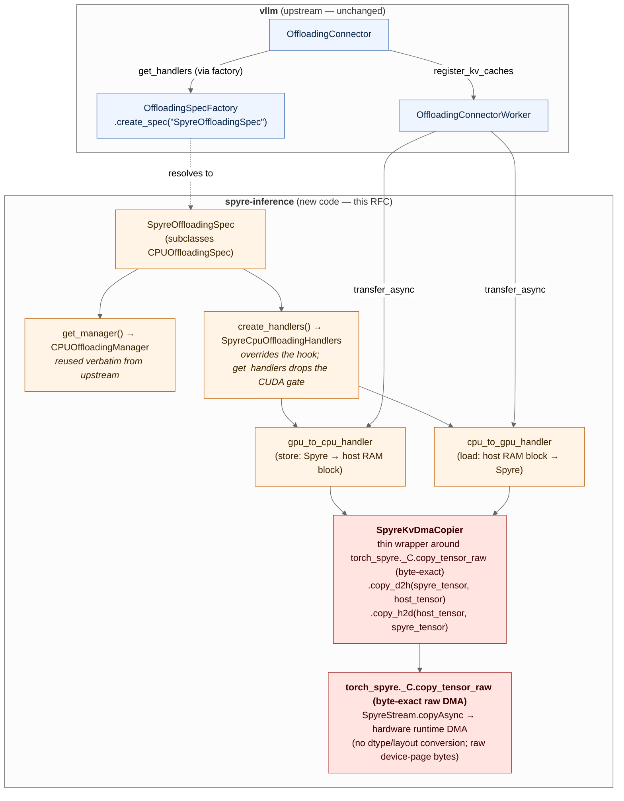
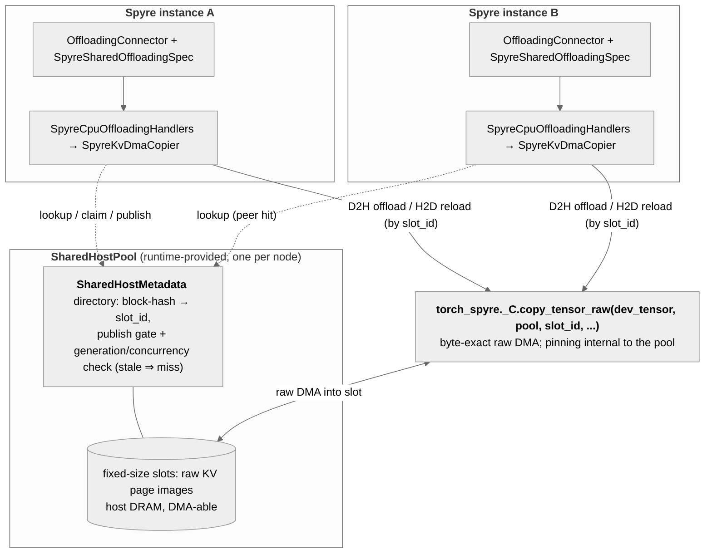

# RFC: Port the upstream KV Connector experience to spyre-inference

| Field | Value |
|---|---|
| Status | Draft |
| Authors | Chen Wang ([@wangchen615](https://github.com/wangchen615)), Yue Zhu ([@yuezhu1](https://github.com/yuezhu1)), Pravein Govindan Kannan ([@praveingk](https://github.com/praveingk)), Hubertus Franke ([@frankeh](https://github.com/frankeh)) |
| Created | 2026-06-05 |
| Updated | 2026-07-23 — M1 single-instance host offload + M2 cross-instance shared host pool; M2 realigned to the `SharedHostPool`/`SharedHostMetadata` `slot_id` surface (subclassing M1's `SpyreOffloadingSpec`, reusing its device↔host copier unchanged); both milestones depend on the byte-exact raw-copy primitive (`copy_tensor_raw`), which is not in the current pinned build; neutral terminology throughout. |
| Tracking | First design doc for [#76 — \[Epic\] Develop KVCacheConnector for Spyre](https://github.com/torch-spyre/spyre-inference/issues/76) |
| Related | vLLM `OffloadingConnector`, vLLM `TieringOffloadingSpec` (PR #40020), vLLM `tiering/fs` (PR #41735), vLLM `tiering/obj` (PR #41968), prior internal Spyre PD-disaggregation prototype |

## 1. Motivation

The upstream vLLM `OffloadingConnector` framework gives every CUDA platform three things for free:

1. A pluggable scheduler-side `OffloadingManager` that tracks where each block lives (G/H/F tiers).
2. A worker-side `OffloadingHandler` registry keyed by `(src_type, dst_type)` that performs the actual transfer.
3. An `OffloadingSpec` factory that lets out-of-tree platforms drop in their own manager + handlers without touching upstream code.

As of vLLM v0.22, this stack has grown a fourth layer — a first-class **multi-tier framework** that lets a single connector cascade across host RAM, filesystem, and object stores. This RFC does **not** build on that framework as a milestone (§3.5 keeps it as background): the fast second tier we want is a future byte-addressable, DMA-able secondary memory pool reached through the same shared-pool DMA path as M2 — not a filesystem/object `SecondaryTierManager`, so a tiering milestone would be a detour. See §2 "Goals removed."

The existing `spyre-inference` plugin has **none** of this wired up. `TorchSpyreWorker` extends `CPUWorker` and never calls `register_kv_caches`. Both the single-tier `CPUOffloadingSpec` and the new `TieringOffloadingSpec` (which subclasses `CPUOffloadingSpec`) error out on non-CUDA platforms via the `current_platform.is_cuda_alike()` check at `vllm/v1/kv_offload/cpu/spec.py:89`. So the entire upstream offload + tiering stack is unreachable from Spyre today, and the only KV-tier story we have is "the whole cache is on-device, full-stop."

Meanwhile, an earlier internal Spyre PD-disaggregation prototype has already demonstrated end-to-end KV transfer between two Spyre instances over NIXL, using a Spyre-specific device↔host copy primitive. That prototype is not packaged for vLLM's connector contract — it sits in standalone scripts that drive the model directly via `fms` — so it cannot ride the upstream connector ecosystem (LMCache, llm-d shared-storage backend, prefix caching, PD disaggregation) without an adaptor.

This RFC proposes how to combine the two: take the prototype's data-copy primitive, wrap it as an upstream-conformant `OffloadingHandler`, and register a `SpyreOffloadingSpec` so that the upstream `OffloadingConnector` works on Spyre (M1). It then makes the host tier a **cross-instance shared pool** (M2) so co-located instances reuse each other's offloaded blocks with one raw DMA and no serialization — which is also the path a future faster tier (a byte-addressable, DMA-able secondary memory pool) will take. The Spyre-specific code stops at the device↔host primary tier; the connector, manager, and factory above it are platform-agnostic upstream code.

## 2. Goals and non-goals

### Goals (M1)

- A user runs vLLM on Spyre with `--kv-transfer-config '{"kv_connector":"OffloadingConnector", "kv_connector_extra_config":{"spec_name":"SpyreOffloadingSpec","cpu_bytes_to_use":"8000000000"}}'` and gets host-RAM offload that survives across requests.
- The Spyre device↔host copy goes through one named, testable primitive (`SpyreKvDmaCopier`). For KV data the copy must be **byte-exact**: the default converting `copy_tensor` path re-encodes fp16 through the device representation and drifts ~1 ULP on about half of values (§4/§6.1), which is a correctness defect for a KV tier — so M1's copier uses the byte-exact raw copy path (`torch_spyre._C.copy_tensor_raw`), not the converting `copy_tensor`. That raw primitive is a pending torch-spyre dependency (not present in the current pinned build), so M1 is gated on it landing the same way M2 is (§6.7, §10 Q1). No earlier low-level prototype path is reused; no internal DMA-queue primitives.
- `pytest tests/v1/kv_offload/` runs the same matrix as upstream for the CPU spec, plus a Spyre-specific test that round-trips a known-pattern block device→host→device.

### Goals removed (former M1.5 — filesystem/object tiering)

An earlier draft proposed an M1.5 that registered a `SpyreTieringOffloadingSpec` over the upstream
`tiering/{fs,obj}` `SecondaryTierManager`s (host-RAM-plus-filesystem tiered offload, cross-shared via
content-hashed paths on a shared volume). **This milestone is dropped.** The fast second tier Spyre
actually wants is a future **byte-addressable, DMA-able secondary memory pool**, reached the
same way as the M2 shared host pool: through the same shared-pool DMA path as M2. It is *not* a filesystem or object
store, so it does not fit the `SecondaryTierManager` contract (which assumes a `primary_kv_view`
memoryview read/written by CPU-side store/load, not a DMA endpoint). Building the fs/obj tiering path
would therefore be throwaway work on the way to that pool. Cross-instance sharing — the real value M1.5
was reaching for — is delivered directly by **M2** (a shared host-RAM pool now, the DMA-able secondary pool later) without
a disk round-trip. The upstream tiering framework is retained only as background (§3.5) for readers
who still want an fs/obj tier as a deployment choice; it is not a milestone of this RFC.

### Goals (M2 — cross-instance shared host-memory KV pool)

M1 gives each instance its **own** host-RAM primary tier — a block offloaded by one instance is
invisible to every other. M2 makes the host tier a single **shared host KV pool** provided by the
hardware runtime and shared by every co-located Spyre instance, so a KV block offloaded by one
instance is reloaded by another with **one raw DMA and no serialization**. This is the cross-instance
sharing the dropped M1.5 was reaching for, but at memory speed and without a disk round-trip — and it
is the same shared-pool DMA path a future byte-addressable, DMA-able secondary memory pool will use.

- A user runs two `vllm serve` instances on the same host, each with `spec_name:
  "SpyreSharedOffloadingSpec"` and a shared pool config, and the second instance gets a prefix-cache
  hit on a block the first offloaded — served by a device←host DMA out of the shared pool, no
  recompute, no file I/O.
- The shared pool is a valid Spyre DMA endpoint regardless of how the runtime backs the pool, via the
  hardware runtime's raw-copy primitive exposed through torch-spyre as `copy_tensor_raw` over a
  `SharedHostPool` / `SharedHostMetadata` surface (the torch-spyre KV-offload Python-surface design).
- Torn reads under concurrent overwrite are **impossible to consume silently** — the shared directory's
  publish gate plus a generation/concurrency check means a stale or mid-write slot degrades to a cache
  miss, never to corruption.

M2 depends on lower-layer work that does not exist yet (the hardware runtime's raw-copy primitive and
its torch-spyre `copy_tensor_raw` / `SharedHostPool` / `SharedHostMetadata` bindings); §6.6 and §11
track that dependency chain. M2 is specified here so the milestone ladder is coherent, but it is gated
on those upstream pieces landing.

Items explicitly out of scope (PD disaggregation, replacing the device addressing scheme, etc.) are listed in §11 alongside their owners and follow-up plans.

## 3. Background: what the upstream `OffloadingConnector` actually requires

Three abstraction points matter on the worker side. References are to vLLM `main` at the version this fork tracks.

### 3.1 `OffloadingConnector` (`vllm/distributed/kv_transfer/kv_connector/v1/offloading_connector.py:46`)

Constructed once per role (`SCHEDULER`/`WORKER`) and delegates to `OffloadingConnectorScheduler` or `OffloadingConnectorWorker`. The worker side calls `connector_worker.register_kv_caches(kv_caches)` with the `dict[str, torch.Tensor]` that the runner has already allocated. **This is the only ingestion point for the on-device KV cache** — everything downstream operates on tensors handed in here.

### 3.2 `OffloadingSpec` (`vllm/v1/kv_offload/base.py`, verified at the pinned vLLM `v0.24.0`)

The contract a platform implements is two abstract methods (this is the `get_handlers`-based API of
`v0.24.0` — the vLLM version this plugin pins; note it is **not** the `get_worker` API on vLLM `main`):

- `get_manager() -> OffloadingManager` — scheduler-side bookkeeping (which blocks are where, eviction policy).
- `get_handlers(kv_caches) -> Iterator[tuple[type[LoadStoreSpec], type[LoadStoreSpec], OffloadingHandler]]` — yields `(src_type, dst_type, handler)`. An `OffloadingHandler` exposes `transfer_async(job_id, transfer_spec) -> bool` and `get_finished() -> list[TransferResult]`; `TransferResult(job_id, success, ...)` is the completion record.

### 3.3 `CPUOffloadingSpec` / `CpuGpuOffloadingHandlers` (`vllm/v1/kv_offload/cpu/{spec,gpu_worker}.py`, v0.24.0)

The reference CUDA implementation, and the class we subclass. Two facts (verified) shape the whole
plugin design:

- **The CUDA gate is in `CPUOffloadingSpec.get_handlers`**, which raises "CPU Offloading is currently
  only supported on CUDA-alike and XPU GPUs" unless `current_platform.is_cuda_alike() or .is_xpu()`.
  It then builds handlers via an **overridable `create_handlers()`** hook and yields
  `(GPULoadStoreSpec, CPULoadStoreSpec, handlers.gpu_to_cpu_handler)` + the reverse.
- **`CpuGpuOffloadingHandlers` is not directly reusable on Spyre** — its handlers move bytes with
  `torch.cuda.Stream` per transfer, assert `gpu_tensor.is_cuda`, call `ops.swap_blocks_batch` (a CUDA
  op), and optionally `cudaHostRegister`-pin.

So the reuse seam is clean: **override `create_handlers()`** (and drop the platform check) to return
Spyre handlers, while inheriting `get_handlers`' yield structure, `get_manager`, and the `num_blocks`
math. `TieringOffloadingSpec(CPUOffloadingSpec)` reuses that same inherited `get_handlers` for its
GPU↔CPU hop — which is what lets M2 reuse the tiering manager and change only the handlers (§6.8).

### 3.4 Dynamic spec loading (`vllm/v1/kv_offload/factory.py:21`)

`OffloadingSpecFactory.register_spec(name, module_path, class_name)` records a tuple but does **not** import the module at registration time. The actual import happens lazily in `create_spec(...)` when the user's `kv_connector_extra_config.spec_name` selects this spec. That matters for an out-of-tree platform plugin: we can register `SpyreOffloadingSpec` from `spyre_inference/__init__.py` without dragging in any Spyre-only module at vLLM import time, and CUDA-only deployments that load `spyre-inference` for unrelated reasons pay zero cost for our spec.

The same pattern applies to `SecondaryTierFactory.register_tier(...)` (`vllm/v1/kv_offload/tiering/factory.py`). Adding a new secondary tier from a third-party package — including ours, if M2 ever ships one — is a one-line registration call, not an upstream PR.

### 3.5 The v0.22 multi-tier layer

vLLM v0.22 added a multi-tier framework on top of the four pieces above:

- **`TieringOffloadingSpec`** (`vllm/v1/kv_offload/tiering/spec.py`, PR #40020) — a concrete `OffloadingSpec` that builds a `TieringOffloadingManager` over a CPU primary tier and one or more secondary tiers.
- **`SecondaryTierManager`** abstract base class (`vllm/v1/kv_offload/tiering/base.py`, PR #40020) — the contract any new tier must implement (`submit_store`, `submit_load`, `get_finished_jobs`, etc.). Cannot be instantiated directly; concrete tiers subclass it.
- **`SecondaryTierFactory`** (`vllm/v1/kv_offload/tiering/factory.py`, PR #40020) — the registry where tiers are plugged in by name (mirrors `OffloadingSpecFactory`).
- **In-tree concrete tiers:** `tiering/fs` (filesystem, PR #41735) and `tiering/obj` (object store, PR #41968), both subclassing `SecondaryTierManager`.

A deployment selects `spec_name: "TieringOffloadingSpec"` (a single spec) and lists secondary tiers in `extra_config`. The `TieringOffloadingManager` orchestrates a coherent hierarchy — primary CPU tier mmap'd via `SharedOffloadRegion`, plus one or more `SecondaryTierManager`s that read/write through a `primary_kv_view: memoryview`. Stores can cascade primary→secondary; loads can promote secondary→primary; the manager owns the bookkeeping.

This framework is **background only** for this RFC — it is not a milestone (see §2 "Goals removed").
A deployment may still select an fs/obj `SecondaryTierManager` on top of M1's `SpyreOffloadingSpec`
via upstream config if it wants a disk/object tier, but this RFC ships no Spyre-specific tiering spec:
the fast second tier we care about (a future byte-addressable, DMA-able secondary memory pool) is
served by M2's shared-pool path, not an fs/obj secondary tier.

**Historical note on the prior llm-d shape.** llm-d v0.8 deployments use a different shape that pre-dates the v0.22 multi-tier framework: `MultiConnector` stacking two independent top-level `OffloadingSpec`s — typically one Spyre/CUDA `OffloadingSpec` for device↔host plus `SharedStorageOffloadingSpec` from the in-tree `llmd_fs_backend` module in [`llm-d/llm-d-kv-cache`](https://github.com/llm-d/llm-d-kv-cache) for host↔shared-storage. The two children operate in parallel without coordination — saves fan out to both, loads return from whichever child reports a hit first. The standalone PyPI package `llmd-fs-connector` was already EOL at `==0.22`; the maintainers of `llmd_fs_backend` (its in-tree successor in `llm-d/llm-d-kv-cache`) have signaled they are retiring it in favor of the upstream `TieringOffloadingSpec` + `tiering/fs` shape. **This RFC does not target the `MultiConnector + llmd_fs_backend` shape**: it points at a moving target on the way out. The upstream-canonical replacement (`TieringOffloadingSpec` + `tiering/fs`) remains available to deployments as upstream config, but is not a milestone here — cross-instance sharing is delivered by M2's shared pool instead.

## 4. Background: device↔host copy in current torch-spyre

torch-spyre exposes a public, stream-backed copy entrypoint that handles both directions and is already in the dev-image-pinned commit (`4dcfee15c3a93446`):

```python
import torch
import torch_spyre._C as _C   # registered as a private extension; no extra deps

cpu_t   = torch.empty_like(spyre_t, device="cpu")
_C.copy_tensor(spyre_t, cpu_t, non_blocking=False)   # device → host

cpu_in  = torch.zeros(..., dtype=...)
spyre_in = torch.empty(..., device="spyre")
_C.copy_tensor(cpu_in, spyre_in, non_blocking=False) # host → device
```

`copy_tensor(src, dst, non_blocking=False)` is bound in [`torch_spyre/csrc/module.cpp:272`](https://github.com/torch-spyre/torch-spyre/blob/4dcfee15c3a9344652f067149ec65c4bf2941890/torch_spyre/csrc/module.cpp#L272) → `spyre::spyre_copy_from` ([`torch_spyre/csrc/spyre_mem.cpp:581`](https://github.com/torch-spyre/torch-spyre/blob/4dcfee15c3a9344652f067149ec65c4bf2941890/torch_spyre/csrc/spyre_mem.cpp#L581)) → `SpyreStream::copyAsync` ([`torch_spyre/csrc/spyre_stream.cpp:142`](https://github.com/torch-spyre/torch-spyre/blob/4dcfee15c3a9344652f067149ec65c4bf2941890/torch_spyre/csrc/spyre_stream.cpp#L142)) → `copyAsyncImpl`, which invokes the hardware runtime's DMA. Direction is auto-detected from `src.is_cpu()` / `src.is_privateuseone()`; no separate H2D/D2H entrypoints. With `non_blocking=False`, `spyre_copy_from` calls `stream.synchronize()` after the DMA, so callers can treat it as synchronous; `non_blocking=True` returns immediately and the caller is responsible for syncing.

**`copy_tensor` is not byte-exact for KV data, so it is not what M1 or M2 use.** The default `copy_tensor` path is a *converting* copy: a plain fp16 device↔host round-trip re-encodes into the device representation and drifts ~1 ULP on about half of the values. For a KV tier — where the whole point is to reload a block and reuse it as if it were never evicted — that drift is a correctness defect, not a rounding nicety. **Both M1 and M2 therefore require the byte-exact raw copy path** (`torch_spyre._C.copy_tensor_raw`, §6.7), a raw DMA that reproduces the device page's bytes exactly with no dtype/layout conversion. The converting `copy_tensor` merely exists today; the byte-exact raw primitive M1 and M2 both need is still pending (§10 Q1), so both milestones are gated on it landing.

M1's device↔host copy is a single raw-DMA primitive. Earlier internal Spyre prototypes drove the device DMA queues directly through internal DMA-queue primitives, addressed via device addresses parsed from a compile-time descriptor; that was an earlier low-level prototype path that existed before torch-spyre exposed a Python copy surface, and it is not reused here. With the torch-spyre copy surface available, the connector handler operates on plain `torch.Tensor` arguments and never touches those internal DMA-queue primitives or descriptor artifacts.

### 4.1 Data paths in scope

| Path | Milestone | Compose how | Notes |
|---|---|---|---|
| Spyre device ↔ host RAM (single tier) | **M1** | `OffloadingConnector` + `SpyreOffloadingSpec` | Single-tier offload; survives across requests. |
| Spyre device ↔ **shared** host-RAM pool (cross-instance, on-node) | **M2** | `OffloadingConnector` + `SpyreSharedOffloadingSpec` | Multiple co-located instances attach one shared host KV pool (`SharedHostPool`) with a shared directory (`SharedHostMetadata`); a block offloaded by one instance is reloaded by another with one raw DMA — no serialization, no disk. Device↔pool transfer is `copy_tensor_raw(dev_tensor, pool, slot_id, ...)`; the seam between the plugin and torch-spyre is an integer `slot_id` (§6.6). Reuses M1's device↔host copier unchanged. See §6.7–6.8. |
| Direct Spyre device ↔ filesystem / object store | Out of scope | n/a | Would require a Spyre-side analogue of NVIDIA GDS so a secondary tier can DMA without a host bounce. Not provided by torch-spyre today, and the upstream `SecondaryTierManager` contract assumes the `primary_kv_view` is over CPU memory; supporting this would change both. Filed as a future-work item in §11. |

M1 and M2 reuse the same device↔host copy path (§4/§6.1, §6.7); M2 only changes the host destination
from a per-instance `torch.empty` page to a slot in the shared `SharedHostPool`, named by integer
`slot_id`. A deployment that additionally wants a disk/object tier can still stack an upstream fs/obj
`SecondaryTierManager` on top of M1's `SpyreOffloadingSpec` via config, but this RFC ships no
Spyre-specific tiering spec (§2, §3.5).

## 5. Proposed architecture

<!-- Source: figures/spyre-offloading-arch.{mmd,d2}. Regenerate with:
       npx -y -p @mermaid-js/mermaid-cli@10 mmdc \
         -i docs/architecture/rfcs/figures/spyre-offloading-arch.mmd \
         -o docs/architecture/rfcs/figures/spyre-offloading-arch.svg -b transparent
       d2 docs/architecture/rfcs/figures/spyre-offloading-arch.d2 docs/architecture/rfcs/figures/spyre-offloading-arch.d2.svg
-->



<details>
<summary>Diagram sources (Mermaid at <code>figures/spyre-offloading-arch.mmd</code>; D2 at <code>figures/spyre-offloading-arch.d2</code>, rendered to <code>spyre-offloading-arch.d2.svg</code>)</summary>



</details>

Key shape: **only `SpyreCpuOffloadingHandlers` and `SpyreKvDmaCopier` are new code on the Spyre side.** Everything above (manager, factory, scheduler-side connector, eviction policies, llm-d composition) is unchanged upstream code.

### 5.1 Why we don't subclass `CpuGpuOffloadingHandlers`

The upstream class is structured around `torch.cuda.Stream`/`torch.Event`. Even ignoring the `is_cuda` assert, half the methods (`get_finished`, `wait`, `shutdown`) call `event.query()` / `event.synchronize()` / `event.elapsed_time()`. There is no "swap CUDA for Spyre" override point. A clean implementation of the same interface (`OffloadingHandler` from `vllm/v1/kv_offload/worker/worker.py`) is shorter than working around the CUDA assumptions.

### 5.2 Why we reuse `CPUOffloadingManager` verbatim

The manager is pure bookkeeping. It is keyed by `LoadStoreSpec` types, not by tensor backends, and the upstream pluggable cache policy registry (`lru`, `arc`) handles eviction. Nothing in it is CUDA-specific.

## 6. Component design

### 6.1 `SpyreKvDmaCopier`

```python
# spyre_inference/v1/kv_offload/copier.py
import torch
import torch_spyre._C as _spyre_c


class SpyreKvDmaCopier:
    """Single-purpose owner of every host↔Spyre KV byte transfer.

    Thin wrapper around torch_spyre._C.copy_tensor_raw, the byte-exact raw
    DMA bound to SpyreStream.copyAsync → the hardware runtime's raw-copy
    primitive. KV data must round-trip byte-for-byte: the converting
    copy_tensor path re-encodes fp16 through the device representation and
    drifts ~1 ULP on about half of values (§4), which is a correctness
    defect for a KV tier, so the copier uses the raw path exclusively.
    We expose two named methods purely for handler readability.
    """

    def copy_d2h(self, src_spyre: torch.Tensor, dst_host: torch.Tensor) -> None:
        # byte-exact raw DMA; no dtype/layout conversion
        _spyre_c.copy_tensor_raw(src_spyre, dst_host, to_device=False, non_blocking=False)

    def copy_h2d(self, src_host: torch.Tensor, dst_spyre: torch.Tensor) -> None:
        _spyre_c.copy_tensor_raw(dst_spyre, src_host, to_device=True, non_blocking=False)
```

Constraints:

- Both methods are synchronous (`non_blocking=False` causes `spyre_copy_from` to call `stream.synchronize()` after the DMA). M1 does not pursue async overlap; an async path is a follow-up tracked in §11 ("Async DMA on Spyre").
- Neither method allocates. The handler caller owns allocation.
- A single instance is shared across both directions; the class holds no state beyond the bound `_C.copy_tensor_raw` reference, so it is effectively a namespace.

Why a class at all instead of inlining `_C.copy_tensor_raw` into the handler? Two reasons. First, the `OffloadingHandler` shouldn't import `torch_spyre._C` directly — keeping the device-side primitive behind one wrapper means tests can monkey-patch `SpyreKvDmaCopier` without touching the C extension. Second, if torch-spyre later adds an async or batched copy entrypoint, swapping `SpyreKvDmaCopier`'s implementation is a one-file change; everything above it stays unchanged.

### 6.2 `SpyreCpuOffloadingHandlers`

Mirrors upstream `CpuGpuOffloadingHandlers`' shape (same `gpu_to_cpu_handler` / `cpu_to_gpu_handler`
attribute names, so `get_handlers` yields them exactly as the parent does):

```python
# spyre_inference/v1/kv_offload/handlers.py
class SpyreCpuOffloadingHandlers:
    def __init__(self,
                 kv_caches: CanonicalKVCaches,
                 block_size_factor: int,
                 num_cpu_blocks: int,
                 copier: SpyreKvDmaCopier,
                 pool=None): ...             # M2 passes the SharedHostPool; M1 leaves None

    @property
    def gpu_to_cpu_handler(self) -> OffloadingHandler: ...   # store: Spyre → host
    @property
    def cpu_to_gpu_handler(self) -> OffloadingHandler: ...   # load:  host → Spyre
```

Each direction is a `_SingleDirectionSpyreHandler(OffloadingHandler)` implementing the v0.24.0
contract:

1. `transfer_async(job_id, transfer_spec) -> bool` — walk the block-id pairs in `transfer_spec` and call `copier.copy_{d2h,h2d}` for each.
2. `get_finished() -> list[TransferResult]` — return `TransferResult(job_id, success=...)` records; synchronous today, so every submitted job is already done.
3. `shutdown()` clears references to the registered tensors.

Host-side destinations differ by milestone. When `pool is None` (M1), a
`torch.zeros(num_cpu_blocks, cpu_page_bytes, int8)` per attention group is the process-local host page,
exactly as upstream `CpuGpuOffloadingHandlers` builds it (verified at v0.24.0). When a `SharedHostPool`
is supplied (M2), the host destination is a fixed-size pool slot named by integer `slot_id`, and the
copier's raw DMA targets that slot via `copy_tensor_raw(dev_tensor, pool, slot_id, ...)` (§6.7–6.8).
Crucially, the M2 device↔host copy path is the M1 path **unchanged** — the only difference is the host
destination is a pool slot rather than a `torch.empty` page. Pinning is **internal to the pool**: there
is no Python-level host-buffer registration and no raw host pointer or device address crosses into
Python (a hard runtime requirement). There is no `cudaHostRegister` on Spyre — there is no equivalent,
and none is needed because the runtime owns pinning inside `SharedHostPool`.

### 6.3 `SpyreOffloadingSpec`

Subclass `CPUOffloadingSpec` and override the two things that are CUDA-coupled: the `create_handlers()`
hook (return Spyre handlers) and the platform gate in `get_handlers`. Everything else — the
`num_blocks`-from-`cpu_bytes_to_use` `__init__` math and `get_manager` (the upstream
`CPUOffloadingManager`) — is inherited unchanged.

```python
# spyre_inference/v1/kv_offload/spec.py
class SpyreOffloadingSpec(CPUOffloadingSpec):
    def __init__(self, vllm_config, kv_cache_config):
        super().__init__(vllm_config, kv_cache_config)   # computes self.num_blocks, block_size_factor
        self._copier = SpyreKvDmaCopier()

    # get_manager: inherited from CPUOffloadingSpec (reuse the upstream manager verbatim).

    def create_handlers(self, kv_caches):                # the overridable hook CPUOffloadingSpec exposes
        return SpyreCpuOffloadingHandlers(
            kv_caches=kv_caches,
            block_size_factor=self.block_size_factor,
            num_cpu_blocks=self.num_blocks,
            copier=self._copier,
        )

    def get_handlers(self, kv_caches):
        # Same as the parent, minus the is_cuda_alike()/is_xpu() gate.
        if not self._handlers:
            self._handlers = self.create_handlers(kv_caches)
        yield GPULoadStoreSpec, CPULoadStoreSpec, self._handlers.gpu_to_cpu_handler
        yield CPULoadStoreSpec, GPULoadStoreSpec, self._handlers.cpu_to_gpu_handler
```

`GPULoadStoreSpec` is the upstream "device-side" type — a tag, not CUDA-specific (named so for
historical reasons), so we use it for Spyre. Subclassing `CPUOffloadingSpec` (not `OffloadingSpec`
directly) also gives M2's `SpyreSharedOffloadingSpec` a clean base: it subclasses **this M1 spec**
(§6.8) and reuses the same `get_handlers` yield structure and `create_handlers` hook, changing only
the host destination from a process-local page to a `SharedHostPool` slot.

### 6.4 Filesystem/object tiering — not a milestone

An earlier draft specified a `SpyreTieringOffloadingSpec` here (a sibling of upstream
`TieringOffloadingSpec` that skipped the `is_cuda_alike()` gate and reused `TieringOffloadingManager`
+ `SecondaryTierFactory` over an fs/obj tier). It has been **removed** (§2 "Goals removed"): the fast
second tier we want is a future byte-addressable, DMA-able secondary memory pool served by M2's
shared-pool path, not an fs/obj `SecondaryTierManager`. A deployment that wants a disk/object tier can
still select upstream `TieringOffloadingSpec` + `tiering/{fs,obj}` on top of M1's `SpyreOffloadingSpec`
via config — no Spyre-specific spec is needed for that, and none is shipped here.

### 6.5 Registration

In `spyre_inference/__init__.py`, after the existing platform plugin registration:

```python
from vllm.v1.kv_offload.factory import OffloadingSpecFactory

OffloadingSpecFactory.register_spec(
    "SpyreOffloadingSpec",
    "spyre_inference.v1.kv_offload.spec",
    "SpyreOffloadingSpec",
)

# Added in M2:
OffloadingSpecFactory.register_spec(
    "SpyreSharedOffloadingSpec",
    "spyre_inference.v1.kv_offload.shared_spec",
    "SpyreSharedOffloadingSpec",
)
```

This mirrors how the upstream CPU spec is registered. No changes to `TorchSpyrePlatform`, no changes to `TorchSpyreWorker` — the connector is selected by `kv-transfer-config` at engine init.

### 6.6 Worker-side glue

`OffloadingConnectorWorker.register_kv_caches` is invoked by the engine after `_allocate_kv_cache_tensors` returns. This already happens through the upstream `KVConnectorBase_V1` machinery — **no plugin change is needed** as long as the tensors `_allocate_kv_cache_tensors` returns are real `torch.Tensor` objects on `device("spyre")`. They are: see `spyre_model_runner.py:339–345` (`device="spyre"`).

The one thing we have to verify in implementation is that `OffloadingConnectorWorker` does not assert tensor device type before handing the `kv_caches` dict to our spec. If it does, we fix that in upstream vLLM with a one-liner.

### 6.7 M2 — the shared host pool surface (`SharedHostPool` / `SharedHostMetadata` / `copy_tensor_raw`)

M1's `SpyreKvDmaCopier` already does a byte-exact raw DMA between a device page and a host destination
(§6.1). M2 keeps that copy path unchanged and only changes the host destination to a slot in a shared
host KV pool provided by the hardware runtime. torch-spyre exposes that pool to Python as two objects
(the torch-spyre KV-offload Python-surface design):

```python
# torch_spyre (M2 dependency — not in the current pinned build)

class SharedHostPool:
    """A DMA-able shared-memory pool of fixed-size slots. Pinning is internal."""
    @classmethod
    def create_or_attach(cls, stream, name: str, num_slots: int, slot_bytes: int) -> "SharedHostPool": ...
    def slot_count(self) -> int: ...
    def slot_bytes(self) -> int: ...

class SharedHostMetadata:
    """A shared directory: block-hash → slot_id. Concurrency-safe."""
    def lookup(self, block_hash) -> int | None: ...   # slot_id or miss
    def claim(self, block_hash) -> int: ...           # reserve a slot for a store
    def publish(self, block_hash, slot_id) -> None: ...
    def evict(self, block_hash) -> None: ...

# The device↔pool byte transfer — byte-exact raw DMA, runtime owns the copy size.
def copy_tensor_raw(dev_tensor: torch.Tensor, pool: SharedHostPool, slot_id: int,
                    to_device: bool, non_blocking: bool = False) -> None: ...
```

`copy_tensor_raw` is a **byte-exact raw DMA** between a `device("spyre")` KV page tensor and a pool
slot named by integer `slot_id` — no dtype/layout conversion. The **runtime owns the copy size** (the
padded/tiled physical size, not `numel * itemsize`), the chunking, and the byte-identical-layout
invariant; the plugin does not compute byte counts. The **seam** between the plugin and torch-spyre is
that integer `slot_id` (plus a tensor): **raw host pointers and device addresses never cross into
Python** — a hard runtime requirement — and there is no Python-level host-buffer registration, because
pinning is internal to the pool. The M2 `SpyreKvDmaCopier` reuses its M1 `copy_d2h` / `copy_h2d`
methods against `copy_tensor_raw`; the only added argument is `(pool, slot_id)` in place of a
torch-owned host tensor.

### 6.8 M2 — `SpyreSharedOffloadingSpec`: the shared host pool design

M2 makes the host tier a **single shared host KV pool shared by every co-located instance**, instead
of M1's per-instance `torch.empty` host blocks. There is **one design**: the pool is a `SharedHostPool`
of fixed-size slots with a `SharedHostMetadata` directory, both provided by the hardware runtime
through torch-spyre (§6.7), and the plugin names each offloadable slot by an integer `slot_id`.

**`SpyreSharedOffloadingSpec` subclasses M1's `SpyreOffloadingSpec`.** It reuses M1's
`SpyreCpuOffloadingHandlers` / `SpyreKvDmaCopier` device↔host path **unchanged** — the only difference
is the host destination is a pool slot, not a process-local `torch.empty` page. Its manager names each
offloadable block by content hash (exactly as vLLM's prefix cache already computes it), maps that hash
to a pool `slot_id` via `SharedHostMetadata` (`claim` on store, `lookup` on load), and honors
`publish` / `evict` and the directory's concurrency guarantees:

```python
# spyre_inference/v1/kv_offload/shared_spec.py
from spyre_inference.v1.kv_offload.spec import SpyreOffloadingSpec
from torch_spyre import SharedHostPool, SharedHostMetadata

class SpyreSharedOffloadingSpec(SpyreOffloadingSpec):
    """Cross-instance shared host KV pool on Spyre.

    Subclasses M1's SpyreOffloadingSpec and reuses its handlers + copier
    unchanged. The ONLY difference from M1 is the host destination: a slot
    in a runtime-provided SharedHostPool, named by integer slot_id via a
    shared SharedHostMetadata directory (block-hash -> slot_id), instead of
    a process-local torch.empty page. Two instances attaching the same
    named pool + directory see the same slots.
    """
    def __init__(self, vllm_config, kv_cache_config):
        super().__init__(vllm_config, kv_cache_config)
        cfg = self.shared_pool                       # {name, num_slots, slot_bytes}
        self._pool = SharedHostPool.create_or_attach(
            stream=..., name=cfg.name,
            num_slots=cfg.num_slots, slot_bytes=cfg.slot_bytes,
        )
        self._directory = SharedHostMetadata(...)    # attaches the same named directory

    def create_handlers(self, kv_caches):            # M1's hook; only the host dest changes
        return SpyreCpuOffloadingHandlers(
            kv_caches=kv_caches, block_size_factor=self.block_size_factor,
            num_cpu_blocks=self._pool.slot_count(), copier=self._copier,
            pool=self._pool,                         # host slots come from the shared pool
        )
    # get_handlers: inherited from SpyreOffloadingSpec (§6.3) — drops the CUDA gate.
```

**Store / load.** On store, the manager `claim`s a `slot_id` for the block's content hash, the copier
D2H-DMAs the device page into that slot via `copy_tensor_raw(dev_tensor, pool, slot_id, to_device=False)`,
and — only after the DMA has synchronized — the directory `publish`es the hash→slot mapping. On load,
the manager `lookup`s the content hash; a hit yields a `slot_id`, which the copier H2D-DMAs back into a
device page via `copy_tensor_raw(dev_tensor, pool, slot_id, to_device=True)`. The runtime owns the copy
size and the byte-identical-layout invariant, so a stored slot restores byte-for-byte.

**Cross-instance sharing.** Two instances that attach the same named pool + directory see the same
slots. A block instance A stores and publishes is discoverable by instance B's `lookup` on the same
content hash, and loaded via the same raw copy — no recompute, no serialization, no disk. The
instances must agree on the hash seed (as vLLM prefix caching already requires).

**Torn reads.** A stale or mid-write slot degrades to a cache **miss, never torn bytes**: the
directory's publish gate plus a generation/concurrency check means a reader only ever observes a slot
whose write has been published, and a slot reused mid-copy fails the check and is treated as a miss.
This correctness property is now **owned by the runtime directory** — the plugin holds no host
pointers, no device addresses, and no lock of its own; it names slots by integer and passes tensors.

**Dependency gating.** M2 is gated on the runtime + torch-spyre surface — `copy_tensor_raw`,
`SharedHostPool`, and `SharedHostMetadata` — landing. These are **external prerequisites, not present
in the current pinned build**; §7 and §11 track them. M2 is specified here so the milestone ladder is
coherent, but it cannot ship until they land.

The shared-pool topology — two co-located instances attaching one node-local `SharedHostPool` +
`SharedHostMetadata` via `SpyreSharedOffloadingSpec` (subclassing M1's `SpyreOffloadingSpec`), each
DMA-ing into a slot with `copy_tensor_raw(dev_tensor, pool, slot_id, ...)`:

<!-- Source: figures/spyre-shared-pool-m2.{mmd,d2}. Regenerate with:
       npx -y -p @mermaid-js/mermaid-cli@10 mmdc -i docs/architecture/rfcs/figures/spyre-shared-pool-m2.mmd \
         -o docs/architecture/rfcs/figures/spyre-shared-pool-m2.svg -b transparent
       d2 docs/architecture/rfcs/figures/spyre-shared-pool-m2.d2 docs/architecture/rfcs/figures/spyre-shared-pool-m2.d2.svg -->


<!-- NOTE: the SVG below is stale and must be regenerated from the updated .mmd/.d2 sources (labels changed to SharedHostPool / SharedHostMetadata / slot_id / copy_tensor_raw). -->


<details>
<summary>Diagram sources (Mermaid at <code>figures/spyre-shared-pool-m2.mmd</code>; D2 at <code>figures/spyre-shared-pool-m2.d2</code>, rendered to <code>spyre-shared-pool-m2.d2.svg</code>)</summary>



</details>

## 7. File-by-file plan

### M1 files

New files in `spyre_inference/v1/kv_offload/`:

| File | Purpose | Approx LOC |
|---|---|---|
| `__init__.py` | empty | 0 |
| `copier.py` | `SpyreKvDmaCopier` (thin wrapper around the byte-exact `torch_spyre._C.copy_tensor_raw`) | ~30 |
| `handlers.py` | `SpyreCpuOffloadingHandlers`, `_SingleDirectionSpyreHandler` | ~180 |
| `spec.py` | `SpyreOffloadingSpec` | ~70 |

Modified files:

| File | Change |
|---|---|
| `spyre_inference/__init__.py` | Add `OffloadingSpecFactory.register_spec(...)` call for `SpyreOffloadingSpec`. |
| `pyproject.toml` | Bump the torch-spyre pin to one that exposes the byte-exact `torch_spyre._C.copy_tensor_raw` (the converting `copy_tensor` in the current pin is not byte-exact for KV data — §4/§6.1). |

New tests in `tests/v1/kv_offload/`:

| File | Coverage |
|---|---|
| `test_copier_round_trip.py` | Allocate a Spyre tensor with a known fp16 pattern, copy d2h, mutate host copy, copy h2d, assert content. Skipped if `device("spyre")` not available (CI gating already exists for other Spyre tests). |
| `test_spec_registration.py` | Import `spyre_inference`, then `OffloadingSpecFactory.create_spec(...)` resolves. Pure-CPU test — no Spyre device required. |
| `test_handler_dispatch.py` | Exercise the handlers' `transfer_async` (`gpu_to_cpu_handler` / `cpu_to_gpu_handler`) against block-id specs and assert the correct content lands and `get_finished` reports success. |

### M2 files (cross-instance shared pool — gated on §6.7 external deps)

M2 depends on the runtime + torch-spyre surface `copy_tensor_raw` / `SharedHostPool` /
`SharedHostMetadata` (the torch-spyre KV-offload Python-surface design), which does not exist in the
current pinned build. The M2 files are a thin spec + registration over the reused M1 device↔host path:

| File | Purpose | Approx LOC |
|---|---|---|
| `spyre_inference/v1/kv_offload/shared_spec.py` | `SpyreSharedOffloadingSpec(SpyreOffloadingSpec)` — attach a `SharedHostPool` + `SharedHostMetadata`, map block-hash → `slot_id` (`claim` on store, `lookup` on load, `publish`/`evict`), and override only `create_handlers` to point the reused M1 handlers at the pool. Reuses M1's copier/handlers device↔host path unchanged. | ~90 |
| `spyre_inference/__init__.py` | Add a third `OffloadingSpecFactory.register_spec(...)` for `SpyreSharedOffloadingSpec`. | +5 |
| `pyproject.toml` | Bump the torch-spyre pin to one that exposes `copy_tensor_raw` + `SharedHostPool` / `SharedHostMetadata`. | +1 |
| `tests/v1/kv_offload/test_shared_pool_round_trip.py` | Spyre-gated shared-pool round-trip: store a known-pattern device page into a pool slot (`claim` + D2H `copy_tensor_raw`, `publish`), then `lookup` + H2D `copy_tensor_raw` into a fresh page and assert byte-exact content; also assert a mid-write slot degrades to a miss via the directory gate (torn-read safety). | ~120 |
| `tests/v1/kv_offload/test_cross_instance.py` | Two-process cross-instance test: process A stores+publishes a block into the shared pool; process B, attaching the same named pool + directory, `lookup`s the same content hash and reloads it — asserts a cross-instance hit and byte-identical reload. | ~140 |

## 8. Compatibility with existing connectors and tiers

The seam that matters:

1. **Device↔host hop** — `OffloadingSpec.get_handlers`. M1 makes this work on Spyre by registering `SpyreCpuOffloadingHandlers`; M2 keeps the same handler and swaps the host buffer for a shared, DMA-registered pool.

After M1 ships (and M2 for the shared pool), the following work on Spyre **without further Spyre-specific plugin code**:

- **Single-tier host-RAM offload** (M1) — via `SpyreOffloadingSpec`. Same prefix-cache semantics as the upstream CPU spec on CUDA.
- **Cross-instance shared host-RAM pool** (M2) — via `SpyreSharedOffloadingSpec`; on-node, memory-speed, no serialization.
- **`tiering/fs` / `tiering/obj` secondary tiers as a deployment choice** — a user can stack upstream `TieringOffloadingSpec` + `tiering/{fs,obj}` on top of M1's `SpyreOffloadingSpec` via config if they want a disk/object tier. This RFC ships no Spyre-specific tiering spec for it (§2, §3.5): the intended fast tier is a future byte-addressable, DMA-able secondary memory pool, served by M2's DMA path, not an fs/obj `SecondaryTierManager`. With matching `PYTHONHASHSEED`, two instances on a shared `root_dir` still cross-share via the upstream content-hashed `FileMapper`.
- **LMCache connectors that route through the `OffloadingHandler` device↔host seam** — M1 alone is enough. LMCache ships several connector flavors, not all of which use this seam (some implement their own CUDA copy path); M1 supports the ones that do, and the others would need an LMCache-side change to swap their device↔host hop for `SpyreKvDmaCopier` (§11).

The only connector that does **not** drop in is anything that requires async copy semantics (e.g. CUDA-graph-capturable transfers) — the M1/M2 handlers are synchronous today (§11 "Async DMA on Spyre").

## 9. Migration: from the prior PD prototype to upstream

For users currently running the prior standalone NIXL demo, the migration shape is:

| Today (prior prototype) | After this RFC |
|---|---|
| Standalone `demo.py --role prefill/decode` | `vllm serve --kv-transfer-config '{"kv_connector":"OffloadingConnector",...}'` on each side |
| Prototype's accessor driven directly from script | `SpyreKvDmaCopier` driven by the handler |
| Custom NIXL connector module | Upstream `NixlConnector` does the cross-host hop after the device→host hop is in place |
| Cross-instance sharing via custom router copies | Built-in via M2's shared host-RAM pool (on-node, memory-speed, no serialization). A shared-volume disk tier remains available as an upstream `tiering/fs` deployment choice if wanted. |
| device addresses resolved from a compile-time descriptor | Same — until torch-spyre exposes a stable descriptor (filed separately) |

The PD-disaggregation half of the prior prototype (custom NIXL connector and `CpuBufferManager`) is out of scope for this RFC — see §11 for the follow-up plan.

## 10. Open questions

1. **Device↔host primitive — the byte-exact raw copy is still pending.** A *converting* copy entrypoint (`torch_spyre._C.copy_tensor`) is bound in the current pinned torch-spyre commit and routes through `SpyreStream::copyAsync`. But for KV data it is **not** the primitive M1 needs: the converting path re-encodes fp16 through the device representation and drifts ~1 ULP on about half of the values (§4/§6.1), which is a correctness defect for a KV tier. M1 (and M2) require the **byte-exact raw copy** `copy_tensor_raw`, which reproduces the device page's bytes exactly with no dtype/layout conversion and lets the runtime own the copy size. That raw primitive is **not in the current pinned build** — it is the external prerequisite both milestones are gated on. The earlier debate about low-level DMA fallbacks vs. unmerged accessors is no longer relevant; the open item is landing the byte-exact raw copy, not the converting copy that merely exists.
2. **`OffloadingConnectorWorker` device assertions.** Does any code in the worker path call `.is_cuda` on the registered tensors? A quick grep at implementation time will tell us; if so, we land a one-liner upstream.
3. **TP > 1.** `SpyreCommunicator` currently only supports TP=2. The connector handler operates per-rank, so TP>1 should be transparent, but we should verify the `kv_caches` dict the worker hands us at TP=2 contains exactly the local-rank slice. (It does on CUDA; we expect the same on Spyre because both go through the same upstream allocator.)
4. **Block alignment.** Spyre's `_allocate_kv_cache_tensors` rounds `num_blocks` up to a multiple of 64 (`spyre_model_runner.py:336`). The upstream `block_size_factor` machinery assumes the GPU/device block count and the offloaded block count are integer-related, which holds, but the alignment slack means a few blocks at the end are unusable. We should document this in the spec and not try to "use" the alignment slack on the host side.
5. **`SpyreOffloadingSpec` parent class.** Two viable bases: subclass `OffloadingSpec` directly (clean, but we duplicate the ~30 lines of `__init__` math from `CPUOffloadingSpec` that compute `num_blocks` from `cpu_bytes_to_use`); or subclass `CPUOffloadingSpec` and override `get_handlers` to skip the `is_cuda_alike()` gate (less duplication, but inherits a parent that documents itself as CUDA-only). The implementation will pick one once we see how much of `CPUOffloadingSpec` is genuinely CUDA-coupled vs. just gated. M2's `SpyreSharedOffloadingSpec` subclasses this M1 spec, so the choice cascades.
6. **Host block allocation for M2.** M1's `SpyreCpuOffloadingHandlers` builds host-side block tensors with `torch.empty` (per-instance, unshared) when `pool is None`. M2 instead passes the handlers a runtime-provided `SharedHostPool`, and the host destination becomes a fixed-size pool slot named by integer `slot_id` (§6.7–6.8). The handlers' `pool` parameter (§6.2) is the seam; they self-allocate a process-local page only when it is `None`. The plugin holds no host pointers or device addresses — pinning is internal to the pool.

## 11. Out of scope (filed as follow-ups)

- **Public Spyre device↔host primitive for third-party connectors.** Promote `spyre_inference.v1.kv_offload.copier.SpyreKvDmaCopier` to a stable, documented import surface so out-of-tree connectors that today target CUDA's `swap_blocks_batch` / `cudaMemcpy` can swap their device↔host hop for Spyre by importing one symbol. M1 builds the primitive; a later commit stabilizes its API and documents it. (Raised by [@yuezhu1](https://github.com/yuezhu1) on the M1 draft. Note: cross-instance *sharing* of the host pool is now a first-class milestone — see M2 in §2 / §6.7–6.8 — which is distinct from this connector-reuse item; the raw-copy primitive M2 adds is the natural thing to stabilize here.)
- **Direct device ↔ filesystem / object store.** Would need a Spyre-side analogue of NVIDIA GDS so a secondary tier can read/write device memory without a host bounce. Requires both a torch-spyre primitive and a contract change to upstream's `SecondaryTierManager` (which today takes a `primary_kv_view: memoryview` over CPU memory). Tracked separately. (Raised by [@yuezhu1](https://github.com/yuezhu1).)
- **PD disaggregation on Spyre.** Standalone RFC, builds on M1. Every component PD needs *except* the cross-host transport is delivered by M1 — the follow-up is purely about wiring a NIXL agent into the upstream PD producer/consumer connectors. The prior prototype's NIXL connector and `CpuBufferManager` get two *hosts* exchanging CPU tensors over the network; M1 makes the device→host hop stand on its own, so that NIXL adapter can be lifted into a PD-specific RFC without re-doing the device-side work.
- **Async DMA on Spyre.** Depends on torch-spyre exposing a stream/event API. Until then, the synchronous handler is fine for offload/prefetch but precludes overlap with compute.
- **Stable on-device KV descriptor.** Depends on torch-spyre. The M1/M2 raw copy operates on `at::Tensor` allocations directly (no explicit device-address addressing in Python). Filed separately for the future case where a Spyre-side direct-storage path needs a descriptor independent of an allocated tensor.
- **Authoring a new secondary tier.** Anything that does not slot into an existing `SecondaryTierManager` (e.g. a Spyre-to-Spyre direct fabric tier) is a separate design, not a milestone of this RFC.

## 12. Acceptance criteria

Each milestone's acceptance is a literal `vllm serve` invocation a deployment engineer can run, plus the observable behavior that confirms it works.

### M1 acceptance

**A1.1 — single-tier host-RAM offload runs end-to-end.**

```bash
vllm serve <model> --kv-transfer-config '{
  "kv_connector": "OffloadingConnector",
  "kv_role": "kv_both",
  "kv_connector_extra_config": {
    "spec_name": "SpyreOffloadingSpec",
    "cpu_bytes_to_use": 8000000000,
    "lazy_offload": true
  }
}'
```

- [ ] Server boots. `OffloadingConnectorWorker.register_kv_caches` is reached on the Spyre worker without raising.
- [ ] A two-prompt sweep where the second prompt extends the first by ≥256 tokens reports a host-tier hit on the second prompt. Concretely: the worker log emits `OffloadingConnectorWorker: loading N blocks from host` (or the same `kv_offload_blocks_loaded` counter exposed by `OffloadingConnectorScheduler.get_metrics()` in v0.22, depending on which interface the deployment scrapes) with `N > 0`. Either source is sufficient — pick one in the test harness.
- [ ] With `temperature=0`, generated tokens for both prompts are byte-identical to a baseline run with the same model and `--kv-transfer-config` omitted. (No tolerance — `temperature=0` is deterministic.)

**A1.2 — plugin-side test suite green.**

- [ ] `pytest spyre_inference/tests/v1/kv_offload/test_copier_round_trip.py` passes on a Spyre runner.
- [ ] `pytest spyre_inference/tests/v1/kv_offload/test_spec_registration.py` and `test_handler_dispatch.py` pass on CPU-only runners.

**A1.3 — no plugin-platform-side regressions.**

- [ ] No source changes required to `TorchSpyreWorker` or `TorchSpyrePlatform` for M1 to land. (If we have to change them, the RFC's premise is wrong — pause and revise.) Verified by inspecting the M1 PR diff: `spyre_inference/v1/worker/` and `spyre_inference/platform.py` are unchanged.
- [ ] The existing Spyre platform/worker test suite (`pytest spyre_inference/tests/ -k 'not kv_offload'`) passes both with `SpyreOffloadingSpec` registered (M1 default after `spyre_inference` is imported) and with the connector unselected (no `--kv-transfer-config`). Same suite, two configs, both green — confirms registration alone has no effect when the connector isn't selected.
- [ ] `bash format.sh` clean. (`format.sh` at the repo root is this repo's lint wrapper around `uvx prek`; runs `--all-files` if no arg is given.)

### M2 acceptance

M2 is gated on the §6.7 external dependencies (the hardware runtime's raw-copy primitive and its
torch-spyre bindings — `copy_tensor_raw`, `SharedHostPool`, `SharedHostMetadata`), which are **not
present in the current pinned build**. Acceptance below assumes those have landed on the pinned dev
image.

**A2.1 — cross-instance shared-pool hit runs end-to-end.**

```bash
# Two instances on the same host, same shared pool (name/num_slots/slot_bytes).
vllm serve <model> --kv-transfer-config '{
  "kv_connector": "OffloadingConnector",
  "kv_role": "kv_both",
  "kv_connector_extra_config": {
    "spec_name": "SpyreSharedOffloadingSpec",
    "cpu_bytes_to_use": 8000000000,
    "shared_pool": {"name": "/kv.<model-id>", "num_slots": 4096, "slot_bytes": 262144}
  }
}'
```

- [ ] Both instances boot; each attaches the same `shared_pool` (`SharedHostPool.create_or_attach`) and
      the same `SharedHostMetadata` directory. Pinning is internal to the pool — the plugin passes no
      host pointer and does no per-transfer registration.
- [ ] Instance A serves a prompt (offloads its prefix into the shared pool: `claim` a `slot_id`, D2H
      `copy_tensor_raw`, `publish`). Instance B, started with the same `shared_pool`, serves a prompt
      sharing the first ≥256 tokens and reports a host-tier hit **on its first request** (no warmup on
      B) — B `lookup`s the same content hash, gets the `slot_id`, and reloads via H2D `copy_tensor_raw`,
      not recompute and not disk.
- [ ] With `temperature=0`, B's tokens are byte-identical to a no-cache baseline.

**A2.2 — copy correctness and torn-read safety.**

- [ ] Byte-exact round-trip: a device KV page snapshotted D2H into a pool slot and restored H2D into a
      different same-`(shape,dtype)` page reproduces the pattern **byte-for-byte** (`copy_tensor_raw` is
      byte-exact; the converting `copy_tensor` would drift ~1 ULP and is not used). The runtime owns the
      copy size (the padded/tiled physical size, not `numel*itemsize`).
- [ ] Torn-read safety: while a reader copies a slot, the owner evicts and re-DMAs it; assert no torn
      read is consumed — the `SharedHostMetadata` publish gate plus its generation/concurrency check
      means a stale or mid-write slot degrades to a **cache miss, never torn bytes**, under concurrent
      multi-instance load. This is owned by the runtime directory, not the plugin.

**A2.3 — no regression, dependency honesty.**

- [ ] The M1 (`SpyreOffloadingSpec`) path is unaffected; `pytest spyre_inference/tests/v1/kv_offload/` green.
- [ ] `SpyreSharedOffloadingSpec` registration is inert when not selected (importing `spyre_inference`
      on a build without the M2 torch-spyre surface must not error — the spec import is lazy via the
      factory, as in §3.4).
- [ ] `SpyreSharedOffloadingSpec` reuses M1's `SpyreCpuOffloadingHandlers` / `SpyreKvDmaCopier`
      device↔host path unchanged — the only difference from M1 is the host destination is a pool slot
      named by integer `slot_id`, not a process-local `torch.empty` page. The plugin holds no host
      pointers or device addresses.

## 13. References

- Upstream `OffloadingConnector`: `vllm/distributed/kv_transfer/kv_connector/v1/offloading_connector.py`
- Upstream `OffloadingSpec`: `vllm/v1/kv_offload/base.py:319`
- Upstream CPU spec (CUDA-only today): `vllm/v1/kv_offload/cpu/spec.py`
- Upstream factory: `vllm/v1/kv_offload/factory.py:21`
- Upstream tiering framework (PR #40020, merged 2026-05-13): `vllm/v1/kv_offload/tiering/{base,manager,spec,factory}.py`
- Upstream FS secondary tier (PR #41735, merged 2026-05-24): `vllm/v1/kv_offload/tiering/fs/manager.py`
- Upstream object-store secondary tier (PR #41968, merged 2026-06-05): `vllm/v1/kv_offload/tiering/obj/`
- Upstream `SharedOffloadRegion`: `vllm/v1/kv_offload/cpu/shared_offload_region.py`
- Upstream `FileMapper` (content-hashed paths): `vllm/v1/kv_offload/file_mapper.py`
- Upstream `OffloadingConnector` user-facing usage guide (single- and multi-tier): [vllm-project/vllm#44415](https://github.com/vllm-project/vllm/pull/44415) — adds `docs/features/kv_offloading_usage.md`, the canonical end-user reference for the M1 offload shape (and for the optional upstream fs/obj tiering a deployment may still stack on top).
- Prior llm-d shape (historical context, see §3.5): [`llm-d/llm-d-kv-cache`](https://github.com/llm-d/llm-d-kv-cache) — `llmd_fs_backend` / `SharedStorageOffloadingSpec`. Not targeted by this RFC; included for readers migrating from existing llm-d v0.8 deployments.
- Spyre KV allocation today: `spyre_inference/v1/worker/spyre_model_runner.py:322–368`
- **M2 lower layers (external prerequisites, not yet in the pinned build):** the hardware-runtime shared-host-pool design (the runtime's byte-exact raw-copy primitive over a shared host memory pool) → the torch-spyre KV-offload Python-surface design (`copy_tensor_raw`, `SharedHostPool`, `SharedHostMetadata`).
