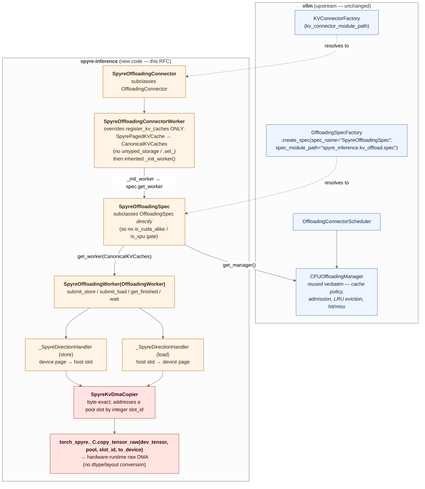
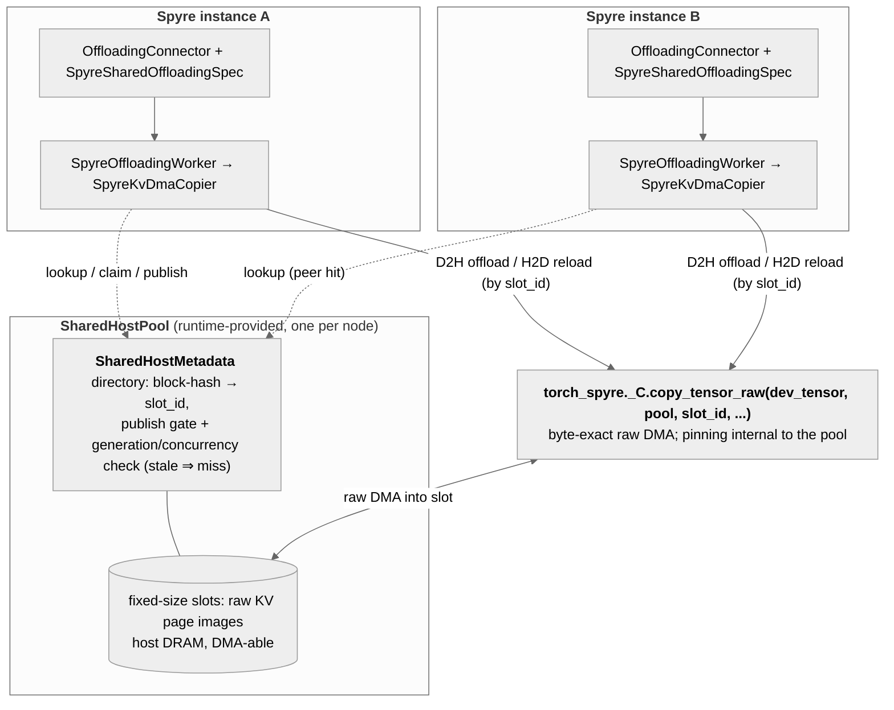

# RFC: Port the upstream KV Connector experience to spyre-inference

| Field | Value |
|---|---|
| Status | Draft |
| Authors | Chen Wang ([@wangchen615](https://github.com/wangchen615)), Yue Zhu ([@yuezhu1](https://github.com/yuezhu1)), Pravein Govindan Kannan ([@praveingk](https://github.com/praveingk)), Hubertus Franke ([@frankeh](https://github.com/frankeh)) |
| Created | 2026-06-05 |
| Tracking | First design doc for [#76 — \[Epic\] Develop KVCacheConnector for Spyre](https://github.com/torch-spyre/spyre-inference/issues/76) |
| Related | vLLM `OffloadingConnector`, vLLM `TieringOffloadingSpec` (PR #40020), vLLM `tiering/fs` (PR #41735), vLLM `tiering/obj` (PR #41968), prior internal Spyre PD-disaggregation prototype |

## 1. Motivation

The upstream vLLM `OffloadingConnector` framework gives every CUDA platform three things for free:

1. A pluggable scheduler-side `OffloadingManager` that tracks where each block lives (G/H/F tiers).
2. A worker-side `OffloadingWorker` that performs the actual transfer, with direction explicit via `submit_store` / `submit_load`.
3. An `OffloadingSpec` factory that lets out-of-tree platforms drop in their own manager + worker without touching upstream code.

As of vLLM v0.22, this stack has grown a fourth layer — a first-class **multi-tier framework** that lets a single connector cascade across host RAM, filesystem, and object stores. This RFC does **not** build on that framework as a milestone (§3.5 keeps it as background): the fast second tier we want is a future **DMA-able, faster-than-DRAM memory pool** (a CXL-class secondary memory tier the Spyre runtime layer sketches — expansion memory the device reaches *by DMA*, exactly like host DRAM, **not** a byte-addressable mmap'd region) reached through the same shared-pool DMA path as M2 — not a filesystem/object `SecondaryTierManager`, so a tiering milestone would be a detour.

The existing `spyre-inference` plugin has **none** of this wired up. `TorchSpyreWorker` extends `CPUWorker` and never calls `register_kv_caches`. Both the single-tier `CPUOffloadingSpec` and the `TieringOffloadingSpec` that subclasses it error out on non-CUDA platforms via the `current_platform.is_cuda_alike() or .is_xpu()` check inside `CPUOffloadingSpec.get_worker` (`vllm/v1/kv_offload/cpu/spec.py`). So the entire upstream offload + tiering stack is unreachable from Spyre today, and the only KV-tier story we have is "the whole cache is on-device, full-stop."

Meanwhile, an earlier internal Spyre PD-disaggregation prototype has already demonstrated end-to-end KV transfer between two Spyre instances over NIXL, using a Spyre-specific device↔host copy primitive. That prototype is not packaged for vLLM's connector contract — it sits in standalone scripts that drive the model directly via `fms` — so it cannot ride the upstream connector ecosystem (LMCache, llm-d shared-storage backend, prefix caching, PD disaggregation) without an adaptor.

This RFC proposes how to combine the two: take the prototype's data-copy primitive, wrap it as an upstream-conformant `OffloadingWorker`, and register a `SpyreOffloadingSpec` so that the upstream `OffloadingConnector` works on Spyre (M1). It then makes the host tier a **cross-instance shared pool** (M2) so co-located instances reuse each other's offloaded blocks with one raw DMA and no serialization — which is also the path a future faster tier (a DMA-able, faster-than-DRAM CXL-class secondary memory pool) will take. The Spyre-specific code stops at the device↔host primary tier plus one KV-cache-layout adapter (§6.6); the manager, factory, and scheduler-side connector above it are platform-agnostic upstream code, reused unchanged.

**Both extension points this needs are already public** — `spec_module_path` for the spec and `kv_connector_module_path` for the connector — so **no upstream vLLM change is required** (§3.4). That is a deliberate constraint: Spyre-specific support is slow to land upstream, so the design depends only on general-purpose seams that already exist at the pinned version.

## 2. Goals and non-goals

### Goals (M1)

- A user runs vLLM on Spyre with `--kv-transfer-config '{"kv_connector":"SpyreOffloadingConnector", "kv_connector_module_path":"spyre_inference.v1.kv_offload.connector", "kv_connector_extra_config":{"spec_name":"SpyreOffloadingSpec","spec_module_path":"spyre_inference.v1.kv_offload.spec","cpu_bytes_to_use":"8000000000"}}'` and gets host-RAM offload that survives across requests. Both module paths are public upstream config keys, so this needs no vLLM patch (§3.4); the connector half is what carries the Spyre paged-KV adapter (§6.6).
- The Spyre device↔host copy goes through one named, testable primitive (`SpyreKvDmaCopier`). For KV data the copy must be **byte-exact**: the default converting `copy_tensor` path re-encodes fp16 through the device representation and drifts ~1 ULP on about half of values (§4/§6.1), which is a correctness defect for a KV tier — so M1's copier uses the byte-exact raw copy path (`torch_spyre._C.copy_tensor_raw`), not the converting `copy_tensor`. That raw primitive is a pending torch-spyre dependency (not present in the current pinned build), so M1 is gated on it landing the same way M2 is (§6.7, §10 Q1). No earlier low-level prototype path is reused; no internal DMA-queue primitives.
- `pytest tests/v1/kv_offload/` runs the same matrix as upstream for the CPU spec, plus a Spyre-specific test that round-trips a known-pattern block device→host→device.

### Goals (M2 — cross-instance shared host-memory KV pool)

M1 gives each instance its **own** host-RAM primary tier — a block offloaded by one instance is
invisible to every other. M2 makes the host tier a single **shared host KV pool** provided by the
hardware runtime and shared by every co-located Spyre instance, so a KV block offloaded by one
instance is reloaded by another with **one raw DMA and no serialization** — at memory speed and
without a disk round-trip. It is the same shared-pool DMA path a future DMA-able, faster-than-DRAM
memory pool (a CXL-class secondary memory tier, §6.4) will use.

- A user runs two `vllm serve` instances on the same host, each with `spec_name:
  "SpyreSharedOffloadingSpec"` and a shared pool config, and the second instance gets a prefix-cache
  hit on a block the first offloaded — served by a device←host DMA out of the shared pool, no
  recompute, no file I/O.
- The shared pool is a valid Spyre DMA endpoint regardless of how the runtime backs the pool, via the
  hardware runtime's raw-copy primitive exposed through torch-spyre as `copy_tensor_raw` over a
  `SharedHostPool` / `SharedHostMetadata` surface (the torch-spyre KV-offload Python-surface design).
- Torn reads under concurrent overwrite are **impossible to consume silently** — the shared directory's
  publish gate plus a generation/concurrency check means a stale or mid-write slot degrades to a cache
  miss, never to corruption.

M2 depends on lower-layer work that does not exist yet (the hardware runtime's raw-copy primitive and
its torch-spyre `copy_tensor_raw` / `SharedHostPool` / `SharedHostMetadata` bindings); §6.7 and §11
track that dependency chain. M2 is specified here so the milestone ladder is coherent, but it is gated
on those upstream pieces landing.

Items explicitly out of scope (PD disaggregation, replacing the device addressing scheme, etc.) are listed in §11 alongside their owners and follow-up plans.

## 3. Background: what the upstream `OffloadingConnector` actually requires

Three abstraction points matter on the worker side.

**Version basis.** All upstream claims in this RFC are verified against the **exact rev this plugin
pins**: `pyproject.toml` declares `vllm>=0.26.0,<0.27` and `uv.lock` resolves it to `v0.26.0` =
`568afb3a13806beb53bb2e6bd518269357b237c0`. Where post-`0.26` upstream `main` has already moved on in
ways that will affect our next bump, this is called out in §3.6 rather than mixed into the design.

### 3.1 `OffloadingConnector` and the KV-cache ingestion point

`OffloadingConnector` (`vllm/distributed/kv_transfer/kv_connector/v1/offloading_connector.py`) is
constructed once per role (`SCHEDULER`/`WORKER`) and delegates to `OffloadingConnectorScheduler` or
`OffloadingConnectorWorker` (the latter in `.../v1/offloading/worker.py` at this pin — note the
package layout, see §3.6). The worker side calls `connector_worker.register_kv_caches(kv_caches)`
with the caches the runner has already allocated. **This is the only ingestion point for the on-device
KV cache** — everything downstream operates on what is handed in here.

The parameter is typed `dict[str, torch.Tensor | list[torch.Tensor]]`, so a list-valued entry is
*type-legal* at the boundary. But inside, the `AttentionSpec` branch canonicalizes each layer to one
contiguous storage:

```python
assert isinstance(layer_kv_cache, torch.Tensor)
raw = torch.empty(0, dtype=torch.int8, device=layer_kv_cache.device).set_(
    layer_kv_cache.untyped_storage())
tensors_per_block[layer_name] = (
    torch.as_strided(raw, (num_blocks, page), (block_stride_bytes, 1), byte_offset),)
```

Both steps are fatal for Spyre: `SpyrePagedKVCache` is two Python lists of per-block tensors (so the
`isinstance` assert fails), and storage reinterpretation via `.set_()` is unsupported on Spyre tensors
regardless. `register_kv_caches` ends by calling `self._init_worker(canonical_kv_caches)`, so
**canonicalization runs strictly before any spec method** — which is why no spec-level hook can fix
it. This is the single highest-risk dependency in M1; §6.6 gives the design and §6.5 the registration
that makes it reachable without patching vLLM.

### 3.2 `OffloadingSpec` (`vllm/v1/kv_offload/base.py`, verified at the pinned `v0.26.0`)

The contract a platform implements is exactly two abstract methods:

- `get_manager() -> OffloadingManager` — scheduler-side bookkeeping (which blocks are where, admission,
  eviction policy).
- `get_worker(kv_caches: CanonicalKVCaches) -> OffloadingWorker` — worker-side transfer engine.

`OffloadingWorker` is a four-method ABC (plus a non-abstract `shutdown()`), with **direction explicit
in the method name** rather than routed by `(src_medium, dst_medium)` type pairs:

- `submit_store(job_id, src_spec: GPULoadStoreSpec, dst_spec: LoadStoreSpec) -> bool` — device → offloaded medium
- `submit_load(job_id, src_spec: LoadStoreSpec, dst_spec: GPULoadStoreSpec) -> bool` — offloaded medium → device
- `get_finished() -> list[TransferResult]`
- `wait(job_ids: set[int]) -> None`

`CanonicalKVCaches` is the canonicalized block view: `tensors: list[CanonicalKVCacheTensor]` (each
`(num_blocks, page_size_bytes)`, `int8`) plus `group_data_refs` mapping each KV-cache group's layers
onto those tensors.

> **Supersedes an earlier draft of this RFC.** Prior revisions described a `get_handlers()` API
> yielding `(src_type, dst_type, OffloadingHandler)` triples, with handlers exposing
> `transfer_async(job_id, transfer_spec)`. That was the `v0.24`-era shape. At the pinned `v0.26.0`,
> `get_handlers`, `OffloadingHandler`, and `CpuGpuOffloadingHandlers` **do not exist** (zero real
> occurrences repo-wide). Any design written against them is not merely dated — it would fail to
> instantiate, since Python rejects a subclass that leaves `get_worker` unimplemented.

### 3.3 `CPUOffloadingSpec` / `CPUOffloadingWorker` (`vllm/v1/kv_offload/cpu/{spec,gpu_worker}.py`)

The reference CUDA implementation. Three verified facts shape our design:

- **The platform gate is inside `CPUOffloadingSpec.get_worker`**, which raises "CPU Offloading is
  currently only supported on CUDA-alike and XPU GPUs" unless
  `current_platform.is_cuda_alike() or current_platform.is_xpu()`. Since `is_cuda_alike()` is
  `self._enum in (PlatformEnum.CUDA, PlatformEnum.ROCM)` and `TorchSpyrePlatform._enum` is
  `PlatformEnum.OOT`, Spyre fails it. Critically, the raise happens **before** the overridable
  `create_worker()` hook is reached, so **the gate cannot be removed by subclassing
  `CPUOffloadingSpec`** — the only way past it is to not inherit it (§3.4).
- **`CPUOffloadingWorker` is not reusable on Spyre.** Its constructor does
  `kv_cache_tensor.tensor.view(torch.int8).view((-1, gpu_page_size_bytes))` — storage reinterpretation,
  unsupported on Spyre tensors — and its transfers are CUDA-stream driven.
- **But its internal structure is worth mirroring.** `CPUOffloadingWorker` composes **two
  `SingleDirectionOffloadingHandler` instances** (one per direction) and exposes them through
  `submit_store`/`submit_load`. So the handler-pair idea from earlier drafts of this RFC is still the
  right *internal* factoring — it simply sits one level down, as a private detail behind the worker,
  instead of being the upstream-facing contract.

`OffloadingManager` and `CPUOffloadingManager`, by contrast, **are** reusable verbatim:
`vllm/v1/kv_offload/cpu/manager.py` contains no `current_platform`, `is_cuda_alike`, or `torch.cuda`
reference, so the upstream cache policy (admission, LRU eviction, block-hash bookkeeping, hit/miss)
is platform-agnostic. This is what lets both milestones inherit policy and override only mechanism
(§5.2).

### 3.4 Dynamic loading — two public seams, no upstream patch required

This RFC's central feasibility claim: **every extension point M1 and M2 need is already public and
documented at the pinned rev.** No Spyre-specific change to vLLM is required. That matters because
landing Spyre support upstream is slow and uncertain; the plan below deliberately depends on
general-purpose seams that already exist rather than on new ones we would have to negotiate.

**(a) Spec loading — `OffloadingSpecFactory` (`vllm/v1/kv_offload/factory.py`).** Two paths: an
in-tree `_registry` populated by `register_spec(name, module_path, class_name)`, and — for anything
out-of-tree — a config-driven import:

```python
spec_name = extra_config.get("spec_name", "CPUOffloadingSpec")
if spec_name in cls._registry:
    spec_cls = cls._registry[spec_name]()
else:
    spec_module_path = extra_config.get("spec_module_path")
    if spec_module_path is None:
        raise ValueError(f"Unsupported spec type: {spec_name}")
    spec_module = importlib.import_module(spec_module_path)
    spec_cls = getattr(spec_module, spec_name)
assert issubclass(spec_cls, OffloadingSpec)
```

So `spec_name` + `spec_module_path` in `kv_connector_extra_config` loads an out-of-tree spec whose only
requirement is subclassing `OffloadingSpec` and accepting one `OffloadingConfig`. Both `register_spec`
and this path import lazily, so a CUDA-only deployment that happens to install `spyre-inference` pays
nothing for our spec.

Because the platform gate lives inside `CPUOffloadingSpec.get_worker` (§3.3) and **not** in the
framework, a spec that subclasses `OffloadingSpec` **directly** is never subject to it. That is the
design consequence: we do not "drop" or "patch out" the gate — we simply do not inherit it.

**(b) Connector loading — `KVConnectorFactory` (`vllm/distributed/kv_transfer/kv_connector/factory.py`).**
The same pattern one layer up, via the documented `KVTransferConfig` field:

```python
kv_connector_module_path: str | None = None
"""The Python module path to dynamically load the KV connector from.
Only supported in V1."""
```

This is what makes the §3.1 canonicalization blocker solvable in-tree: we can ship our own
`KVConnector` and therefore our own `register_kv_caches`, without an upstream PR (§6.6).

**(c) Secondary tiers** use the same idiom via `SecondaryTierFactory.register_tier(...)`
(`vllm/v1/kv_offload/tiering/factory.py`), and upstream has since added an explicit `module_path` key
for out-of-tree tier managers. Not used by this RFC — noted only so the three seams are not confused
with one another: `module_path` (tiers) is a different, narrower key than `spec_module_path` (specs).

### 3.5 The v0.22 multi-tier layer

vLLM v0.22 added a multi-tier framework on top of the four pieces above:

- **`TieringOffloadingSpec`** (`vllm/v1/kv_offload/tiering/spec.py`, PR #40020) — a concrete `OffloadingSpec` that builds a `TieringOffloadingManager` over a CPU primary tier and one or more secondary tiers.
- **`SecondaryTierManager`** abstract base class (`vllm/v1/kv_offload/tiering/base.py`, PR #40020) — the contract any new tier must implement (`submit_store`, `submit_load`, `get_finished_jobs`, etc.). Cannot be instantiated directly; concrete tiers subclass it.
- **`SecondaryTierFactory`** (`vllm/v1/kv_offload/tiering/factory.py`, PR #40020) — the registry where tiers are plugged in by name (mirrors `OffloadingSpecFactory`).
- **In-tree concrete tiers:** `tiering/fs` (filesystem, PR #41735) and `tiering/obj` (object store, PR #41968), both subclassing `SecondaryTierManager`.

A deployment selects `spec_name: "TieringOffloadingSpec"` (a single spec) and lists secondary tiers in `extra_config`. The `TieringOffloadingManager` orchestrates a coherent hierarchy — primary CPU tier mmap'd via `SharedOffloadRegion`, plus one or more `SecondaryTierManager`s that read/write through a `primary_kv_view: memoryview`. Stores can cascade primary→secondary; loads can promote secondary→primary; the manager owns the bookkeeping.

This framework is **background only** for this RFC — it is not a milestone.
A deployment may still select an fs/obj `SecondaryTierManager` on top of M1's `SpyreOffloadingSpec`
via upstream config if it wants a disk/object tier, but this RFC ships no Spyre-specific tiering spec:
the fast second tier we care about (a future DMA-able, faster-than-DRAM CXL-class secondary memory pool, §6.4) is
served by M2's shared-pool path, not an fs/obj secondary tier.

**Historical note on the prior llm-d shape.** llm-d v0.8 deployments use a different shape that pre-dates the v0.22 multi-tier framework: `MultiConnector` stacking two independent top-level `OffloadingSpec`s — typically one Spyre/CUDA `OffloadingSpec` for device↔host plus `SharedStorageOffloadingSpec` from the in-tree `llmd_fs_backend` module in [`llm-d/llm-d-kv-cache`](https://github.com/llm-d/llm-d-kv-cache) for host↔shared-storage. The two children operate in parallel without coordination — saves fan out to both, loads return from whichever child reports a hit first. The standalone PyPI package `llmd-fs-connector` was already EOL at `==0.22`; the maintainers of `llmd_fs_backend` (its in-tree successor in `llm-d/llm-d-kv-cache`) have signaled they are retiring it in favor of the upstream `TieringOffloadingSpec` + `tiering/fs` shape. **This RFC does not target the `MultiConnector + llmd_fs_backend` shape**: it points at a moving target on the way out. The upstream-canonical replacement (`TieringOffloadingSpec` + `tiering/fs`) remains available to deployments as upstream config, but is not a milestone here — cross-instance sharing is delivered by M2's shared pool instead.

### 3.6 Post-`0.26` upstream drift (what our next vLLM bump will bring)

The KV-offload area is under heavy active development — well over a hundred merged "KV Offload" PRs,
many landing after `v0.26.0`. The following are already on upstream `main` and will arrive with our
next bump. None invalidates this design; each is listed with the concrete action it implies, so the
bump is a known quantity rather than a surprise.

| Upstream change | Effect on this design |
|---|---|
| Canonicalization moved back into `offloading_connector.py` under an `OffloadingConnectorWorker` class (at our pin it lives in the `offloading/worker.py` package) | **§6.6 import path changes; logic does not.** The subclass target keeps its name, so the override survives a path update. |
| `OffloadingConnectorWorker.__init__` gained `vllm_config` as a 2nd positional arg | Our subclass must forward `*args`/`**kwargs` rather than pin a fixed signature. Cheap insurance — adopt from day one. |
| `CanonicalKVCacheRef` gained an optional `mapping: CanonicalPageMapping \| None = None` field | Backward-compatible (defaulted). We construct refs positionally by `tensor_idx`/`page_size_bytes`; no change needed. |
| `SharedOffloadRegion` became the default CPU-offload backing, gated on `_uses_shared_region()` | A **second** platform gate returning `is_cuda_alike()`. Another reason to subclass `OffloadingSpec` directly rather than `CPUOffloadingSpec` (§3.3, §3.4). |
| `SUPPORTS_REPLICATED_LAYOUT` flag replaced by an overridable `_uses_shared_region()` method | Only relevant if we ever subclass `CPUOffloadingSpec`; recorded for completeness. |
| `OffloadingConfig` replaced `VllmConfig` in the spec constructor | **Helps us** — a narrow, stable config surface for an out-of-tree spec. Already assumed by §3.4. |
| Out-of-tree `SecondaryTierManager` via a `module_path` key | Not used here (§3.4c); noted to keep it distinct from `spec_module_path`. |

The `OffloadingSpec` / `OffloadingWorker` / `OffloadingManager` ABCs themselves are **unchanged**
between our pin and current `main` — same abstract methods, same signatures. So the contracts this
design targets are the stable part; the churn is in the CPU reference implementation and in where
canonicalization physically lives. §7 keeps our code in one package so a bump touches few files.

## 4. Background: device↔host copy in current torch-spyre

torch-spyre exposes a public, stream-backed copy entrypoint that handles both directions and is already in the dev-image-pinned commit (`4dcfee15c3a93446`):

```python
import torch
import torch_spyre._C as _C   # registered as a private extension; no extra deps

cpu_t   = torch.empty_like(spyre_t, device="cpu")
_C.copy_tensor(spyre_t, cpu_t, non_blocking=False)   # device → host

cpu_in  = torch.zeros(..., dtype=...)
spyre_in = torch.empty(..., device="spyre")
_C.copy_tensor(cpu_in, spyre_in, non_blocking=False) # host → device
```

`copy_tensor(src, dst, non_blocking=False)` is bound in [`torch_spyre/csrc/module.cpp:272`](https://github.com/torch-spyre/torch-spyre/blob/4dcfee15c3a9344652f067149ec65c4bf2941890/torch_spyre/csrc/module.cpp#L272) → `spyre::spyre_copy_from` ([`torch_spyre/csrc/spyre_mem.cpp:581`](https://github.com/torch-spyre/torch-spyre/blob/4dcfee15c3a9344652f067149ec65c4bf2941890/torch_spyre/csrc/spyre_mem.cpp#L581)) → `SpyreStream::copyAsync` ([`torch_spyre/csrc/spyre_stream.cpp:142`](https://github.com/torch-spyre/torch-spyre/blob/4dcfee15c3a9344652f067149ec65c4bf2941890/torch_spyre/csrc/spyre_stream.cpp#L142)) → `copyAsyncImpl`, which invokes the hardware runtime's DMA. Direction is auto-detected from `src.is_cpu()` / `src.is_privateuseone()`; no separate H2D/D2H entrypoints. With `non_blocking=False`, `spyre_copy_from` calls `stream.synchronize()` after the DMA, so callers can treat it as synchronous; `non_blocking=True` returns immediately and the caller is responsible for syncing.

**`copy_tensor` is not byte-exact for KV data, so it is not what M1 or M2 use.** The default `copy_tensor` path is a *converting* copy: a plain fp16 device↔host round-trip re-encodes into the device representation and drifts ~1 ULP on about half of the values. For a KV tier — where the whole point is to reload a block and reuse it as if it were never evicted — that drift is a correctness defect, not a rounding nicety. **Both M1 and M2 therefore require the byte-exact raw copy path** (`torch_spyre._C.copy_tensor_raw`, §6.7), a raw DMA that reproduces the device page's bytes exactly with no dtype/layout conversion. The converting `copy_tensor` merely exists today; the byte-exact raw primitive M1 and M2 both need is still pending (§10 Q1), so both milestones are gated on it landing.

M1's device↔host copy is a single raw-DMA primitive over the torch-spyre copy surface: the connector handler operates on plain `torch.Tensor` arguments and never touches low-level DMA-queue primitives or compile-time descriptor artifacts.

**Single-chunk vs multi-chunk (why the plugin need not care).** On some Spyre generations a KV page is a single contiguous device allocation, and the byte-exact invariant — two tensors of the same `(shape, dtype)` share a byte-identical on-card layout, so a raw snapshot restores into any same-shaped page — holds directly. On others a KV tensor may span multiple device domains (multi-chunk); there, the Spyre runtime packs the chunks contiguously into the slot on offload and rebuilds the device-side address from a chunk descriptor it stores in `SharedHostMetadata` on reload. That pack/rebuild is **entirely the runtime's** — single-chunk is just the degenerate one-chunk case, and it is **not** a plugin- or torch-spyre-enforced restriction. So the connector worker is oblivious to chunking on every generation: it passes a tensor and a `slot_id` and lets the Spyre runtime own the layout.

### 4.1 Data paths in scope

| Path | Milestone | Compose how | Notes |
|---|---|---|---|
| Spyre device ↔ host RAM (single tier) | **M1** | `OffloadingConnector` + `SpyreOffloadingSpec` | Single-tier offload; survives across requests. |
| Spyre device ↔ **shared** host-RAM pool (cross-instance, on-node) | **M2** | `OffloadingConnector` + `SpyreSharedOffloadingSpec` | Multiple co-located instances attach one shared host KV pool (`SharedHostPool`) with a shared directory (`SharedHostMetadata`); a block offloaded by one instance is reloaded by another with one raw DMA — no serialization, no disk. Device↔pool transfer is `copy_tensor_raw(dev_tensor, pool, slot_id, ...)`; the seam between the plugin and torch-spyre is an integer `slot_id` (§6.6). Reuses M1's device↔host copier unchanged. See §6.7–6.8. |
| Direct Spyre device ↔ filesystem / object store | Out of scope | n/a | Would require a Spyre-side analogue of NVIDIA GDS so a secondary tier can DMA without a host bounce. Not provided by torch-spyre today, and the upstream `SecondaryTierManager` contract assumes the `primary_kv_view` is over CPU memory; supporting this would change both. Filed as a future-work item in §11. |

M1 and M2 reuse the same device↔host copy path (§4/§6.1, §6.7); both offload into a `SharedHostPool`
slot named by integer `slot_id`, and M2 only changes the pool from M1's single-process one to a named
cross-instance pool with a `SharedHostMetadata` directory. A deployment that additionally wants a disk/object tier can still stack an upstream fs/obj
`SecondaryTierManager` on top of M1's `SpyreOffloadingSpec` via config, but this RFC ships no
Spyre-specific tiering spec (§2, §3.5).

## 5. Proposed architecture

<!-- Source: figures/spyre-offloading-arch.{mmd,d2}. Regenerate with:
       npx -y -p @mermaid-js/mermaid-cli@10 mmdc \
         -i docs/architecture/rfcs/figures/spyre-offloading-arch.mmd \
         -o docs/architecture/rfcs/figures/spyre-offloading-arch.svg -b transparent
       d2 docs/architecture/rfcs/figures/spyre-offloading-arch.d2 docs/architecture/rfcs/figures/spyre-offloading-arch.d2.svg
-->



<details>
<summary>Diagram sources (Mermaid at <code>figures/spyre-offloading-arch.mmd</code>; D2 at <code>figures/spyre-offloading-arch.d2</code>, rendered to <code>spyre-offloading-arch.d2.svg</code>)</summary>


```mermaid
%%{ init: { "flowchart": { "htmlLabels": true, "curve": "basis" }, "theme": "neutral" } }%%
flowchart TB

    subgraph vllm["<b>vllm</b> (upstream — unchanged)"]
        direction TB
        Factory["OffloadingSpecFactory<br/>.create_spec(spec_name=&quot;SpyreOffloadingSpec&quot;,<br/>spec_module_path=&quot;spyre_inference.kv_offload.spec&quot;)"]
        KVFactory["KVConnectorFactory<br/>(kv_connector_module_path)"]
        Mgr["CPUOffloadingManager<br/><i>reused verbatim — cache policy,<br/>admission, LRU eviction, hit/miss</i>"]
        Sched["OffloadingConnectorScheduler"]
    end

    subgraph spyre["<b>spyre-inference</b> (new code — this RFC)"]
        direction TB
        Conn["<b>SpyreOffloadingConnector</b><br/>subclasses OffloadingConnector"]
        CWorker["<b>SpyreOffloadingConnectorWorker</b><br/>overrides register_kv_caches ONLY:<br/>SpyrePagedKVCache → CanonicalKVCaches<br/>(no untyped_storage / .set_)<br/>then inherited _init_worker()"]
        Spec["<b>SpyreOffloadingSpec</b><br/>subclasses OffloadingSpec <i>directly</i><br/>(so no is_cuda_alike / is_xpu gate)"]
        Worker["<b>SpyreOffloadingWorker(OffloadingWorker)</b><br/>submit_store / submit_load / get_finished / wait"]
        D2H["_SpyreDirectionHandler (store)<br/>device page → host slot"]
        H2D["_SpyreDirectionHandler (load)<br/>host slot → device page"]
        Copier["<b>SpyreKvDmaCopier</b><br/>byte-exact; addresses a pool slot by integer slot_id"]
        Backend["<b>torch_spyre._C.copy_tensor_raw(dev_tensor, pool, slot_id, to_device)</b><br/>→ hardware-runtime raw DMA<br/>(no dtype/layout conversion)"]

        Conn --> CWorker
        Spec -- "get_worker(CanonicalKVCaches)" --> Worker
        Worker --> D2H
        Worker --> H2D
        D2H --> Copier
        H2D --> Copier
        Copier --> Backend
    end

    KVFactory -. "resolves to" .-> Conn
    Factory -. "resolves to" .-> Spec
    CWorker -- "_init_worker → spec.get_worker" --> Spec
    Spec -- "get_manager()" --> Mgr
    Sched --> Mgr

    classDef upstream fill:#eef5ff,stroke:#3b6fb3,color:#0b2447
    classDef plugin fill:#fff4e6,stroke:#c1620a,color:#3a2300
    classDef hot fill:#ffe4e1,stroke:#a83232,color:#3a0000

    class Factory,KVFactory,Mgr,Sched upstream
    class Conn,CWorker,Spec,Worker,D2H,H2D plugin
    class Copier,Backend hot
```

</details>

Key shape: **the new Spyre code is one connector-worker override, one spec, one worker, and the
copier.** Cache policy (`CPUOffloadingManager`), the scheduler-side connector, eviction policies, and
llm-d composition are unchanged upstream code. Both new registrations go through public config keys
(§3.4), so **no upstream vLLM patch is required**.

### 5.1 Why we implement `OffloadingWorker` instead of subclassing the CPU one

Two independent reasons, both verified at the pin:

- **The platform gate is unreachable by subclassing.** `CPUOffloadingSpec.get_worker` raises for any
  non-CUDA/XPU platform *before* it reaches the overridable `create_worker()` hook, so a subclass
  cannot "drop the gate" — it can only inherit the raise. Subclassing `OffloadingSpec` directly avoids
  it entirely (§3.3). Post-`0.26` upstream adds a second such gate via `_uses_shared_region()` (§3.6),
  reinforcing the same choice.
- **`CPUOffloadingWorker` is CUDA-shaped end to end.** Its constructor reinterprets storage
  (`tensor.view(torch.int8).view((-1, page))` — unsupported on Spyre tensors), and its transfers are
  driven by `torch.cuda.Stream`/`Event` with `event.query()` / `synchronize()` / `elapsed_time()`.
  There is no "swap CUDA for Spyre" override point.

We do, however, **mirror its internal factoring**: upstream's `CPUOffloadingWorker` composes two
`SingleDirectionOffloadingHandler`s and dispatches `submit_store`/`submit_load` to them. Our
`SpyreOffloadingWorker` does the same with two `_SpyreDirectionHandler`s. The per-direction split from
earlier revisions of this RFC therefore survives — as a private implementation detail, not as the
upstream-facing contract (§3.2).

### 5.2 Why we reuse `CPUOffloadingManager` verbatim

The manager is pure bookkeeping: keyed by `LoadStoreSpec` types rather than tensor backends, with
eviction delegated to the upstream pluggable cache-policy registry (`lru`, `arc`). Verified
platform-agnostic — `vllm/v1/kv_offload/cpu/manager.py` contains no `current_platform`,
`is_cuda_alike`, or `torch.cuda` reference. So **both milestones own only the transfer mechanism and
inherit the cache policy** (see also §6.8, which states this explicitly for M2).

## 6. Component design

### 6.1 `SpyreKvDmaCopier`

```python
# spyre_inference/v1/kv_offload/copier.py
import torch
import torch_spyre._C as _spyre_c


class SpyreKvDmaCopier:
    """Single-purpose owner of every device↔pool KV byte transfer.

    Thin wrapper around torch_spyre._C.copy_tensor_raw, the byte-exact raw
    DMA bound to SpyreStream.copyAsync → the hardware runtime's raw-copy
    primitive. KV data must round-trip byte-for-byte: the converting
    copy_tensor path re-encodes fp16 through the device representation and
    drifts ~1 ULP on about half of values (§4), which is a correctness
    defect for a KV tier, so the copier uses the raw path exclusively.
    We expose two named methods purely for handler readability.

    The host destination is always a SharedHostPool slot named by integer
    slot_id — there is no host-tensor form of copy_tensor_raw (raw host
    pointers never cross into Python). M1 uses a single-process pool; M2
    uses the same pool shape plus a cross-instance directory (§6.7). This
    is why the copier is byte-for-byte identical across both milestones.
    """

    def copy_d2h(self, dev: torch.Tensor, pool, slot_id: int) -> None:
        # offload: byte-exact raw DMA device → pool slot; no dtype/layout conversion
        _spyre_c.copy_tensor_raw(dev, pool, slot_id, to_device=False, non_blocking=False)

    def copy_h2d(self, dev: torch.Tensor, pool, slot_id: int) -> None:
        # reload: byte-exact raw DMA pool slot → device
        _spyre_c.copy_tensor_raw(dev, pool, slot_id, to_device=True, non_blocking=False)
```

Constraints:

- Both methods are synchronous (`non_blocking=False` causes `spyre_copy_from` to call `stream.synchronize()` after the DMA). M1 does not pursue async overlap; an async path is a follow-up tracked in §11 ("Async DMA on Spyre").
- Neither method allocates. The handler caller owns allocation.
- A single instance is shared across both directions; the class holds no state beyond the bound `_C.copy_tensor_raw` reference, so it is effectively a namespace.

Why a class at all instead of inlining `_C.copy_tensor_raw` into the worker? Two reasons. First, the `OffloadingWorker` shouldn't import `torch_spyre._C` directly — keeping the device-side primitive behind one wrapper means tests can monkey-patch `SpyreKvDmaCopier` without touching the C extension. Second, if torch-spyre later adds an async or batched copy entrypoint, swapping `SpyreKvDmaCopier`'s implementation is a one-file change; everything above it stays unchanged.

### 6.2 `SpyreOffloadingWorker`

Implements the upstream `OffloadingWorker` ABC (§3.2) — the worker-side transfer engine that
`SpyreOffloadingSpec.get_worker()` returns. Internally it mirrors upstream's own factoring: a pair of
single-direction handlers behind explicit `submit_store` / `submit_load` entry points.

```python
# spyre_inference/v1/kv_offload/worker.py
from vllm.v1.kv_offload.base import (
    CanonicalKVCaches, GPULoadStoreSpec, LoadStoreSpec, OffloadingWorker, TransferResult,
)


class SpyreOffloadingWorker(OffloadingWorker):
    def __init__(self,
                 kv_caches: CanonicalKVCaches,
                 blocks_per_chunk: int,
                 num_host_blocks: int,
                 copier: SpyreKvDmaCopier,
                 pool,                        # SharedHostPool: single-process (M1) or shared (M2)
                 directory=None):             # SharedHostMetadata; M2 passes it, M1 leaves None
        self._store = _SpyreDirectionHandler(..., to_device=False)
        self._load = _SpyreDirectionHandler(..., to_device=True)

    def submit_store(self, job_id: int,
                     src_spec: GPULoadStoreSpec, dst_spec: LoadStoreSpec) -> bool:
        return self._store.transfer(job_id, src_spec, dst_spec)      # device → host slot

    def submit_load(self, job_id: int,
                    src_spec: LoadStoreSpec, dst_spec: GPULoadStoreSpec) -> bool:
        return self._load.transfer(job_id, src_spec, dst_spec)       # host slot → device

    def get_finished(self) -> list[TransferResult]:
        return self._store.get_finished() + self._load.get_finished()

    def wait(self, job_ids: set[int]) -> None:
        self._store.wait(job_ids); self._load.wait(job_ids)

    def shutdown(self) -> None:                                       # non-abstract upstream
        self._store.shutdown(); self._load.shutdown()
```

Each `_SpyreDirectionHandler` is private to us — it implements no upstream interface (there is no
`OffloadingHandler` type at the pinned version, §3.2). Per transfer it:

1. Walks the block-id pairs in the two specs, resolving each to a pool `slot_id` (M1: directly from the
   block index; M2: via the `SharedHostMetadata` directory).
2. Calls `copier.copy_{d2h,h2d}(dev, pool, slot_id)` for each block.
3. Records a `TransferResult(job_id, success=...)`; synchronous today, so every submitted job is
   already complete when `get_finished()` is next called.

Note the direction is fixed by which method the framework calls, not inferred from a
`(src_type, dst_type)` registration — one of the simplifications the `0.26` API brought.

The host destination is a `SharedHostPool` slot in **both** milestones — the canonical
`copy_tensor_raw(dev_tensor, pool, slot_id, ...)` has no host-tensor form (raw host pointers never
cross into Python, §6.7), so there is no `torch.empty` host-page path. M1 supplies a **single-process**
pool: a `SharedHostPool` sized from `cpu_bytes_to_use`, with **no** `SharedHostMetadata` directory
(one instance, no cross-instance lookup — the handler assigns `slot_id` directly from the block index).
M2 supplies the **same pool shape plus a shared directory** so co-located instances name each other's
slots by content hash (§6.7–6.8). Either way the copier's raw DMA targets the slot via
`copy_tensor_raw(dev_tensor, pool, slot_id, ...)`. This is why the M2 device↔host copy path is the M1
path **unchanged** — M2 adds only the cross-instance directory, not a different transfer. Pinning is
**internal to the pool**: there is no Python-level host-buffer registration and no raw host pointer or
device address crosses into Python (a hard runtime requirement). There is no `cudaHostRegister` on
Spyre — there is no equivalent, and none is needed because the runtime owns pinning inside
`SharedHostPool`.

### 6.3 `SpyreOffloadingSpec`

Subclass `OffloadingSpec` **directly** and implement its two abstract methods: `get_manager()`
(delegating to the upstream `CPUOffloadingManager`, reused verbatim) and `get_worker()` (returning our
`SpyreOffloadingWorker`).

**Why not subclass `CPUOffloadingSpec`?** Because its platform gate is unreachable from a subclass:
`get_worker` raises for non-CUDA/XPU platforms *before* reaching the overridable `create_worker()`
hook (§3.3). Subclassing it would inherit the raise with no way to remove it; subclassing
`OffloadingSpec` never acquires it. Post-`0.26` upstream adds a second gate via
`_uses_shared_region()` returning `is_cuda_alike()` (§3.6), which we likewise never inherit. The cost
of going one level up is re-implementing the `num_blocks`-from-`cpu_bytes_to_use` arithmetic — a few
lines, and it keeps our `slot_bytes` derived from the device page's **physical** size rather than
CUDA's `numel × itemsize` assumption.

```python
# spyre_inference/v1/kv_offload/spec.py
import os
import torch_spyre._C as _spyre_c
from torch_spyre._C import SharedHostPool
from vllm.v1.kv_offload.base import CanonicalKVCaches, OffloadingManager, OffloadingSpec, OffloadingWorker
from vllm.v1.kv_offload.cpu.manager import CPUOffloadingManager


class SpyreOffloadingSpec(OffloadingSpec):
    def __init__(self, config):                          # OffloadingConfig (§3.6)
        super().__init__(config)
        self.num_blocks = ...                            # from extra_config["cpu_bytes_to_use"]
        self.slot_bytes = ...                            # device page PHYSICAL size, not numel*itemsize
        self._copier = SpyreKvDmaCopier()
        self._manager: OffloadingManager | None = None
        self._worker: OffloadingWorker | None = None
        # M1's host tier is a single-process SharedHostPool (no shared directory).
        # M2's SpyreSharedOffloadingSpec overrides this to attach a *named* pool +
        # SharedHostMetadata directory instead (§6.8). The name is process-unique
        # here so nothing else attaches it.
        self._pool = SharedHostPool.create_or_attach(
            _spyre_c.get_dma_stream(), name=f"/kv.m1.{os.getpid()}",
            num_slots=self.num_blocks, slot_bytes=self.slot_bytes,
        )

    def get_manager(self) -> OffloadingManager:
        # Upstream cache policy, reused verbatim: admission, LRU eviction,
        # block-hash bookkeeping, hit/miss. Verified platform-agnostic (§5.2).
        if self._manager is None:
            self._manager = CPUOffloadingManager(
                num_blocks=self.num_blocks,
                cache_policy=self.extra_config.get("eviction_policy", "lru"),
                enable_events=self.kv_events_config.enable_kv_cache_events,
            )
        return self._manager

    def get_worker(self, kv_caches: CanonicalKVCaches) -> OffloadingWorker:
        # No platform gate: we never inherited one.
        if self._worker is None:
            self._worker = self._create_worker(kv_caches)
        return self._worker

    def _create_worker(self, kv_caches: CanonicalKVCaches) -> OffloadingWorker:
        # M2 overrides ONLY this, to pass a shared pool + directory (§6.8).
        return SpyreOffloadingWorker(
            kv_caches=kv_caches,
            blocks_per_chunk=self.blocks_per_chunk,
            num_host_blocks=self.num_blocks,
            copier=self._copier,
            pool=self._pool,                             # M1: single-process; directory stays None
        )
```

`GPULoadStoreSpec` (used in the worker's signatures, §6.2) is the upstream "device-side" type — a tag,
not CUDA-specific despite the name — so we use it for Spyre unchanged.

We keep our own `_create_worker` seam so M2's `SpyreSharedOffloadingSpec` subclasses **this M1 spec**
and overrides only pool construction (§6.8), leaving the worker, the copier, and both `get_*` methods
byte-for-byte identical across milestones.

### 6.4 Filesystem/object tiering — not a milestone

This RFC ships no Spyre-specific tiering spec. The fast second tier we want is a future DMA-able,
faster-than-DRAM memory pool — a **CXL-class secondary memory tier** the Spyre runtime layer sketches:
CXL-class expansion memory the device reaches *by DMA*,
exactly like host DRAM. The runtime is explicit that the contract with this tier is **a DMA endpoint,
not a byte-addressable, mmap'd region** — so it is served by M2's shared-pool DMA path (hot blocks in
secondary memory, spilling to DRAM on eviction), not an fs/obj `SecondaryTierManager` (which assumes a
`primary_kv_view` memoryview read/written by CPU-side store/load, not a DMA endpoint). Crucially, the
runtime's building blocks are **tier-agnostic**: a secondary memory tier changes *which DMA-able buffer the bytes
live in and the promotion/eviction policy* (a spyre-inference concern), not the runtime's `copyRaw` /
`SharedHostPool` / `SharedHostMetadata` contract — so nothing in M2 needs to change to add it later. A
deployment that instead wants a disk/object tier can still select upstream `TieringOffloadingSpec` +
`tiering/{fs,obj}` on top of M1's `SpyreOffloadingSpec` via config — no Spyre-specific spec is needed
for that, and none is shipped here.

### 6.5 Registration

In `spyre_inference/__init__.py`, after the existing platform plugin registration:

```python
from vllm.v1.kv_offload.factory import OffloadingSpecFactory

OffloadingSpecFactory.register_spec(
    "SpyreOffloadingSpec",
    "spyre_inference.v1.kv_offload.spec",
    "SpyreOffloadingSpec",
)

# Added in M2:
OffloadingSpecFactory.register_spec(
    "SpyreSharedOffloadingSpec",
    "spyre_inference.v1.kv_offload.shared_spec",
    "SpyreSharedOffloadingSpec",
)
```

This mirrors how the upstream CPU spec is registered. No changes to `TorchSpyrePlatform` and no changes
to `TorchSpyreWorker` — both the connector and the spec are selected by `kv-transfer-config` at engine
init.

Registration is by **public config key**, so nothing here needs an upstream vLLM patch (§3.4). A
deployment selects both halves — our connector (for §6.6's KV-cache ingestion) and our spec (for the
transfer engine):

```bash
vllm serve $MODEL --kv-transfer-config '{
  "kv_connector": "SpyreOffloadingConnector",
  "kv_connector_module_path": "spyre_inference.v1.kv_offload.connector",
  "kv_role": "kv_both",
  "kv_connector_extra_config": {
    "spec_name": "SpyreOffloadingSpec",
    "spec_module_path": "spyre_inference.v1.kv_offload.spec",
    "cpu_bytes_to_use": 17179869184
  }
}'
```

`spec_module_path` makes the `register_spec` calls above strictly optional (a convenience so
`spec_name` alone resolves); `kv_connector_module_path` is a documented `KVTransferConfig` field.

### 6.6 `SpyreOffloadingConnector` — getting a paged KV cache past canonicalization

**This is M1's highest-risk component, and the one place the "zero plugin change" premise fails.**

`register_kv_caches` is the sole ingestion point for the on-device KV cache (§3.1), and at the pinned
rev its `AttentionSpec` branch requires one contiguous storage per layer:

```python
assert isinstance(layer_kv_cache, torch.Tensor)          # (a)
raw = torch.empty(0, dtype=torch.int8, device=...).set_(
    layer_kv_cache.untyped_storage())                    # (b)
```

Spyre fails **both**: `SpyrePagedKVCache` is two Python lists of per-block tensors, so (a) raises; and
storage reinterpretation via `.set_()` is unsupported on Spyre tensors, so (b) would fail even for a
single tensor. Because `register_kv_caches` ends by calling `self._init_worker(canonical_kv_caches)`,
this runs **strictly before** `spec.get_worker()` — so no spec-level hook, and no amount of
`spec_module_path` cleverness, can intervene.

**The fix, entirely in-tree.** Ship our own connector via `kv_connector_module_path` (§3.4b) and
override exactly one method:

```python
# spyre_inference/v1/kv_offload/connector.py
from vllm.distributed.kv_transfer.kv_connector.v1.offloading_connector import OffloadingConnector
# NB: at the pinned rev the worker lives in .../v1/offloading/worker.py; on post-0.26 main it
# moved into offloading_connector.py. Import defensively (§3.6) — the class name is stable.


class SpyreOffloadingConnectorWorker(OffloadingConnectorWorker):
    def register_kv_caches(self, kv_caches):
        # Build CanonicalKVCaches from the Spyre paged-list layout directly:
        # one CanonicalKVCacheTensor per layer group, page_size_bytes from the
        # device page's PHYSICAL size, and group_data_refs mapping each layer to
        # its tensor index. No untyped_storage(), no .set_(), no as_strided.
        canonical = spyre_paged_to_canonical(kv_caches, self._kv_cache_config)
        self._init_worker(canonical)          # inherited, unchanged


class SpyreOffloadingConnector(OffloadingConnector):
    # Same scheduler side; worker side swapped for the paged-aware one.
    _worker_cls = SpyreOffloadingConnectorWorker
```

Everything downstream of `_init_worker` — job scheduling, `get_finished`, preemption handling, the
scheduler-side connector, the manager — is inherited unchanged.

**Two consequences to state plainly:**

1. **This is not a "no plugin change" design.** Earlier revisions of this RFC claimed
   `register_kv_caches` would work as long as the tensors were real `torch.Tensor`s on
   `device("spyre")`. That is false: the cache is not a tensor per layer, and the canonicalization
   would reject it. Any issue or plan asserting "no changes to the Spyre worker or platform, verified
   by diff" as an acceptance criterion needs correcting — a paged-list adapter is mandatory.
2. **It couples us to an upstream internal.** `register_kv_caches` is a public method, but our override
   reimplements logic whose *shape* upstream may change (it already relocated between our pin and
   `main`, and gained a `vllm_config` constructor arg — §3.6). Mitigation: keep the adapter in one
   function (`spyre_paged_to_canonical`), forward `*args/**kwargs` in the constructor, and pin a test
   that fails loudly on signature drift. The §11 follow-up is to upstream a paged-layout hook so the
   subclass can be deleted; until then this is a known, bounded maintenance cost — and it is the price
   of needing **zero** upstream changes today.

Note the runner-side allocation itself is unchanged (`spyre_model_runner.py`, `device="spyre"`); what
changes is only how we *present* those allocations to the connector.

### 6.7 M2 — the shared host pool surface (`SharedHostPool` / `SharedHostMetadata` / `copy_tensor_raw`)

M1's `SpyreKvDmaCopier` already does a byte-exact raw DMA between a device page and a `SharedHostPool`
slot (§6.1). M2 keeps that copy path unchanged and only swaps M1's single-process pool for a shared,
named host KV pool provided by the hardware runtime, adding a directory so co-located instances name
each other's slots. torch-spyre exposes that pool to Python as two objects (the torch-spyre KV-offload
Python-surface design):

```python
# torch_spyre._C (M2 dependency — not in the current pinned build).
# These are thin pybind passthroughs over the Spyre runtime objects;
# torch-spyre adds no SHM creation, locking, or directory logic of its own.

class SharedHostPool:
    """A DMA-able shared-memory pool of fixed-size slots. Pinning is internal."""
    @staticmethod
    def create_or_attach(stream, name: str, num_slots: int, slot_bytes: int) -> "SharedHostPool": ...
    def slot_count(self) -> int: ...
    def slot_bytes(self) -> int: ...
    # slot_ptr is intentionally NOT exposed to Python; copy_tensor_raw uses it in C++.

class SharedHostMetadata:
    """A shared block-hash → slot directory with a per-slot concurrency protocol."""
    @staticmethod
    def create_or_attach(name: str, num_slots: int, max_chunks: int) -> "SharedHostMetadata": ...
    # lookup / claim / publish / evict + a generation-checked per-slot pin are the
    # Spyre runtime's directory protocol, NOT a committed torch-spyre object
    # API; the exact method set tracks the runtime header once it lands.

# The device↔pool byte transfer — byte-exact raw DMA, the runtime owns the copy size.
def copy_tensor_raw(dev_tensor: torch.Tensor, pool: SharedHostPool, slot_id: int,
                    to_device: bool, non_blocking: bool = False) -> None: ...
```

`copy_tensor_raw` is a **byte-exact raw DMA** between a `device("spyre")` KV page tensor and a pool
slot named by integer `slot_id` — no dtype/layout conversion. **The Spyre runtime owns the copy size** (the
padded/tiled physical `total_size()`, not `numel * itemsize`), the chunking, and the
byte-identical-layout invariant; torch-spyre forwards the tensor's device-side address and the slot and
computes no byte count. The **seam** between the plugin and torch-spyre is that integer `slot_id` (plus
a tensor): **raw host pointers and device addresses never cross into Python** — a hard runtime requirement
(the data pool is index-addressed and the metadata directory keys pinning/eviction on the slot) — and
there is deliberately **no** Python-level host-buffer registration, because pinning is internal to the
pool (the runtime pins the whole pool once per IOMMU Function inside `create_or_attach`). The M2
`SpyreKvDmaCopier` reuses its M1 `copy_d2h` / `copy_h2d` methods against `copy_tensor_raw`
**verbatim** — the copier already takes `(dev, pool, slot_id)` in M1; M2 changes only *which* pool it
is handed (a named cross-instance one) and adds the directory that picks the `slot_id`.

**Which layer calls the directory.** The Spyre runtime owns the *mechanism* (the pool, the `copyRaw` DMA, the
directory lock, the DMA-completion publish gate, and the `generation` reuse check). This RFC's
`SpyreSharedOffloadingSpec` owns the *cache policy* — which block to offload, when to evict, which to
drop — and drives the `lookup`/`claim`/`publish`/`evict` protocol steps (§6.8). That split is the runtime's
ownership contract.

### 6.8 M2 — `SpyreSharedOffloadingSpec`: the shared host pool design

M2 makes the host tier a **single shared host KV pool shared by every co-located instance**, instead
of M1's per-instance single-process pool. There is **one design**: the pool is a `SharedHostPool`
of fixed-size slots with a `SharedHostMetadata` directory, both provided by the hardware runtime
through torch-spyre (§6.7), and the plugin names each offloadable slot by an integer `slot_id`.

**`SpyreSharedOffloadingSpec` subclasses M1's `SpyreOffloadingSpec`.** It reuses M1's
`SpyreOffloadingWorker` / `SpyreKvDmaCopier` device↔host path **unchanged** — the only difference
is the pool is a *named, cross-instance* `SharedHostPool` with a `SharedHostMetadata` directory rather
than M1's single-process pool with no directory. Its manager names each
offloadable block by content hash (exactly as vLLM's prefix cache already computes it), maps that hash
to a pool `slot_id` via `SharedHostMetadata` (`claim` on store, `lookup` on load), and honors
`publish` / `evict` and the directory's concurrency guarantees:

```python
# spyre_inference/v1/kv_offload/shared_spec.py
import torch_spyre._C as _spyre_c
from torch_spyre._C import SharedHostPool, SharedHostMetadata
from spyre_inference.v1.kv_offload.spec import SpyreOffloadingSpec

class SpyreSharedOffloadingSpec(SpyreOffloadingSpec):
    """Cross-instance shared host KV pool on Spyre.

    Subclasses M1's SpyreOffloadingSpec and reuses its worker + copier
    unchanged. The ONLY difference from M1 is the pool: a *named*, runtime-owned
    SharedHostPool plus a shared SharedHostMetadata directory (block-hash ->
    slot_id), instead of M1's single-process pool with no directory. Two
    instances attaching the same named pool + directory see the same slots.
    """
    def __init__(self, config):                      # OffloadingConfig
        super().__init__(config)                     # M1 built a single-process self._pool
        cfg = self.shared_pool                       # {name, num_slots, slot_bytes, max_chunks}
        stream = _spyre_c.get_dma_stream()           # pooled DMA stream (torch-spyre §3.4)
        # Replace M1's single-process pool with the *named* cross-instance one,
        # and add the shared directory M1 doesn't have.
        self._pool = SharedHostPool.create_or_attach(
            stream, name=cfg.name,
            num_slots=cfg.num_slots, slot_bytes=cfg.slot_bytes,
        )
        self._directory = SharedHostMetadata.create_or_attach(  # same named directory
            name=cfg.name, num_slots=cfg.num_slots, max_chunks=cfg.max_chunks,
        )

    def _create_worker(self, kv_caches):             # M1's seam (§6.3); adds the directory
        return SpyreOffloadingWorker(
            kv_caches=kv_caches, blocks_per_chunk=self.blocks_per_chunk,
            num_host_blocks=self._pool.slot_count(), copier=self._copier,
            pool=self._pool, directory=self._directory,   # cross-instance lookup/claim/publish
        )
    # get_manager / get_worker: inherited from SpyreOffloadingSpec (§6.3) unchanged.
    # Cache policy stays the upstream CPUOffloadingManager's (§5.2) — M2 changes
    # only where a decided hit resolves to storage, never admission or eviction.
```

**Why not upstream's `SharedOffloadRegion`?** Upstream now ships a shared-memory CPU-offload region
(`vllm/v1/kv_offload/cpu/shared_offload_region.py`), and post-`0.26` it is the *default* backing for
CPU offload. It is a genuinely similar mechanism — a `/dev/shm` file mmap'd `MAP_SHARED`, with an
O_EXCL creator/joiner rendezvous — so it is worth stating precisely why M2 does not build on it. Four
verified reasons, each independent:

1. **Its DMA-ability is CUDA-only.** The region's bytes become DMA-able via `pin_mmap_region()`, which
   is `cudaHostRegister` and returns early on any non-CUDA platform ("Skipping mmap host registration
   on %s; cudaHostRegister is only available on CUDA/ROCm"). On Spyre we would get an unregistered
   mapping. Upstream treats unpinned as *slower*, not broken, because CUDA can stage through its own
   buffers — Spyre has no such fallback path in-tree, and pinning is exactly what the runtime-owned pool
   provides internally (§6.7).
2. **It is instance-scoped, not host-scoped.** The path is
   `/dev/shm/vllm_offload_{engine_id}.mmap`, and `engine_id` is per-DP-replica (suffixed `_dp{rank}`).
   Its own docstring says "shared across all workers for **a vLLM instance**." Two `vllm serve`
   instances get different files by construction — which is precisely the sharing M2 exists to provide.
3. **Its geometry is rank-sliced and fixed at creation.** The creator `ftruncate`s to
   `num_blocks × kv_bytes_per_block`, and each worker takes a private slice within every block row via
   `_worker_offset = rank * cpu_page_size`. There is no slot for a *different instance's* ranks, and
   every joiner must agree on the exact geometry.
4. **Its lifetime is creator-owned and it has no publish protocol.** `cleanup()` `shm_unlink`s the file
   if this process was the O_EXCL creator — so a co-located instance still mapping it loses the backing
   name. And nothing maps content hash → block, so there is no way for instance B to *find* what A
   wrote, and no publish gate to make a mid-write slot degrade to a miss rather than a torn read.

Items 2–4 hold **even on CUDA**, so this is not merely a Spyre gap: upstream's region is a
within-instance worker-sharing mechanism, not a cross-instance cache. M2's `SharedHostPool` +
`SharedHostMetadata` supply exactly what items 1–4 lack — runtime-owned pinning, host-scoped naming,
allocator-managed slots, and a generation-checked publish/pin protocol (§6.7).
We reuse upstream's *idea* (one shared mapping addressed by index) without inheriting its scoping.

**Store / load.** On store, the manager `claim`s a `slot_id` for the block's content hash, the copier
D2H-DMAs the device page into that slot via `copy_tensor_raw(dev_tensor, pool, slot_id, to_device=False)`,
and — only after the DMA has synchronized — the directory `publish`es the hash→slot mapping. On load,
the manager `lookup`s the content hash; a hit yields a `slot_id`, which the copier H2D-DMAs back into a
device page via `copy_tensor_raw(dev_tensor, pool, slot_id, to_device=True)`. The runtime owns the copy
size and the byte-identical-layout invariant, so a stored slot restores byte-for-byte.

**Cross-instance sharing.** Two instances that attach the same named pool + directory see the same
slots. A block instance A stores and publishes is discoverable by instance B's `lookup` on the same
content hash, and loaded via the same raw copy — no recompute, no serialization, no disk. The
instances must agree on the hash seed (as vLLM prefix caching already requires).

**Torn reads.** A stale or mid-write slot degrades to a cache **miss, never torn bytes**: the
directory's publish gate plus a generation/concurrency check means a reader only ever observes a slot
whose write has been published, and a slot reused mid-copy fails the check and is treated as a miss.
This correctness property is now **owned by the runtime directory** — the plugin holds no host
pointers, no device addresses, and no lock of its own; it names slots by integer and passes tensors.

**Sequencing and the GIL (per Takeshi review).** The connector composes each transfer as a *sequence*
of directory operations issued one call at a time through the torch-spyre bindings, under the Python
GIL — `claim` → D2H `copy_tensor_raw` → `publish` on store, `lookup` → H2D `copy_tensor_raw` on load
(the generation-checked pin is held inside the runtime for the duration of the copy). The connector
deliberately holds **no lock across this sequence**, and there is no single combined
`claim_dma_publish` call: correctness across the span is carried entirely by the runtime's
`RESERVED` + `generation` + publish gate (the "Torn reads" guarantee above), not by the caller. This
is what makes the multi-call sequence safe from Python — and it depends on two properties of the layer
below, called out here so the end-to-end contract is explicit: (1) the runtime never holds its
directory lock across a DMA, so a peer's wait is short and bounded; and (2) the
torch-spyre bindings **release the GIL** while blocked in the runtime (`lookup`/`claim`/`publish`/
`evict` and blocking `copy_tensor_raw`), so one instance stalled on a peer's lock never freezes this
process's Python threads — the vLLM scheduler and other connectors keep running. The connector relies
on those guarantees; it does not implement them.

**Dependency gating.** M2 is gated on the runtime + torch-spyre surface — `copy_tensor_raw`,
`SharedHostPool`, and `SharedHostMetadata` — landing. These are **external prerequisites, not present
in the current pinned build**; §7 and §11 track them. M2 is specified here so the milestone ladder is
coherent, but it cannot ship until they land.

The shared-pool topology — two co-located instances attaching one node-local `SharedHostPool` +
`SharedHostMetadata` via `SpyreSharedOffloadingSpec` (subclassing M1's `SpyreOffloadingSpec`), each
DMA-ing into a slot with `copy_tensor_raw(dev_tensor, pool, slot_id, ...)`:

<!-- Source: figures/spyre-shared-pool-m2.{mmd,d2}. Regenerate with:
       npx -y -p @mermaid-js/mermaid-cli@10 mmdc -i docs/architecture/rfcs/figures/spyre-shared-pool-m2.mmd \
         -o docs/architecture/rfcs/figures/spyre-shared-pool-m2.svg -b transparent
       d2 docs/architecture/rfcs/figures/spyre-shared-pool-m2.d2 docs/architecture/rfcs/figures/spyre-shared-pool-m2.d2.svg -->


<!-- NOTE: the SVG below is stale and must be regenerated from the updated .mmd/.d2 sources (labels changed to SharedHostPool / SharedHostMetadata / slot_id / copy_tensor_raw). -->

<details>
<summary>Diagram sources (Mermaid at <code>figures/spyre-shared-pool-m2.mmd</code>; D2 at <code>figures/spyre-shared-pool-m2.d2</code>, rendered to <code>spyre-shared-pool-m2.d2.svg</code>)</summary>


```mermaid
%%{ init: { "flowchart": { "htmlLabels": true, "curve": "basis" }, "theme": "neutral" } }%%
flowchart TB
    subgraph instA["<b>Spyre instance A</b>"]
        direction TB
        OA["OffloadingConnector + SpyreSharedOffloadingSpec"]
        HA["SpyreOffloadingWorker → SpyreKvDmaCopier"]
        OA --> HA
    end
    subgraph instB["<b>Spyre instance B</b>"]
        direction TB
        OB["OffloadingConnector + SpyreSharedOffloadingSpec"]
        HB["SpyreOffloadingWorker → SpyreKvDmaCopier"]
        OB --> HB
    end
    RAW["<b>torch_spyre._C.copy_tensor_raw(dev_tensor, pool, slot_id, ...)</b><br/>byte-exact raw DMA; pinning internal to the pool"]
    subgraph pool["<b>SharedHostPool</b> (runtime-provided, one per node)"]
        direction TB
        HM["<b>SharedHostMetadata</b> directory: block-hash → slot_id,<br/>publish gate + generation/concurrency check (stale ⇒ miss)"]
        SLOTS[("fixed-size slots: raw KV page images<br/>host DRAM, DMA-able")]
        HM --- SLOTS
    end
    HA -->|"D2H offload / H2D reload (by slot_id)"| RAW
    HB -->|"D2H offload / H2D reload (by slot_id)"| RAW
    RAW <-->|"raw DMA into slot"| SLOTS
    HA -. "lookup / claim / publish" .-> HM
    HB -. "lookup (peer hit)" .-> HM
```

</details>

## 7. File-by-file plan

### M1 files

New files in `spyre_inference/v1/kv_offload/`:

| File | Purpose | Approx LOC |
|---|---|---|
| `__init__.py` | empty | 0 |
| `copier.py` | `SpyreKvDmaCopier` (thin wrapper around the byte-exact `torch_spyre._C.copy_tensor_raw`) | ~30 |
| `worker.py` | `SpyreOffloadingWorker(OffloadingWorker)` + two private `_SpyreDirectionHandler`s | ~180 |
| `spec.py` | `SpyreOffloadingSpec(OffloadingSpec)` — `get_manager` / `get_worker` + `num_blocks` math | ~100 |
| `connector.py` | `SpyreOffloadingConnector` + `SpyreOffloadingConnectorWorker` (paged-list `register_kv_caches` override) and the `spyre_paged_to_canonical` adapter (§6.6) | ~120 |

Modified files:

| File | Change |
|---|---|
| `spyre_inference/__init__.py` | Add `OffloadingSpecFactory.register_spec(...)` call for `SpyreOffloadingSpec` (optional convenience — `spec_module_path` also resolves it). |
| `pyproject.toml` | Bump the torch-spyre pin to one that exposes the byte-exact `torch_spyre._C.copy_tensor_raw` (the converting `copy_tensor` in the current pin is not byte-exact for KV data — §4/§6.1). |

No changes to `TorchSpyrePlatform`, and no changes to `TorchSpyreWorker` or the model runner's KV
allocation: the paged→canonical adaptation lives entirely in our connector (§6.6), not in the runner.

New tests in `tests/v1/kv_offload/`:

| File | Coverage |
|---|---|
| `test_copier_round_trip.py` | Allocate a Spyre tensor with a known fp16 pattern, copy d2h, mutate host copy, copy h2d, assert content. Skipped if `device("spyre")` not available (CI gating already exists for other Spyre tests). |
| `test_spec_registration.py` | Import `spyre_inference`, then `OffloadingSpecFactory.create_spec(...)` resolves; also assert `SpyreOffloadingSpec` instantiates on a non-CUDA platform (i.e. no `is_cuda_alike()` gate was inherited). Pure-CPU test — no Spyre device required. |
| `test_worker_dispatch.py` | Exercise `SpyreOffloadingWorker.submit_store` / `submit_load` against block-id specs; assert the correct content lands and `get_finished()` reports success. |
| `test_canonicalize_paged.py` | Pure-CPU test of `spyre_paged_to_canonical`: a fake paged-list KV cache produces a `CanonicalKVCaches` with the expected `tensors` / `group_data_refs` and per-layer physical `page_size_bytes` — and does so without calling `untyped_storage()` or `.set_()`. Also asserts our connector-worker constructor tolerates extra positional args, so an upstream signature change (§3.6) fails here rather than at serve time. |

### M2 files (cross-instance shared pool — gated on §6.7 external deps)

M2 depends on the runtime + torch-spyre surface `copy_tensor_raw` / `SharedHostPool` /
`SharedHostMetadata` (the torch-spyre KV-offload Python-surface design), which does not exist in the
current pinned build. The M2 files are a thin spec + registration over the reused M1 device↔host path:

| File | Purpose | Approx LOC |
|---|---|---|
| `spyre_inference/v1/kv_offload/shared_spec.py` | `SpyreSharedOffloadingSpec(SpyreOffloadingSpec)` — attach a `SharedHostPool` + `SharedHostMetadata`, map block-hash → `slot_id` (`claim` on store, `lookup` on load, `publish`/`evict`), and override only `_create_worker` to point the reused M1 worker at the shared pool. Reuses M1's copier/worker device↔host path unchanged; inherits the upstream cache policy (§5.2, §6.8). | ~90 |
| `spyre_inference/__init__.py` | Add a third `OffloadingSpecFactory.register_spec(...)` for `SpyreSharedOffloadingSpec`. | +5 |
| `pyproject.toml` | Bump the torch-spyre pin to one that exposes `copy_tensor_raw` + `SharedHostPool` / `SharedHostMetadata`. | +1 |
| `tests/v1/kv_offload/test_shared_pool_round_trip.py` | Spyre-gated shared-pool round-trip: store a known-pattern device page into a pool slot (`claim` + D2H `copy_tensor_raw`, `publish`), then `lookup` + H2D `copy_tensor_raw` into a fresh page and assert byte-exact content; also assert a mid-write slot degrades to a miss via the directory gate (torn-read safety). | ~120 |
| `tests/v1/kv_offload/test_cross_instance.py` | Two-process cross-instance test: process A stores+publishes a block into the shared pool; process B, attaching the same named pool + directory, `lookup`s the same content hash and reloads it — asserts a cross-instance hit and byte-identical reload. | ~140 |

## 8. Compatibility with existing connectors and tiers

The seam that matters:

1. **Device↔host hop** — `OffloadingSpec.get_worker`. M1 makes this work on Spyre by registering `SpyreOffloadingSpec`, which returns a `SpyreOffloadingWorker`; M2 keeps the same worker and swaps the host buffer for a shared, DMA-registered pool.
2. **KV-cache ingestion** — `register_kv_caches`. M1 supplies its own connector so the Spyre paged-list layout survives canonicalization (§6.6); every connector below inherits that fix, since they all reach the device↔host hop through it.

After M1 ships (and M2 for the shared pool), the following work on Spyre **without further Spyre-specific plugin code**:

- **Single-tier host-RAM offload** (M1) — via `SpyreOffloadingSpec`. Same prefix-cache semantics as the upstream CPU spec on CUDA.
- **Cross-instance shared host-RAM pool** (M2) — via `SpyreSharedOffloadingSpec`; on-node, memory-speed, no serialization.
- **`tiering/fs` / `tiering/obj` secondary tiers as a deployment choice** — a user can stack upstream `TieringOffloadingSpec` + `tiering/{fs,obj}` on top of M1's `SpyreOffloadingSpec` via config if they want a disk/object tier. This RFC ships no Spyre-specific tiering spec for it (§2, §3.5): the intended fast tier is a future DMA-able, faster-than-DRAM CXL-class secondary memory pool (§6.4), served by M2's DMA path, not an fs/obj `SecondaryTierManager`. With matching `PYTHONHASHSEED`, two instances on a shared `root_dir` still cross-share via the upstream content-hashed `FileMapper`.
- **LMCache connectors that route through the `OffloadingWorker` device↔host seam** — M1 alone is enough. LMCache ships several connector flavors, not all of which use this seam (some implement their own CUDA copy path); M1 supports the ones that do, and the others would need an LMCache-side change to swap their device↔host hop for `SpyreKvDmaCopier` (§11).

Two caveats. Anything requiring async copy semantics (e.g. CUDA-graph-capturable transfers) does **not** drop in — the M1/M2 workers are synchronous today (§11 "Async DMA on Spyre"). And any connector that is *not* ours does not get the §6.6 canonicalization fix: a deployment selecting upstream `OffloadingConnector` directly (rather than `SpyreOffloadingConnector`) will fail in `register_kv_caches` on the paged layout. Composite connectors therefore need our connector as the device↔host leg.

## 9. Migration: from the prior PD prototype to upstream

For users currently running the prior standalone NIXL demo, the migration shape is:

| Today (prior prototype) | After this RFC |
|---|---|
| Standalone `demo.py --role prefill/decode` | `vllm serve --kv-transfer-config '{"kv_connector":"OffloadingConnector",...}'` on each side |
| Prototype's accessor driven directly from script | `SpyreKvDmaCopier` driven by the handler |
| Custom NIXL connector module | Upstream `NixlConnector` does the cross-host hop after the device→host hop is in place |
| Cross-instance sharing via custom router copies | Built-in via M2's shared host-RAM pool (on-node, memory-speed, no serialization). A shared-volume disk tier remains available as an upstream `tiering/fs` deployment choice if wanted. |
| device addresses resolved from a compile-time descriptor | Same — until torch-spyre exposes a stable descriptor (filed separately) |

The PD-disaggregation half of the prior prototype (custom NIXL connector and `CpuBufferManager`) is out of scope for this RFC — see §11 for the follow-up plan.

## 10. Open questions

1. **Device↔host primitive — the byte-exact raw copy is still pending.** A *converting* copy entrypoint (`torch_spyre._C.copy_tensor`) is bound in the current pinned torch-spyre commit and routes through `SpyreStream::copyAsync`. But for KV data it is **not** the primitive M1 needs: the converting path re-encodes fp16 through the device representation and drifts ~1 ULP on about half of the values (§4/§6.1), which is a correctness defect for a KV tier. M1 (and M2) require the **byte-exact raw copy** `copy_tensor_raw`, which reproduces the device page's bytes exactly with no dtype/layout conversion and lets the runtime own the copy size. That raw primitive is **not in the current pinned build** — it is the external prerequisite both milestones are gated on. The open item is landing the byte-exact raw copy, not the converting copy that merely exists.
2. ~~**`OffloadingConnectorWorker` device assertions.**~~ **Resolved — and worse than an `.is_cuda` assert.** The worker path does not merely assert device type; it canonicalizes each layer to a single contiguous storage (`assert isinstance(layer_kv_cache, torch.Tensor)` then `.set_(untyped_storage())`), which the Spyre paged-list layout fails outright. The fix is **not** a one-liner upstream: we ship our own connector via the public `kv_connector_module_path` and override `register_kv_caches` (§3.1, §6.6). No upstream change required.
3. **TP > 1.** `SpyreCommunicator` currently only supports TP=2. The connector handler operates per-rank, so TP>1 should be transparent, but we should verify the `kv_caches` dict the worker hands us at TP=2 contains exactly the local-rank slice. (It does on CUDA; we expect the same on Spyre because both go through the same upstream allocator.)
4. **Block alignment.** Spyre's `_allocate_kv_cache_tensors` rounds `num_blocks` up to a multiple of 64 (`spyre_model_runner.py:336`). The upstream `block_size_factor` machinery assumes the GPU/device block count and the offloaded block count are integer-related, which holds, but the alignment slack means a few blocks at the end are unusable. We should document this in the spec and not try to "use" the alignment slack on the host side.
5. ~~**`SpyreOffloadingSpec` parent class.**~~ **Resolved: subclass `OffloadingSpec` directly.** Subclassing `CPUOffloadingSpec` is not viable — its `get_worker` raises for non-CUDA/XPU platforms *before* reaching the overridable `create_worker()` hook, so a subclass inherits the gate with no way to remove it (§3.3, §5.1). Post-`0.26` upstream adds a second gate via `_uses_shared_region()` (§3.6). The cost is re-implementing the `num_blocks`-from-`cpu_bytes_to_use` math (~30 lines), which we want anyway so `slot_bytes` derives from the device page's physical size rather than `numel × itemsize`. M2's `SpyreSharedOffloadingSpec` subclasses the M1 spec, so this cascades.
6. **Host pool for M1 vs M2.** Both milestones offload into a `SharedHostPool` slot — the canonical `copy_tensor_raw(dev, pool, slot_id, ...)` has no host-tensor form (§6.7), so there is no `torch.empty` host-page path on either. M1 attaches a **single-process** pool with no directory (the direction handler assigns `slot_id` from the block index); M2 attaches a **named cross-instance** pool plus a `SharedHostMetadata` directory that maps content hash → `slot_id` (§6.7–6.8). The worker's `pool` / `directory` parameters (§6.2) are the seam; M1 leaves `directory=None`. The plugin holds no host pointers or device addresses — pinning is internal to the pool.

7. **Upstream drift on the `register_kv_caches` override (§6.6).** Our connector-worker subclass reimplements a method whose internals upstream is actively changing — it relocated between our pin and `main`, and its constructor gained a `vllm_config` positional arg (§3.6). Open: how much of the canonicalization we can share vs. reimplement, and whether upstream would accept a paged-layout hook (a `_canonicalize()` seam, or accepting `list[torch.Tensor]` in the `AttentionSpec` branch) so the subclass can be deleted. Mitigation until then: the adapter lives in one function, the constructor forwards `*args/**kwargs`, and `test_canonicalize_paged.py` fails loudly on signature drift (§7).

## 11. Out of scope (filed as follow-ups)

- **Upstream a paged-KV-layout hook so `SpyreOffloadingConnector` can be deleted.** The §6.6 override exists only because upstream canonicalization assumes one contiguous storage per layer. A small upstream seam — a `_canonicalize()` override point, or honoring the already-declared `list[torch.Tensor]` in the type signature — would let us drop the connector subclass and use upstream `OffloadingConnector` with just our spec. Worth proposing once M1 is working and we can point at a concrete, tested consumer.
- **Public Spyre device↔host primitive for third-party connectors.** Promote `spyre_inference.v1.kv_offload.copier.SpyreKvDmaCopier` to a stable, documented import surface so out-of-tree connectors that today target CUDA's `swap_blocks_batch` / `cudaMemcpy` can swap their device↔host hop for Spyre by importing one symbol. M1 builds the primitive; a later commit stabilizes its API and documents it. (Raised by [@yuezhu1](https://github.com/yuezhu1). Note: cross-instance *sharing* of the host pool is now a first-class milestone — see M2 in §2 / §6.7–6.8 — which is distinct from this connector-reuse item; the raw-copy primitive M2 adds is the natural thing to stabilize here.)
- **Direct device ↔ filesystem / object store.** Would need a Spyre-side analogue of NVIDIA GDS so a secondary tier can read/write device memory without a host bounce. Requires both a torch-spyre primitive and a contract change to upstream's `SecondaryTierManager` (which today takes a `primary_kv_view: memoryview` over CPU memory). Tracked separately. (Raised by [@yuezhu1](https://github.com/yuezhu1).)
- **PD disaggregation on Spyre.** Standalone RFC, builds on M1. Every component PD needs *except* the cross-host transport is delivered by M1 — the follow-up is purely about wiring a NIXL agent into the upstream PD producer/consumer connectors. The prior prototype's NIXL connector and `CpuBufferManager` get two *hosts* exchanging CPU tensors over the network; M1 makes the device→host hop stand on its own, so that NIXL adapter can be lifted into a PD-specific RFC without re-doing the device-side work.
- **Async DMA on Spyre.** Depends on torch-spyre exposing a stream/event API. Until then, the synchronous handler is fine for offload/prefetch but precludes overlap with compute.
- **Stable on-device KV descriptor.** Depends on torch-spyre. The M1/M2 raw copy operates on `at::Tensor` allocations directly (no explicit device-address addressing in Python). Filed separately for the future case where a Spyre-side direct-storage path needs a descriptor independent of an allocated tensor.
- **Authoring a new secondary tier.** Anything that does not slot into an existing `SecondaryTierManager` (e.g. a Spyre-to-Spyre direct fabric tier) is a separate design, not a milestone of this RFC.

## 12. Acceptance criteria

Each milestone's acceptance is a literal `vllm serve` invocation a deployment engineer can run, plus the observable behavior that confirms it works.

### M1 acceptance

**A1.1 — single-tier host-RAM offload runs end-to-end.**

```bash
vllm serve <model> --kv-transfer-config '{
  "kv_connector": "SpyreOffloadingConnector",
  "kv_connector_module_path": "spyre_inference.v1.kv_offload.connector",
  "kv_role": "kv_both",
  "kv_connector_extra_config": {
    "spec_name": "SpyreOffloadingSpec",
    "spec_module_path": "spyre_inference.v1.kv_offload.spec",
    "cpu_bytes_to_use": 8000000000,
    "lazy_offload": true
  }
}'
```

- [ ] Server boots. `register_kv_caches` is reached on the Spyre worker and completes **without raising** — i.e. our paged-list adapter (§6.6) produced a valid `CanonicalKVCaches` from `SpyrePagedKVCache`. Selecting upstream `OffloadingConnector` here instead is expected to fail; that negative case is asserted in A1.3.
- [ ] `SpyreOffloadingSpec` instantiates on the OOT Spyre platform — confirming no `is_cuda_alike()`/`is_xpu()` gate was inherited (§3.3).
- [ ] A two-prompt sweep where the second prompt extends the first by ≥256 tokens reports a host-tier hit on the second prompt. Concretely: the worker log emits `OffloadingConnectorWorker: loading N blocks from host` (or the same `kv_offload_blocks_loaded` counter exposed by `OffloadingConnectorScheduler.get_metrics()` in v0.22, depending on which interface the deployment scrapes) with `N > 0`. Either source is sufficient — pick one in the test harness.
- [ ] With `temperature=0`, generated tokens for both prompts are byte-identical to a baseline run with the same model and `--kv-transfer-config` omitted. (No tolerance — `temperature=0` is deterministic.)

**A1.2 — plugin-side test suite green.**

- [ ] `pytest spyre_inference/tests/v1/kv_offload/test_copier_round_trip.py` passes on a Spyre runner.
- [ ] `pytest spyre_inference/tests/v1/kv_offload/test_spec_registration.py`, `test_worker_dispatch.py`, and `test_canonicalize_paged.py` pass on CPU-only runners.

**A1.3 — no plugin-platform-side regressions.**

- [ ] **No upstream vLLM patch required.** M1 lands using only the public `spec_module_path` and `kv_connector_module_path` seams (§3.4). Verified by the M1 PR touching no vendored/patched vLLM source.
- [ ] No source changes required to `TorchSpyreWorker` or `TorchSpyrePlatform`, and none to the model runner's KV allocation. Verified by inspecting the M1 PR diff: `spyre_inference/v1/worker/` and `spyre_inference/platform.py` are unchanged. **Note:** this is *not* a claim that no plugin code is needed — M1 necessarily adds a connector subclass that overrides `register_kv_caches` (§6.6), because upstream canonicalization rejects the Spyre paged-list layout. The criterion is that the *platform and worker* stay untouched, not that the plugin adds nothing.
- [ ] **Negative control:** the same serve command with `"kv_connector": "OffloadingConnector"` (upstream, no `kv_connector_module_path`) fails in `register_kv_caches`. This documents *why* our connector exists; if it unexpectedly succeeds, upstream has relaxed the layout assumption and §6.6 can likely be deleted (§11).
- [ ] The existing Spyre platform/worker test suite (`pytest spyre_inference/tests/ -k 'not kv_offload'`) passes both with `SpyreOffloadingSpec` registered (M1 default after `spyre_inference` is imported) and with the connector unselected (no `--kv-transfer-config`). Same suite, two configs, both green — confirms registration alone has no effect when the connector isn't selected.
- [ ] `bash format.sh` clean. (`format.sh` at the repo root is this repo's lint wrapper around `uvx prek`; runs `--all-files` if no arg is given.)

### M2 acceptance

M2 is gated on the §6.7 external dependencies (the hardware runtime's raw-copy primitive and its
torch-spyre bindings — `copy_tensor_raw`, `SharedHostPool`, `SharedHostMetadata`), which are **not
present in the current pinned build**. Acceptance below assumes those have landed on the pinned dev
image.

**A2.1 — cross-instance shared-pool hit runs end-to-end.**

```bash
# Two instances on the same host, same shared pool (name/num_slots/slot_bytes/max_chunks).
vllm serve <model> --kv-transfer-config '{
  "kv_connector": "SpyreOffloadingConnector",
  "kv_connector_module_path": "spyre_inference.v1.kv_offload.connector",
  "kv_role": "kv_both",
  "kv_connector_extra_config": {
    "spec_name": "SpyreSharedOffloadingSpec",
    "cpu_bytes_to_use": 8000000000,
    "shared_pool": {"name": "/kv.<model-id>", "num_slots": 4096, "slot_bytes": 262144, "max_chunks": 1}
  }
}'
```

- [ ] Both instances boot; each attaches the same `shared_pool` (`SharedHostPool.create_or_attach`) and
      the same `SharedHostMetadata` directory. Pinning is internal to the pool — the plugin passes no
      host pointer and does no per-transfer registration.
- [ ] Instance A serves a prompt (offloads its prefix into the shared pool: `claim` a `slot_id`, D2H
      `copy_tensor_raw`, `publish`). Instance B, started with the same `shared_pool`, serves a prompt
      sharing the first ≥256 tokens and reports a host-tier hit **on its first request** (no warmup on
      B) — B `lookup`s the same content hash, gets the `slot_id`, and reloads via H2D `copy_tensor_raw`,
      not recompute and not disk.
- [ ] With `temperature=0`, B's tokens are byte-identical to a no-cache baseline.

**A2.2 — copy correctness and torn-read safety.**

- [ ] Byte-exact round-trip: a device KV page snapshotted D2H into a pool slot and restored H2D into a
      different same-`(shape,dtype)` page reproduces the pattern **byte-for-byte** (`copy_tensor_raw` is
      byte-exact; the converting `copy_tensor` would drift ~1 ULP and is not used). The runtime owns the
      copy size (the padded/tiled physical size, not `numel*itemsize`).
- [ ] Torn-read safety: while a reader copies a slot, the owner evicts and re-DMAs it; assert no torn
      read is consumed — the `SharedHostMetadata` publish gate plus its generation/concurrency check
      means a stale or mid-write slot degrades to a **cache miss, never torn bytes**, under concurrent
      multi-instance load. This is owned by the runtime directory, not the plugin.
- [ ] Sequencing under the GIL: the connector composes `claim`→D2H→`publish` / `lookup`→H2D across
      separate binding calls and holds **no** lock across the sequence (no combined `claim_dma_publish`);
      a directory op or blocking `copy_tensor_raw` that stalls on a peer's lock does **not** block this
      process's other Python threads — the torch-spyre bindings release the GIL while blocked in the
      runtime (verified against the torch-spyre surface).

**A2.3 — no regression, dependency honesty.**

- [ ] The M1 (`SpyreOffloadingSpec`) path is unaffected; `pytest spyre_inference/tests/v1/kv_offload/` green.
- [ ] `SpyreSharedOffloadingSpec` registration is inert when not selected (importing `spyre_inference`
      on a build without the M2 torch-spyre surface must not error — the spec import is lazy via the
      factory, as in §3.4).
- [ ] `SpyreSharedOffloadingSpec` reuses M1's `SpyreOffloadingWorker` / `SpyreKvDmaCopier`
      device↔host path unchanged — the only difference from M1 is the pool is a named cross-instance
      `SharedHostPool` with a `SharedHostMetadata` directory, not M1's single-process pool. Both
      offload into a slot named by integer `slot_id`; the plugin holds no host pointers or device
      addresses.

## 13. References

- Upstream `OffloadingConnector`: `vllm/distributed/kv_transfer/kv_connector/v1/offloading_connector.py`
- Upstream `OffloadingSpec`: `vllm/v1/kv_offload/base.py:319`
- Upstream CPU spec (CUDA-only today): `vllm/v1/kv_offload/cpu/spec.py`
- Upstream factory: `vllm/v1/kv_offload/factory.py:21`
- Upstream tiering framework (PR #40020, merged 2026-05-13): `vllm/v1/kv_offload/tiering/{base,manager,spec,factory}.py`
- Upstream FS secondary tier (PR #41735, merged 2026-05-24): `vllm/v1/kv_offload/tiering/fs/manager.py`
- Upstream object-store secondary tier (PR #41968, merged 2026-06-05): `vllm/v1/kv_offload/tiering/obj/`
- Upstream `SharedOffloadRegion`: `vllm/v1/kv_offload/cpu/shared_offload_region.py`
- Upstream `FileMapper` (content-hashed paths): `vllm/v1/kv_offload/file_mapper.py`
- Upstream `OffloadingConnector` user-facing usage guide (single- and multi-tier): [vllm-project/vllm#44415](https://github.com/vllm-project/vllm/pull/44415) — adds `docs/features/kv_offloading_usage.md`, the canonical end-user reference for the M1 offload shape (and for the optional upstream fs/obj tiering a deployment may still stack on top).
- Prior llm-d shape (historical context, see §3.5): [`llm-d/llm-d-kv-cache`](https://github.com/llm-d/llm-d-kv-cache) — `llmd_fs_backend` / `SharedStorageOffloadingSpec`. Not targeted by this RFC; included for readers migrating from existing llm-d v0.8 deployments.
- Spyre KV allocation today: `spyre_inference/v1/worker/spyre_model_runner.py:322–368`
- **M2 lower layers (external prerequisites, not yet in the pinned build):**
    - Spyre runtime shared host KV pool design — the layer that actually owns the mechanism: the `copyRaw` byte-exact raw DMA, `SharedHostPool` (DMA-able slot pool, pinned once per IOMMU Function), and `SharedHostMetadata` (the block-hash→slot directory + per-slot rwlock/`generation` concurrency protocol). The raw-copy *body* lives here, in the Spyre runtime — not in torch-spyre.
    - torch-spyre KV-offload Python-surface design (`torch-spyre:docs/source/architecture/raw_copy_kv_offload.md`) — the thin `torch_spyre._C` bindings over the Spyre runtime objects: `copy_tensor_raw(dev_tensor, pool, slot_id, to_device, ...)`, `get_composite_address` (the one tensor-aware step), `get_dma_stream`, and pybind passthroughs of `SharedHostPool` / `SharedHostMetadata`. The binding seam is the integer `slot_id`; raw host pointers never cross into Python, and there is deliberately **no** host-buffer-registration binding (pinning is internal to the pool). This supersedes the earlier torch-spyre-only raw-copy design (torch-spyre PR #2796 / issue #2744), which put the raw-copy body and an explicit `register_dmable_host_buffer` in torch-spyre; the copy body is now the Spyre runtime's `copyRaw` and torch-spyre keeps only the accessors + bindings.
